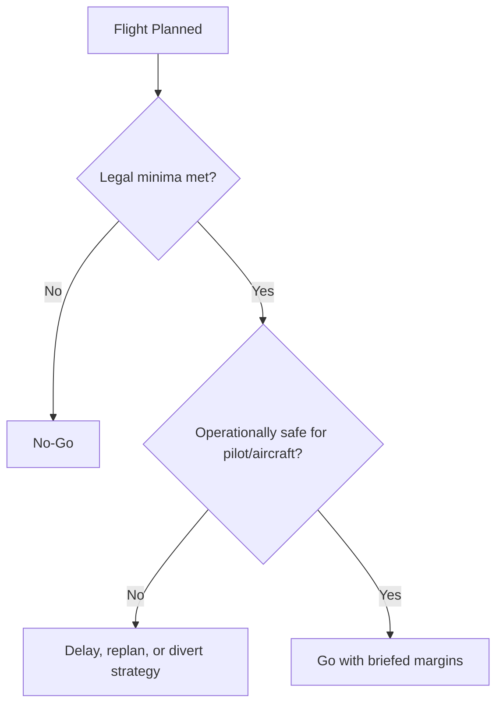

# Chapter 1 - Air Law

**Navigation:** [Table of Contents](ppl_toc.md) | Chapter 1 | [Next -> Chapter 2](ch2_aircraft_general_knowledge_agk.md)

These notes are exam-focused for CASA PPL Air Law. Always treat current CASA legislation, AIP, and published instruments as controlling references.

### How to use this chapter

| Label | Meaning |
|---|---|
| **CASA Primary** | CAR/CASR, MOS, AIP/ERSA, CASA workbook, Airservices SARTIME — default for exam answers |
| **PHAK Secondary** | FAA PHAK for general concepts (communications, airport ops); always verify Australian promulgated rules |

**Study habits:** Use comparison tables for VMC, airspace, and radio urgency. **Sketch** a simple airspace stack or circuit diagram when a scenario names classes and altitudes — wrong class is a frequent trap.

---

## 1.1 Regulatory Structure and Authority

> **Why this matters**
>
> Exam scenarios rarely ask “what is CASA?” — they test whether you can pick the **correct rule set** (private vs training, day vs night, controlled vs non-controlled) before applying minima or responsibilities.

- CASA administers civil aviation safety in Australia.
- Legislative hierarchy (simplified):
  - Civil Aviation Act
  - CASR/CAR
  - Manuals of Standards (MOS)
  - AIP, ERSA, DAP, NOTAM and other promulgated operational information
- For exam questions, read carefully whether the scenario is private, charter, training, controlled/uncontrolled, or day/night VFR.

---

## 1.2 Licensing, Ratings, Endorsements, and Privileges

- Understand privileges and limitations of:
  - Student pilot status
  - RPL vs PPL (and when privileges differ)
- Core licence considerations:
  - Medical/certificate requirements
  - Recency and proficiency requirements
  - Flight review requirements
  - Carriage of passengers requirements
- Know what requires a rating/endorsement/approval (e.g., aircraft category/class, operational privileges).

### RPL vs PPL

| Item | RPL (Recreational Pilot Licence) | PPL (Private Pilot Licence) |
| --- | --- | --- |
| Typical training scope | Entry-level private operations, usually local/regional use | Broader private operations with higher theoretical depth |
| Theory depth | Lower than PPL; focused on core recreational/private operations | Higher depth across all PPL theory subjects |
| Operational privilege scope | More limited privileges; often endorsement-dependent for expanded operations | Wider private pilot privileges (still subject to ratings/endorsements and recency) |
| Aircraft/operation complexity | Generally simpler operations unless extra endorsements held | Supports progression to more complex ops with added ratings/endorsements |
| Pathway value | Good first milestone; can bridge toward PPL | Standard licence for broader private flying and further training pathways |
| Exam mindset | Know what is permitted vs not permitted without extra endorsements | Know broader privileges plus legal/operational limits and conditions |

> Always confirm current CASA definitions, limitations, and endorsement requirements in the latest regulations/MOS and official guidance.

### Exam cues
- Distinguish legal privilege vs practical competency.
- Recency and flight review rules are frequent question areas.

---

## 1.3 Pilot in Command Responsibilities

- PIC is responsible for safe and legal operation.
- Key PIC duties:
  - Verify aircraft airworthiness status/documentation
  - Confirm weather and operational suitability
  - Ensure fuel/oil requirements met
  - Ensure loading/CG within limits
  - Ensure passengers are briefed and secured
  - Comply with all clearances/instructions/procedures
- You cannot delegate legal accountability for the flight outcome.

---

## 1.4 Flight Rules (VFR Focus)

> **CASA Primary:** VMC minima and flight rules — **AIP ENR 1.2** and current CAR/CASR/MOS. Do not rely on memory tables alone.

> **Ask yourself:** If visibility is legal but cloud base is not, are you still VMC? Which chart (day vs night, class, altitude) are you using?

- VFR minima and associated conditions are fundamental exam items.
- Understand:
  - Flight conditions
  - Day VFR vs Night VFR concept differences
  - Cloud clearance and visibility minima by airspace/altitude context
  - Terrain/obstacle and minimum height rules
  - Cruising level selection logic
- Special operations concepts:
  - Operations in controlled vs non-controlled airspace
  - Operations near restricted/prohibited/danger areas
  - Use of special procedures where published.

### Flight Conditions

| Classification | Ceilings and Visibility |
| --- | --- |
| Visual Flight Rules (**VFR**) | > 3,000ft AGL and > 5 SM |
| Marginal VFR (**MVFR**) | 1,000 - 3,000ft AGL and/or 3 - 5 SM | 
| Instrument Flight Rules (**IFR**) | 500 - 1,000ft AGL and/or 1 - 3 SM |
| Low IFR | < 5,000ft AGL and/or < 1 SM |


### VMC/VFR minima criteria

> **Study summary only — not a substitute for law.** The values below are **general** memory aids. **Class, altitude, day/night, and airspace** each change the rule set. For operations and exams tied to current law, use **AIP ENR 1.2** (VMC visibility and distance from cloud — and related ENR 1 provisions) together with **CASR Part 91** and the **Part 91 MOS**, not this table alone.

| Condition | Typical minima (general study aid — verify in AIP ENR 1.2) |
| --- | --- |
| At/above 10,000 ft AMSL | Visibility 8 km; cloud clearance 1,000 ft vertical and 1,500 m horizontal (typical general case) |
| Below 10,000 ft AMSL (general day VFR case) | Visibility 5 km; cloud clearance 1,000 ft vertical and 1,500 m horizontal (typical general case) |
| Class G at or below 3,000 ft AMSL or 1,000 ft AGL (whichever higher threshold applies in context) | Clear of cloud and in sight of ground or water (plus applicable visibility requirement) |
| Controlled airspace entry | ATC clearance required; VMC minima still apply unless operating under IFR |
| Class A | VFR not permitted |

**Night VFR — stricter minima (important)**

- Night VFR requires a **Night VFR rating** (and aircraft/equipment compliance); it is still **VFR in VMC**, but **published minima are generally stricter than day VFR** (commonly higher visibility and specific cloud-clearance rules by airspace class).
- Do **not** assume day-VFR minima from the table above apply at night.
- Check **AIP ENR 1.2** and **Part 91 MOS** for the exact night VMC criteria applicable to your operation.
- Operationally: even when legal, reduced visual cues mean **personal margins** should exceed published minima (Chapter 4 / 7).

**Primary reference:** [AIP ENR 1.2 — VMC visibility and distance from cloud](https://www.airservicesaustralia.com/aip/) (AIP Australia via Airservices; confirm current edition on NAIPS or your briefing provider).

### Day VFR constraints (what limits you)

- Must remain in VMC and comply with applicable visibility/cloud criteria at all times.
- Must comply with airspace, altitude, and clearance requirements for route.
- Navigation and terrain clearance must be possible by visual reference and appropriate charting/planning.
- Fuel planning and flight notification/SARTIME obligations still apply based on operation type/airspace.
- Legal minima are minimums only; operationally safe margins should be higher.

### Night VFR constraints (what changes at night)

- Requires Night VFR privilege/rating and aircraft/equipment that meets night operation requirements.
- Night VFR is still VFR in VMC; however, practical risk is higher due to reduced external visual cues.
- Harder to detect cloud, terrain, and weather deterioration at night; inadvertent IMC risk is increased.
- Greater emphasis on:
  - Instrument cross-check proficiency
  - Lighting/terrain awareness
  - Conservative weather minima and alternate strategy
  - Higher personal decision margins than daytime operations.

### Practical example: Day VFR acceptable, Night VFR not acceptable

- Same route and legal minima by day may be manageable with clear terrain/visual references.
- At night, with scattered cloud layers, limited moonlight, and sparse ground lighting, visual horizon and terrain cues may be inadequate.
- Correct exam/operational decision: reassess as higher risk, tighten minima, and delay/divert or cancel if cues/margins are insufficient.

---

## 1.5 Airspace and ATS

> **Real-world application**
>
> Before entering busy airspace, brief **frequency**, **clearance**, and **transponder code** on paper — fixing radio mistakes under workload is harder than getting them right on the ground.

> **CASA Primary:** Class boundaries, services, and pilot obligations — **AIP** and ERSA. **PHAK Secondary:** general airspace diagram concepts.

- Airspace classes: know service levels, separation responsibilities, and communications/transponder requirements conceptually.
- ATC/ATS interactions:
  - Clearances, readbacks, and compliance
  - Mandatory reports and position reporting where required
  - Frequency management and listening watch requirements

### Airspace classes summary (Australia, exam-focused)

> Study table only. Verify current operational requirements in AIP/ERSA/NOTAM for actual flight.  
> Note: Australia primarily uses Classes `A`, `C`, `D`, `E`, and `G` for PPL operations.

| Airspace class | Service level (ATS) | Separation responsibility | Communications / transponder expectations |
| --- | --- | --- | --- |
| **Class A** | Controlled, IFR-only environment | ATC separates all aircraft (IFR) | VFR not permitted; IFR clearance and full ATC communication compliance required |
| **Class C** | Controlled for IFR and VFR | ATC separates IFR-IFR and IFR-VFR; VFR receives traffic information on other VFR traffic | ATC clearance required; 2-way radio required; transponder required where published/mandated |
| **Class D** | Controlled tower airspace (typically terminal/circuit environment) | ATC separates IFR-IFR; traffic information and sequencing provided to assist IFR/VFR and VFR/VFR integration | ATC clearance required to enter/operate; 2-way radio required; transponder as published/required |
| **Class E** | Controlled airspace for IFR with VFR permitted | ATC separates IFR from IFR; VFR remains responsible for see-and-avoid and own separation from other traffic unless specifically instructed otherwise | IFR requires clearance; VFR generally no clearance for en route transit, but must comply with applicable radio/carriage requirements and published procedures |
| **Class G** | Uncontrolled (non-controlled) airspace | Pilot responsible for separation by see-and-avoid; ATS provides information/alerting services as available | No ATC clearance required; use appropriate area/CTAF procedures; radio/transponder requirements depend on specific airspace/equipment mandates |

### Quick memory points

- `A` = IFR only.
- `C` and `D` = clearance required before entry/operation.
- `E` = IFR controlled, VFR permitted without routine ATC separation.
- `G` = no controlled separation; pilot lookout and traffic awareness are critical.

### Distress and urgency

- **Distress (MAYDAY):** grave and imminent danger requiring immediate assistance.
  - Typical triggers: engine failure with forced landing likely, onboard fire/smoke threat, severe control difficulty, critical fuel state with immediate landing needed.
- **Urgency (PAN PAN):** serious situation requiring priority handling, but not yet immediate danger.
  - Typical triggers: significant technical issue still controllable, deteriorating weather with uncertainty, passenger medical concern without immediate life threat.

### Priority and ATS response

- Distress traffic has highest priority over all other communications.
- Urgency traffic has priority over normal traffic but below distress.
- ATC/ATS will typically provide:
  - Priority handling and traffic deconfliction support
  - Assistance with headings, altitudes, and nearest suitable aerodrome
  - Coordination with emergency services where needed.

### Practical transmission structure

- Use this sequence in plain language:
  - Distress or urgency signal (`MAYDAY` or `PAN PAN`) x3
  - Station called (if known) and callsign/aircraft identification
  - Nature of problem
  - Intentions (e.g., diverting, immediate landing)
  - Position, altitude, heading
  - Persons on board and any other essential information.

### When to declare

- Declare early when safety margin is shrinking; do not delay waiting for perfect diagnosis.
- If uncertain between urgency and distress:
  - Start with PAN PAN if situation is serious but stable.
  - Escalate immediately to MAYDAY if risk becomes immediate.
- Good airmanship: aviate first, then communicate as workload allows.

### Common exam traps (distress/urgency)

- Delaying a call until the situation becomes critical.
- Treating PAN PAN as "optional" and continuing normal operations without priority request.
- Omitting key information (position, intentions, POB) in first call.
- Fixating on radio phraseology perfection instead of timely declaration.

### ICAO-style radio examples

**PAN PAN example (urgency):**

```
PAN PAN, PAN PAN, PAN PAN, Brisbane Centre, Cessna VH-ABC, engine rough running, maintaining 4,500 feet, 15 miles north of Toowoomba, tracking south, request priority direct Toowoomba for landing, 3 persons on board.
```

**MAYDAY example (distress):**

```
MAYDAY, MAYDAY, MAYDAY, Melbourne Centre, Piper VH-XYZ, engine failure, conducting forced landing, 8 miles east of Bacchus Marsh, 2,500 feet descending, 2 persons on board.
```

---

## 1.6 Aerodrome Rules and Surface Operations

- Circuit joining/rejoining/departure expectations:
  - Determine and brief active runway, circuit direction, and aerodrome procedures before arrival/departure.
  - Maintain mandatory broadcasts/calls and listening watch as required for aerodrome type.
  - Join in accordance with published or standard pattern procedures; integrate safely with existing traffic flow.
  - Maintain correct circuit spacing, altitude discipline, and sequencing (avoid cutting in or overtaking in circuit).
  - Rejoin only when safe and predictable to other traffic; if unsure, extend/reposition and rejoin in an orderly manner.
  - Comply with right-of-way and wake-turbulence separation considerations, especially behind heavier/faster aircraft.
  - On departure, follow runway tracking/noise-abatement/published departure procedures unless safety requires otherwise.
  - Do not commence takeoff or cross/enter runway without required clearance/instruction at controlled aerodromes.
  - If go-around is required, execute promptly, broadcast/call as required, and re-sequence safely.
- Runway use, holding points, movement area discipline.
- Readback-critical instructions and runway incursion prevention.
- Light/sign/marking awareness for controlled and non-controlled operations.
- Wake turbulence and prop/jet blast awareness on ground and in circuit.

---

## 1.7 Documents, Publications, and Carriage Requirements

> **Real-world application**
>
> If it is not in the aircraft or on your person when required, the flight can be **illegal** regardless of skill — build a documents pouch checklist and use it every dispatch.

- Typical documents/publications a pilot must consult/carry as applicable:
  - Licence and medical evidence
  - Aircraft registration and airworthiness documentation
  - Maintenance release and defect status
  - Current charts/publications for route
  - Flight plan/notification details where required
- Must understand where to obtain current operational info:
  - NOTAM
  - AIP/ERSA/DAP
  - Weather products and operational advisories.

### SARTIME and SARWATCH (search and rescue notification)

**Definition — SARTIME:** **S**earch **A**nd **R**escue **TIME** — the UTC time by which, if the aircraft has not arrived or the pilot has not cancelled, **search and rescue action may be initiated**. Used for typical **VFR** flight notification in Australia.

**Definition — SARWATCH:** SAR monitoring arrangement associated with **IFR** operations using full reporting procedures; SAR action is tied to **failure to report** at compulsory reporting points / destination, not only a single pilot-nominated time in the same way as SARTIME.

| Feature | SARTIME (VFR context) | SARWATCH (IFR context) |
|---|---|---|
| Typical use | VFR flights where SARTIME notification is required | IFR with reporting procedures |
| Trigger concept | Time passes without arrival **and** no cancellation | Non-arrival / failure to report per IFR rules |
| Who you notify | Lodge with **Airservices** (CENSAR system) | IFR flight plan / ATS reporting chain |
| Cancellation at controlled aerodrome | **Cannot** cancel SARTIME with tower alone — contact CENSAR | Often terminated via **ATC** at destination when IFR reports in |
| Cancellation at non-controlled aerodrome | Pilot must **cancel** with CENSAR | Pilot responsibility to cancel if not closed by ATS |

### Nomination (SARTIME — typical VFR workflow)

1. Complete flight planning (route, endurance, alternates).
2. Nominate a realistic **SARTIME** (UTC) allowing for weather, diversions, and margins — not “minimum possible.”
3. Lodge via approved means (e.g. **NAIPS** SARTIME, phone to CENSAR).
4. Record SARTIME on your nav log and set a personal reminder before it expires.

### Cancellation (critical — common accident prevention)

- **Always cancel** when you arrive safely (or terminate the flight as applicable).
- **SARTIME (VFR):** call **CENSAR** — **1800 814 931** (Australia) — or use approved electronic cancellation; do not assume tower or CTAF hears you “cancel.”
- Late cancellation wastes SAR resources; failure to cancel can trigger unnecessary SAR deployment.

### Common exam and operational traps

| Trap | Correct mindset |
|---|---|
| Confusing SARTIME with ETA | SARTIME is for **SAR initiation**, not your planned landing time |
| Cancelling with tower only (VFR SARTIME) | Must cancel with **CENSAR** unless question states another approved method |
| Forgetting cancellation after diversion | Cancel old notification and lodge updated plan/SARTIME if required |
| SARTIME too tight | Allow fuel, weather, and alternate margins |
| Assuming SARWATCH rules apply on a VFR SARTIME flight | Match procedure to **flight rules and notification type** |

- [CASA — Out-n-Back: flight plans and SARTIME](https://www.casa.gov.au/resources-and-education/education-and-training/out-n-back/episode-25-flight-plans-and-sartime)
- [Airservices — SARTIME](https://www.airservicesaustralia.com/industry-info/pilot-tools/sartime/)
- [Flight Safety Australia — cancelling SARTIME/SARWATCH](https://www.flightsafetyaustralia.com/2019/05/cancelling-sartimes-and-sarwatches/)

---

## 1.8 Fuel and Flight Planning Legal Context

- Legal fuel requirements are not just performance math; they are compliance requirements.
- CASA exam scenarios may explicitly reference policy assumptions (e.g., Part 91 MOS context in exam workbook).
- Always identify:
  - Planned fuel
  - Reserve requirements
  - Alternate/contingency assumptions if scenario requires.

---

## 1.9 Incident, Accident, and Reporting Obligations

- Know post-flight obligations when safety events occur:
  - Immediate safety actions
  - Preservation of evidence where required
  - Who must be notified and when (conceptually)
- Distinguish reportable occurrences from minor defects handled through maintenance channels.

---

## 1.10 Radio and Radiotelephony

> **Why this matters**
>
> Poor phraseology wastes frequency time and erodes separation — in exams, readback and urgency/distress wording are marked precisely.

> **Ask yourself:** Is this situation **urgency** (PAN PAN) or **distress** (MAYDAY)? Can you still fly the aircraft safely while you transmit?

**Primary reference (Dec 2025):** CASA **Multi-Part AC 64.B-02, AC 91-35 and AC 172-05 — Radiotelephony manual for flight operations** (v1.0, updated Dec 2025). This manual standardises phraseology for pilots and replaces much of the radiotelephony material previously in **AIP GEN 3.4** — always use the current AC plus AIP/ERSA for operations.

- [CASA Part 64 — advisory circulars (includes radiotelephony manuals)](https://www.casa.gov.au/rules/regulatory-framework/casr/part-64-casr-authorisations-non-licensed-personnel)
- [Draft / consultation background — radiotelephony AC program](https://www.casa.gov.au/about-us/news-media-releases-and-speeches/have-your-say-guidance-radiotelephony-procedures)
- Until GEN 3.4 is fully withdrawn in your AIP edition, cross-check **AIP GEN 3.4** if the AC is silent on a detail.

### Aviate, Navigate, Communicate

| Priority | Meaning | Radio application |
|---|---|---|
| **Aviate** | Fly the aircraft; maintain control | Do not let radio work cause fixation or neglect attitude/speed |
| **Navigate** | Know position, terrain, and clearance | Position and intentions must be accurate before transmitting |
| **Communicate** | When workload allows | Brief, standard calls; MAYDAY/PAN when appropriate (see 1.5) |

> Under stress: **fly first**, then navigate, then transmit. Perfect phraseology never outweighs aircraft control.

### Standard phraseology principles (from CASA manual themes)

- Use **standard words and phrases** (e.g. “affirm,” “negative,” “unable,” “confirm”).
- Use **ICAO phonetic alphabet** for callsigns and critical identifiers.
- **Read back** runway hold short, line-up, take-off, landing clearances, and level/heading assignments as required.
- Speak **concisely**; think before pressing transmit.

### Example transmissions (PPL training context)

**CTAF — inbound position (non-controlled aerodrome):**

```
Bacchus Marsh CTAF, Cessna VH-ABC, ten miles south, inbound, received Bravo, estimating circuit at four five, Bacchus Marsh.
```

**Initial call to tower (controlled aerodrome):**

```
Melbourne Tower, Cessna VH-ABC, eight miles south, inbound, one thousand five hundred feet, received India, request join for runway 34.
```

**Readback (landing clearance):**

```
Runway 34, cleared to land, Cessna VH-ABC.
```

**Hold short (readback critical):**

```
Hold short runway 34, Cessna VH-ABC.
```

**Request flight information service / weather (example structure):**

```
Brisbane Centre, Cessna VH-ABC, request current weather for Toowoomba and cloud base en route.
```

**Distress / urgency:** use **MAYDAY** or **PAN PAN** structure in section 1.5 — do not improvise non-standard priority calls.

### Common radiotelephony exam traps

- Long, non-standard transmissions on a busy frequency.
- Omitting callsign at end of message (practice good habit per manual).
- Readback of non-critical traffic instead of hold-short/line-up/landing clearances.
- Transmitting before knowing **who you are calling** and **what you need**.
- Fixing phraseology while aircraft is unstable — violates **Aviate** first.

---

## 1.11 Security and Dangerous Goods Awareness

- Security compliance includes controlled access, suspicious activity reporting, and passenger/baggage vigilance.
- Dangerous goods awareness:
  - Do not carry prohibited items unless permitted and properly handled.
  - If unsure, treat as prohibited until verified.

---

## 1.12 Key Definitions and Practical Examples

- **PIC (Pilot in Command):** the pilot legally responsible for operation and safety of the flight.
  - Example: even if an instructor or experienced passenger gives advice, PIC remains responsible for final decisions.
- **Clearance:** formal ATC authorization for a specific operation under stated conditions.
  - Example: cleared into controlled airspace at a specific level does not authorize entry at a different level.
- **Instruction:** ATC direction requiring compliance unless safety is compromised.
  - Example: "Hold short runway" must be complied with and read back as required.
- **NOTAM (Notice to Airmen):** time-critical operational information not practical to publish by permanent amendment.
  - Example: runway lighting unserviceable at destination changes night/VFR feasibility.
- **AIRMET (Airman's Meteorological Information):** aviation weather advisory issued by the Aviation Weather Center to alert pilots of, or forecast, moderate icing, moderate turbulence, sustained surface winds of 30+ knots, or widespread IFR conditions, mostly affecting smaller, single-engine aircraft. AIRMETs cover large areas (3,000+ sq miles) and are updated every 6 hours.
  - AIRMET Sierra (IFR/Mountain Obscuration): issued for ceiling less than 1,000 ft, visibility less than 3 miles, or extensive mountain obscuration.
  - AIRMET Tango (Turbulence): issued for moderate turbulence, sustained surface winds of 30 knots or more, or non-convective low-level wind shear.
  - AIRMET Zulu (Icing): issued for moderate icing and freezing levels.
- **Recency:** recent experience required to exercise specific privileges (e.g., passenger carrying).
  - Example: legally current for solo local flight may still be not current to carry passengers.

### Scenario: legal but not wise

- Conditions are just at legal minima, crosswind near your personal limit, and alternates are marginal.
- Correct exam mindset: legal minima are not automatic go criteria; operational judgment and margins still apply.

---

## 1.13 Pre-Exam Revision (Must Know · Nice to Know · Common Traps)

> **Sketch it:** Draw a vertical slice of airspace (Class C/D/G) with your route and note where VMC, radio, and transponder rules change.

### Must know

- PIC legal responsibilities before, during, and after flight.
- VFR minima logic from **AIP ENR 1.2** (day vs night, class, altitude).
- Controlled vs non-controlled obligations; clearance and readback discipline.
- Required publications and preflight information sources (AIP, ERSA, NOTAM, weather).
- SARTIME vs SARWATCH; **cancel SARTIME** with CENSAR when applicable.
- PAN PAN vs MAYDAY; Aviate–Navigate–Communicate.
- Legal vs operational go/no-go (legal minima are not automatic “go”).

### Nice to know

- Legislative hierarchy (Act → CASR → MOS → AIP).
- Dangerous goods and security awareness headlines.
- ICAO Annex 2 alignment for international context.
- Workbook fuel-policy structure when scenarios cite MOS assumptions.

### Common traps

- Applying memory of old rules instead of current promulgated requirements.
- Confusing ATS service availability with pilot legal responsibility.
- Misreading controlled vs non-controlled airspace obligations.
- Missing scenario qualifiers (passengers, time of day, operation type).
- Treating SOP preferences as legal minima.
- Using **day VMC** for **night VFR** without AIP ENR 1.2.
- Forgetting to **cancel SARTIME** with CENSAR (not tower alone on VFR SARTIME).
- Confusing **SARTIME** (VFR time-based) with **SARWATCH** (IFR reporting-based).

---

## 1.14 Operational Decision Graphics and Tables

### Graphic: legal vs operational go/no-go logic



### Preflight legal compliance matrix (exam memory aid)

| Domain | Core legal check | Typical evidence source |
|---|---|---|
| Pilot | Licence, medical, recency | Licence/medical + logbook records |
| Aircraft | Registration, maintenance release, defects | Aircraft docs and release entries |
| Operation | Weather minima, airspace rules, NOTAM | AIP/ERSA/NOTAM + weather brief |
| Planning | Fuel compliance and alternates | Flight planning sheet + policy assumptions |

### Radio urgency/distress comparison

| Item | PAN PAN (Urgency) | MAYDAY (Distress) |
|---|---|---|
| Threat level | Serious, not immediate grave danger | Grave and imminent danger |
| Priority | Above normal traffic | Highest priority |
| Escalation | Can escalate to MAYDAY if worsens | Immediate emergency handling |

### Practical legal sequence (PIC workflow)

1. Confirm legal authority to fly (pilot, aircraft, operation).
2. Confirm operational suitability (weather, fuel, alternates, risk).
3. Brief threats and hard decision points before departure.
4. Reassess legality and safety after any major condition change.

### VMC typical minima (symbolic revision)

> General study aid only. **Confirm class-specific day and night rules in AIP ENR 1.2** before flight or exam answers that cite exact legal minima.

```text
Vis ≥ 8 km   (typical general case at/above 10,000 ft AMSL)
Vis ≥ 5 km   (typical general day case below 10,000 ft AMSL)
Cloud: ≥ 1000 ft vertical; ≥ 1500 m horizontal (typical general case)
Night VFR: generally stricter — see AIP ENR 1.2 (do not use day table alone)
Class G low-level: special rules — see AIP ENR 1.2
```

### Conceptual fuel sufficiency (exam structure)

Policy and numbers come from the question or current rules; structure is often:

```text
Usable onboard ≥ Taxi + Trip + Reserve + Contingency (if required)
```

---

## References

### CASA Primary

- CASA RPL/PPL/CPL Aeroplane Workbook (exam method assumptions): <https://www.casa.gov.au/rpl-ppl-and-cpl-aeroplane-workbook>
- CASA Radiotelephony manual for flight operations (AC 64.B-02 / AC 91-35 / AC 172-05, Dec 2025): <https://www.casa.gov.au/rules/regulatory-framework/casr/part-64-casr-authorisations-non-licensed-personnel>
- AIP Australia — ENR 1.2 VMC (via Airservices): <https://www.airservicesaustralia.com/aip/>
- Airservices SARTIME: <https://www.airservicesaustralia.com/industry-info/pilot-tools/sartime/>
- CASA Visual Flight Rules Guide (VFRG): <https://www.casa.gov.au/sites/default/files/2022-02/visual-flight-rules-guide.pdf>
- CASA Advisory Circular AC 61-05 (Night VFR rating guidance): <https://www.casa.gov.au/night-vfr-rating>

### PHAK Secondary / supplementary

- FAA PHAK (airport operations and communications supporting concepts): <https://www.faa.gov/regulations_policies/handbooks_manuals/aviation/phak>
- ICAO Annex 2 (Rules of the Air): <https://www.icao.int/>
- CASA Day VFR syllabus page: <https://www.casa.gov.au/day-vfr-helicopters-syllabus>
- EASA Air Operations reference portal: <https://www.easa.europa.eu/en/domains/air-operations>

---

**Navigation:** [Table of Contents](ppl_toc.md) | Chapter 1 | [Next -> Chapter 2](ch2_aircraft_general_knowledge_agk.md)

