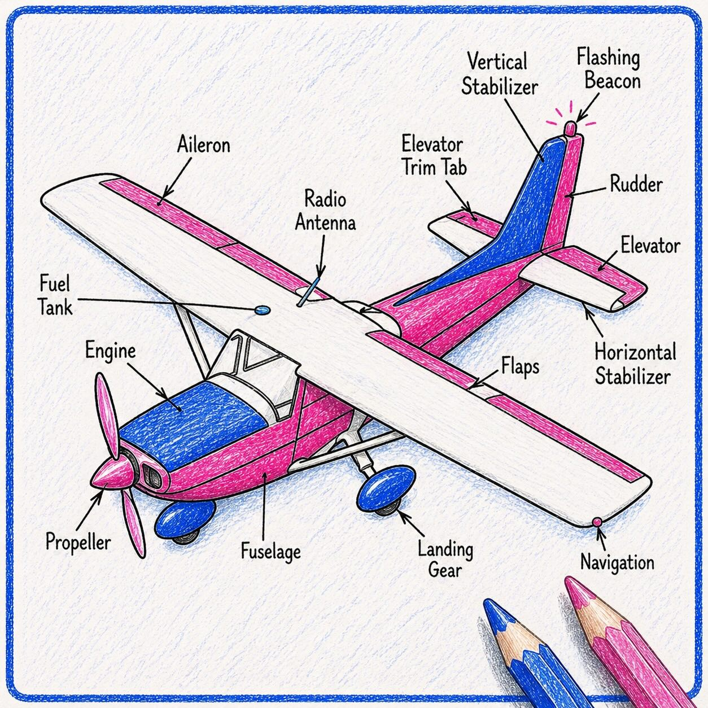
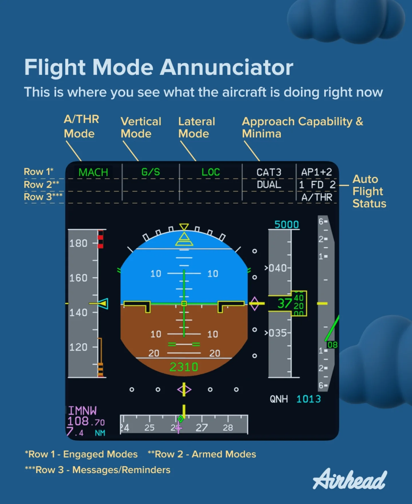
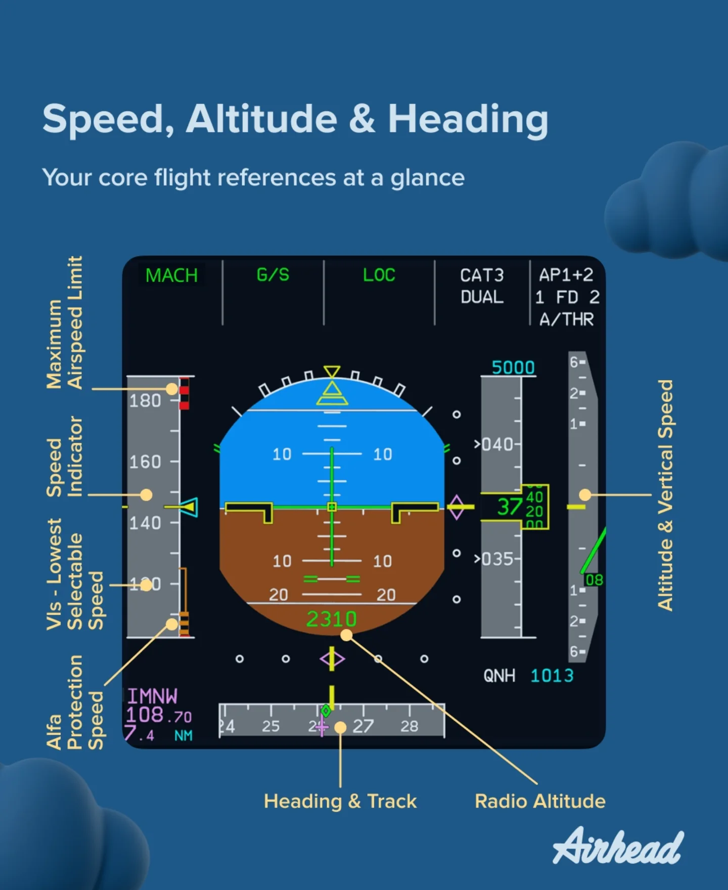
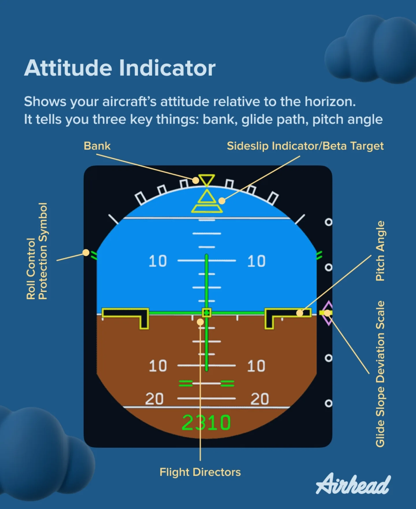
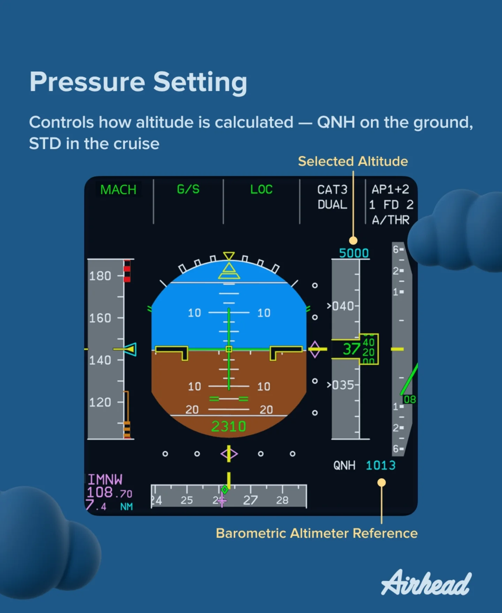
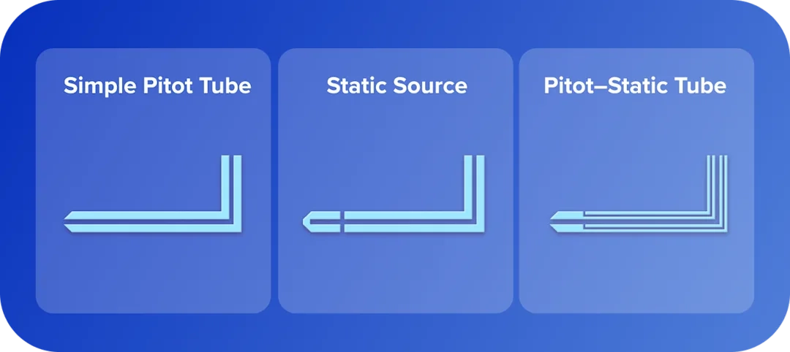
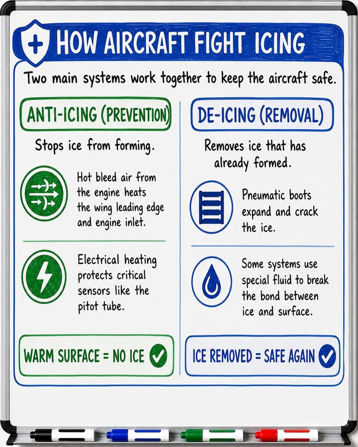

# Chapter 2 - Aircraft General Knowledge (AGK)

**Navigation:** [<- Previous Chapter 1](ch1_air_law.md) | [Table of Contents](ppl_toc.md) | Chapter 2 | [Next -> Chapter 3](ch3_flight_performance_and_planning.md)

These notes are exam-focused for CASA PPL AGK and aligned with FAA PHAK system knowledge where technically applicable. Use your aircraft POH/AFM as final authority for numbers, limitations, and procedures.

---

## 2.0 Terminology: POH and AFM

- **AFM (Airplane/Aircraft Flight Manual):** the approved flight manual containing aircraft-specific operating limitations, procedures, and performance data that pilots must comply with.
- **POH (Pilot's Operating Handbook):** the manufacturer handbook used in day-to-day operations; for most light aircraft, the POH includes the approved AFM sections and is commonly referred to as the aircraft's `AFM/POH`.
- **Why this matters for exam and flight:** if a generic rule conflicts with aircraft documentation, follow the approved `AFM/POH`, placards, and limitations for that specific aircraft.

---

## 2.1 Airframe, Structure, and Flight Controls

[Source](https://www.instagram.com/p/DXnrjAllrrW/?img_index=2)

- **Major airframe groups**
  - **Fuselage**: central structure that carries occupants, payload, and connects wings/tail; houses cockpit/cabin.
  - **Wings**: generate lift; attach engines on many types; carry fuel tanks on many GA aircraft.
  - **Empennage**: tail assembly—usually **horizontal stabilizer** (pitch stability) and **vertical stabilizer** (directional stability/yaw damping).
  - **Landing gear**: supports aircraft on ground; absorbs loads on takeoff/landing (fixed or retractable).
  - **Engine mount**: structure attaching engine to airframe; transmits thrust/vibration loads.
  - **Control surfaces**: movable surfaces that change lift/drag/moment for control (primary and secondary).

- **Primary controls** (rotate aircraft about its axes—see PHAK flight controls chapter):
  - **Ailerons**: trailing-edge wing surfaces that move differentially → **roll** about longitudinal axis.
  - **Elevator** (or **stabilator**): horizontal tail surface(s) → **pitch** about lateral axis.
  - **Rudder**: vertical tail surface → **yaw** about vertical axis.

- **Secondary / high-lift / drag devices**
  - **Flaps** (**plain / split / slotted / Fowler**): extend camber and/or wing area → more lift and drag at low speed (takeoff/landing). [Visual Reference (note the flap position is incorrect)](https://www.instagram.com/p/DXaS6phDgEk/?img_index=2)
  - **Trim tabs** (and related trim systems): small surfaces that reduce steady control forces so the pilot is not holding pressure continuously.

- **Typical construction**
  - **Semi-monocoque**: loads carried by skin plus internal frames/stringers (common metal GA construction).
  - **Stressed skin**: outer skin participates in carrying flight loads.
  - **Frames, stringers**: circumferential/longitudinal stiffeners forming fuselage shape and strength.
  - **Spars, ribs**: main wing beams (**spar**) and cross-section supports (**rib**) that define wing shape and carry bending/torsion.

- **Structural terms**
  - **Datum**: reference plane/line for measuring arms in weight and balance.
  - **Stations / arms**: distance from datum to each weight item (moment arm).
  - **Limit load**: maximum load for normal operation certification basis; **ultimate load**: higher structural proof margin (typically 1.5× limit load conceptually—always use POH/AFM wording).
  - **Normal vs utility category**: operating categories with different approved manoeuvre/weight limits—must match POH.

- **Common failure risks**
  - **Corrosion**: metal loss from environment; inspect joints and drain holes.
  - **Fatigue cracking**: cracks from repeated stress cycles; inspect high-stress areas per maintenance guidance.
  - **Buckling**: thin panels failing under compression/shear.
  - **Control cable wear / hinge damage**: can cause binding or restricted surface movement—preflight free movement checks.

**References:** [FAA PHAK — Chapter 3: Aircraft Construction](https://www.faa.gov/regulationspolicies/handbooksmanuals/aviation/phak/chapter-3-aircraft-construction), [FAA PHAK — Chapter 6: Flight Controls](https://www.faa.gov/regulationspolicies/handbooksmanuals/aviation/phak/chapter-6-flight-controls)

### Visual references (primary and secondary controls)

**Primary flight controls (aileron, elevator, rudder):**

Legend:
<ol>
  <li>Winglet</li>
  <li>Low Speed Aileron</li>
  <li>High Speed Aileron</li>
  <li>Flap track fairing</li>
  <li>Krüger flaps</li>
  <li>Slats</li>
  <li>Three slotted inner flaps</li>
  <li>Three slotted outer flaps</li>
  <li>Spoilers</li>
  <li>Spoilers-Air brakes</li>
</ol>

Source page: [Wikimedia Commons - ControlSurfaces.gif](https://commons.wikimedia.org/wiki/File:ControlSurfaces.gif)

**Secondary/high-lift and drag devices on wing (flaps, slats, spoilers, etc.):**

Source page: [Wikimedia Commons - Control surfaces at the wing of a plane.svg](https://commons.wikimedia.org/wiki/File:Control_surfaces_at_the_wing_of_a_plane.svg)

### Exam cues
- Know what each control does and opposite control combinations for coordinated turns.
- Understand flap effects on stall speed, drag, climb performance, and go-around behavior.

---

## 2.2 Piston Engine Fundamentals

- **Four-stroke cycle** (one thermodynamic cycle per two crankshaft revolutions per cylinder):
  - **Intake**: piston descends, inlet valve open—air/fuel charge enters.
  - **Compression**: valves closed, piston rises—pressure/temperature rise.
  - **Power**: spark ignites mixture near TDC—expansion drives piston down.
  - **Exhaust**: exhaust valve opens—burned gases expelled.

- **Engine layout** (typical light GA piston):
  - **Opposed cylinders**: cylinders arranged on opposite sides of crankcase—often horizontally opposed **flat** engines.
  - **Crankshaft**: converts reciprocating piston motion to rotary output (drives prop).
  - **Camshaft / valve train**: controls **intake and exhaust valve** opening/closing timing.
  - **Spark plugs**: ignite mixture each cycle (two plugs per cylinder common for redundancy).

- **Power output factors**
  - **Mixture strength**: fuel-to-air ratio; affects power, cooling margin, and detonation margin (lean/rich per POH).
  - **RPM**: revolutions per minute; with **constant-speed prop**, **manifold pressure (MP)** also defines power.
  - **Volumetric efficiency**: how well cylinders fill with fresh charge (affected by induction design, altitude, throttle).
  - **Density altitude**: non-standard temperature/pressure reduces mass airflow → less power.

- **Detonation vs pre-ignition**
  - **Detonation**: abnormal rapid pressure rise after spark—can damage pistons/cylinder heads.
  - **Pre-ignition**: mixture ignites before intended spark timing due to hot spot—often very destructive quickly.
  - Both demand mixture/power adjustments and maintenance attention.

- **Shock cooling risk**: rapid power reduction can drop **cylinder head temperatures (CHT)** quickly; some POHs caution against abrupt cooling in descent—follow type guidance.

### Induction systems
- **Carburettor**
  - **Venturi**: narrows duct to speed airflow and lower pressure for fuel discharge.
  - **Fuel metering**: jets/mixture control set fuel flow for throttle position and altitude.
  - **Throttle butterfly**: restricts airflow to control manifold pressure/RPM.
  - **Mixture control**: adjusts fuel flow at a given throttle (often pulled lean for cruise).

- **Fuel injection**: meters fuel at injectors—typically better cylinder-to-cylinder distribution and **no carb icing in the carb** (induction icing can still occur at filter/throttle plate on some systems).

- **Carb icing** (induction ice in carb systems):
  - Forms when moisture and cooling from fuel evaporation/vaporization chill the venturi.
  - Often worst at **partial throttle** (partially closed butterfly).
  - **Symptoms**: falling RPM (fixed pitch), rough running, MP drop (constant speed).
  - **Action**: **carb heat** routes warm air to melt ice—expect temporary rougher running during clearing.

### Ignition
- **Magneto**: self-contained ignition generator driven by engine—**does not require** aircraft electrical bus power for spark.
- **Dual magnetos**: two independent systems + two plugs per cylinder improve combustion and provide redundancy.
- **Magneto check (run-up)**: verifies drop within POH limits—large/no drop can indicate faulty grounding/wiring/plugs.

### Lubrication and cooling
- **Engine oil**: lubricates bearings/cam, **cools** pistons via jet/spray, cleans/contaminant suspension, seals, corrosion protection.
- **Air cooling**: **cylinder fins** plus **baffles** and **cowl flaps** (if fitted) direct cooling airflow.
- **Trend monitoring**: watch oil pressure/temperature and CHT/EGT together—not isolated snapshots.

**References:** [FAA PHAK — Chapter 7: Aircraft Systems](https://www.faa.gov/regulationspolicies/handbooksmanuals/aviation/phak/chapter-7-aircraft-systems) (powerplant, induction, ignition, oil)

**Figure (four-stroke airflow overview):** [Wikimedia Commons — 4-stroke engine with airflows](https://commons.wikimedia.org/wiki/File:4-Stroke-Engine-with-airflows.gif)

---

## 2.3 Propellers

- **Fixed-pitch propeller**: blade angle fixed by manufacture—simple, lighter; power absorbed varies strongly with airspeed/RPM.
  - **Climb prop**: lower pitch—better climb/acceleration; typically lower cruise speed at same RPM.
  - **Cruise prop**: higher pitch—better cruise efficiency; often weaker climb margin.

- **Constant-speed (variable-pitch) propeller**: **governor** changes blade angle to maintain pilot-selected **RPM** as load changes.
  - **Fine pitch / low blade angle**: lower blade AoA—typically higher RPM capability at low speed (takeoff/climb context).
  - **Coarse pitch / high blade angle**: higher blade AoA—typically holds cruise RPM with lower tip speeds / better efficiency.

- **Key terms**
  - **Blade angle**: angle between blade chord and plane of rotation (often controlled via governor).
  - **Geometric pitch**: theoretical distance blade would move forward per revolution if in solid medium (idealized).
  - **Effective pitch**: actual advance per revolution after losses—related to **slip** (propeller not screwing through air perfectly).

- **Operational considerations**
  - **Overspeed**: RPM exceeds limit—reduce power/pitch per POH immediately.
  - **Control sequence**: throttle → mixture → propeller order varies by POH—always follow AFM.
  - **Avoid prohibited combinations**: many POHs chart **RPM × manifold pressure** regions that damage engine.

**References:** [FAA PHAK — Chapter 7: Aircraft Systems](https://www.faa.gov/regulationspolicies/handbooksmanuals/aviation/phak/chapter-7-aircraft-systems) (propellers)

**Figure (propeller blade angle / terminology):** [Wikimedia Commons — Propeller blade AOA](https://commons.wikimedia.org/wiki/File:Propeller_blade_AOA.png) (adapted from FAA PHAK figures)

---

## 2.4 Fuel System and Fuel Management

- **Typical components**
  - **Fuel tanks**: store usable fuel; know **usable vs unusable** per POH.
  - **Vents**: equalize tank pressure with atmosphere—blocked vent can cause feed failure or structural stress.
  - **Fuel selectors / valves**: route fuel from selected tank(s) to engine; incorrect position → **starvation**.
  - **Strainers / filters**: trap debris; blocked filter reduces flow—follow inspection/replacement schedule.
  - **Sumps / drains**: lowest points for water/sediment sampling—preflight until clean sample.
  - **Pumps**: **engine-driven** primary pump (often); **electric auxiliary** boost on many types for priming/takeoff/climb/emergency.
  - **Lines**: rigid/flexible plumbing—inspect for leaks, chafing, security.
  - **Gauges**: often permissive indication—cross-check with visual/timed consumption per POH.
  - **Metering to engine**: **fuel injection** or **carburettor** delivers metered fuel to cylinders.

- **Fuel contamination**
  - **Water**: heavier than AVGAS—settles in sumps; dangerous if ingested.
  - **Sediment / rust**: from tanks/lines—can block filters/injectors.
  - **Microbial growth**: more common in jet fuel storage; still understand contamination risk for training.

- **Fuel grade / type discipline**
  - Use only grades stated in POH/placards (**AVGAS** vs **Jet-A** confusion is catastrophic—different engines).

- **Fuel starvation vs fuel exhaustion**
  - **Starvation**: fuel remains but engine starved (wrong selector, blocked vent, pump failure, blocked line).
  - **Exhaustion**: usable fuel consumed—planning error.

- **Balancing and feed management**
  - Switch tanks per POH for lateral balance and reliable feed.
  - Some POHs warn against certain attitudes with low fuel—follow explicitly.

### CASA exam-relevant points
- CASA workbook uses **AVGAS specific gravity 0.72 kg/L** in loading/fuel calculations.
- Fuel planning questions may reference **CASR Part 91 MOS** day VFR fuel policy.
- In exam scenarios, read whether operation assumptions are Part 91/other as stated.

**References:** [FAA PHAK — Chapter 7: Aircraft Systems](https://www.faa.gov/regulationspolicies/handbooksmanuals/aviation/phak/chapter-7-aircraft-systems) (fuel systems), [CASA workbook](https://www.casa.gov.au/rpl-ppl-and-cpl-aeroplane-workbook)

---

## 2.5 Electrical System

- **Battery**: chemical storage for starting and emergency/bus support; typically **12 V or 24 V DC** in GA.
- **Alternator / generator**: **alternator** is most common on modern GA—produces AC converted to DC at higher efficiency than old generators; provides primary electrical power in flight.
- **Voltage regulator**: maintains bus voltage within limits as electrical load changes.
- **Bus bars**: electrical “distribution rails” feeding avionics, lights, pumps—often split **essential vs non-essential** conceptually.
- **Circuit breakers / fuses**: protect wiring from overcurrent—reset breakers only once per POH guidance (avoid repeated cycling faults).
- **Master / avionics switches**: master connects battery/alternator to electrical system; **avionics master** often delays power-on spikes.

- **System types**: **direct current (DC)** typical for light aircraft.

- **Failure indications**
  - **Ammeter / loadmeter**: shows charge/discharge abnormal patterns.
  - **Low voltage annunciator**: warning of bus voltage decay.
  - **Avionics degradation**: dropped radios/autopilot may indicate partial electrical failure.

- **Typical actions** (always POH-specific)
  - **Load shedding**: turn off non-essential consumers to preserve battery.
  - **Alternator reset**: only if POH permits procedure.
  - **Land as soon as practical** if unable to restore charging—battery time is finite.

**References:** [FAA PHAK — Chapter 7: Aircraft Systems](https://www.faa.gov/regulationspolicies/handbooksmanuals/aviation/phak/chapter-7-aircraft-systems) (electrical)

---

## 2.6 Vacuum/Pressure, Gyros, and Modern Avionics

- **Gyro power sources**
  - **Vacuum system**: suction spins gyro rotors in some legacy panels—**vacuum pressure low** can degrade AI/HI.
  - **Electric gyros / AHRS**: solid-state or electric spin—failure modes differ; may have battery backup on some avionics suites.

- **Gyroscopic principles**
  - **Rigidity in space**: spinning gyro resists reorientation of its spin axis (basis for AI/HI behavior).
  - **Precession**: when torque applied, response is 90° “around” the spin in classical explanation—used in turn instruments’ design.

- **Classic gyro flight instruments**
  - **Attitude indicator (AI)**: displays pitch/bank vs horizon **relative to gyro stability**—must periodically align with reality via cues/synchronization procedures per type.
  - **Heading indicator / directional gyro (HI/DG)**: displays heading but **drifts** due to gyro precession/earth rate—must be periodically reset to magnetic compass.
  - **Turn coordinator**: indicates rate of turn (and slip/skid via inclinometer ball); useful partial-panel instrument.

- **Common failures**
  - **Vacuum pump failure**: decreasing suction→ unreliable vacuum-driven gyros.
  - **Electrical failure**: may blank electric instruments unless on backup bus.

- **Glass cockpit (modern displays)**
  - **Air Data Computer (ADC)**: computes pressure altitude, airspeed, vertical speed from pitot-static sensors.
  - **Attitude and Heading Reference System (AHRS)**: attitude/heading reference system replacing mechanical gyro cluster on many installations.
  - **Primary Flight Displays (PFD) / Multi-Function Displays (MFD)**: integrated displays—know **reversionary mode** and backup instruments per POH. &nbsp; 
  <b>Airbus A320 PFD as Example</b> 
    
    
  [Source](https://www.instagram.com/p/DX6loT-jGQZ/)

**References:** [FAA PHAK — Chapter 8: Flight Instruments](https://www.faa.gov/regulationspolicies/handbooksmanuals/aviation/phak/chapter-8-flight-instruments)

**Figure (vacuum instrument cluster concept):** see gyro instruments section figures in PHAK Chapter 8 PDF.

---

## 2.7 Pitot-Static Instruments and Errors

- **Pitot tube**: senses **total pressure** (**static + dynamic impact**) from airflow—primarily feeds **airspeed indicator**.
- **Static port(s)**: sense **ambient static pressure**—feed **altimeter**, **VSI**, and static side of ASI.
- **Airspeed indicator (ASI)**: differential pressure gauge comparing pitot total vs static → displays dynamic pressure scaled as speed (**IAS**).

- **Altimeter**: aneroid capsules respond to **static pressure decrease with altitude**—pilot sets **subscale** (**QNH** in Australian ops for altitude reporting contexts per procedures).

- **Vertical speed indicator (VSI)**: measures **rate of change** of static pressure → climb/descent rate (may lag slightly).

### Blockage scenarios

| Blockage case | Indicated Airspeed (IAS) on ASI | Indicated Altitude | Indicated Vertical Speed (VS) on VSI |
| --- | --- | --- | --- |
| Pitot ram air source and drain hole blocked | Increases with altitude gain; decreases with altitude loss | Unaffected | Unaffected |
| Pitot ram air source blocked and drain hole open | Displays zero knots | Unaffected | Unaffected |
| Static source blocked | Under-reads in climb, over-reads in descent (typical behavior) | Does not change with altitude gain or loss | Does not change with altitude gain or loss (VSI zero) |
| Both static and pitot sources blocked | All indications remain constant, regardless of changes in airspeed, altitude and vertical speed | All indications remain constant | All indications remain constant |

### Airspeed terminology

| Name | Meaning | Typical usage |
| --- | --- | --- |
| Indicated Airspeed (**IAS**) | Direct instrument reading before corrections | Primary reference for V-speeds and flying by the ASI |
| Calibrated Airspeed (**CAS**) | IAS corrected for **position/instrument error** (POH tables) | Performance chart inputs/outputs when POH specifies CAS |
| Equivalent Airspeed (**EAS**) | CAS corrected for **compressibility** | Higher-speed/altitude corrections (more relevant beyond basic GA regime) |
| True Airspeed (**TAS**) | Actual speed through the air mass; increases vs IAS with altitude (lower density) | Enroute performance and navigation computations |
| Ground Speed (**GS** ) | TAS adjusted for **wind** | ETA/ETE, nav log timing, and range over the ground |

### Instrument/position errors
- **Position error**: static port location and flow field cause static pressure to differ from free stream.
- **Density / compressibility**: at high speed/altitude, ASI interpretation needs POH conversion to TAS.
- **Lag / hysteresis**: especially **VSI**—momentarily misleading during abrupt zoom/climb transitions.

**References:** [FAA PHAK — Chapter 8: Flight Instruments](https://www.faa.gov/regulationspolicies/handbooksmanuals/aviation/phak/chapter-8-flight-instruments)

**Pitot, Static, and Pitot-Static Tubes:**

 [Source](https://www.airheadatpl.com/blog/pitot-tube-101-how-your-airspeed-indicator-works)

---

## 2.8 Magnetic Compass and Turning/Acceleration Errors

- **Magnetic compass**: aligns with **Earth’s magnetic field**, not geographic (**true**) north—subject to aircraft acceleration and turning errors.

- **Variation (magnetic variation / declination)**: angular difference between **true north** and **magnetic north** at a location—shown on charts as **isogonals**.

- **Deviation**: compass error caused by **local magnetic fields** in the aircraft (wiring, ferrous structure)—corrected by **compass correction card** mounted near compass.

- **Turning error (dip-related)** — Southern Hemisphere mnemonic **UNOS**:
  - **Undershoot** headings near **North**, **Overshoot** headings near **South** when rolling into/out of turns from compass-only references.

- **Acceleration error** — Southern Hemisphere mnemonic **ANDS**:
  - **Accelerate** while near **North** headings→ compass tends to show turn toward **East**; **Decelerate**→ tendency toward **West** (conceptual exam framing—always verify with groundschool references).

- **Oscillation / lag**: compass swings in turbulence; dip increases toward poles—use stabilized headings and periodic DI alignment.

**References:** [FAA PHAK — Chapter 8: Flight Instruments](https://www.faa.gov/regulationspolicies/handbooksmanuals/aviation/phak/chapter-8-flight-instruments) (magnetic compass)

**Figure (compass errors overview):** see compass turning/acceleration illustrations in PHAK Chapter 8.

---

## 2.9 Landing Gear, Brakes, and Hydraulics

- **Landing gear configuration**
  - **Tricycle gear**: nosewheel steering typical—more directional stability on ground for most students.
  - **Tailwheel (conventional)**: mains forward of CG—requires specialized technique (**PIO**, ground-loop risk).
  - **Fixed gear**: always extended—lower complexity; more drag.
  - **Retractable gear**: reduces drag—adds **extension/retraction** system, warnings, and emergency procedures.

- **Brakes**
  - Common GA setup: **hydraulic disc brakes** on mains.
  - **Toe brakes**: independent left/right braking for steering on ground (**differential braking**).

- **Risks**
  - **Brake fade / overheating**: prolonged riding brakes after heavy landing or taxi downhill.
  - **Parking brake**: verify **released** before takeoff (critical checklist item).
  - **Hydraulic leaks / soft pedal**: abnormal braking—may indicate leak or air in system—follow POH.

- **Retractable extras**
  - **Extension**: normal electric/hydraulic/manual modes per type.
  - **Warnings**: horn/light—“gear unsafe” cues must be understood.
  - **Emergency extension**: gravity/manual valve procedures—memory items in many POHs.

**References:** [FAA PHAK — Chapter 7: Aircraft Systems](https://www.faa.gov/regulationspolicies/handbooksmanuals/aviation/phak/chapter-7-aircraft-systems) (landing gear, hydraulics)

---

## 2.10 Environmental, Ice/Anti-Ice, and Oxygen Basics

- **Cabin heating (many piston singles)**: often **muff/shroud around exhaust** heats cabin air—**carbon monoxide (CO)** can leak from cracked exhaust/muff—know CO symptoms (headache, nausea, confusion) and shut off heat / ventilate / land.

- **Ventilation / demist**: ram air / cabin vents reduce humidity on windshield—critical for **visibility** in rain/humidity.

- **Ice categories affecting flight**
  - **Induction icing**: blocks/reduces airflow to engine (**carb ice**, filter ice, alternate air doors).
  - **Airframe icing**: accumulates on wings/tail—destroys lift and increases weight/drag.
  - **Instrument icing**: **pitot/static** blocked—airspeed/altitude misleading.

- **Anti-ice vs de-ice**

  

  - **Anti-ice**: systems activated **before** ice accretion in known icing exposure (typically turbine/airliner philosophy; light GA often emphasized **avoidance**).
  - **De-ice**: removes ice after accumulation (**boots**, weeping wing fluid—mostly larger aircraft; light GA often limited capability).

- **Supplemental oxygen** (if installed): understand hypoxic thresholds for prolonged high-altitude legs and fire risk around oxygen equipment—follow POH.

**References:** [FAA PHAK — Chapter 7: Aircraft Systems](https://www.faa.gov/regulationspolicies/handbooksmanuals/aviation/phak/chapter-7-aircraft-systems) (environmental/icing concepts)

---

## 2.11 AFM/POH Knowledge You Must Know for Exam and Flight Test

Typical AFM/POH section layout (terminology varies slightly by manufacturer):

- **Section: Limitations (must-know for every flight)**
  - **Airspeed limitations**: **V-speeds** (see elaboration below) and **color-coded arcs** on the ASI.
  - **Powerplant limits**: max **RPM**, **manifold pressure**, oil pressure/temperature, CHT/EGT limits if listed.
  - **Weight limits**: **MTOW**, max landing weight, max zero fuel weight, compartment limits.
  - **CG envelope**: approved **center of gravity** range; **Normal vs Utility** category limits if applicable.

### About V-speeds

> **All numerical values are aircraft-specific.** Memorize concepts and where to look them up; never use generic numbers on a checkride or in flight—only your **POH/AFM** and placards.

**Naming:** **V** = velocity (knots IAS in US/POH convention unless the POH states otherwise). Subscripts describe **configuration or flight phase**.

| Symbol | Common name | Meaning | Cessna 172S Skyhawk example (KIAS) |
| --- | --- | --- | --- |
| **VS** | Stall speed (general) | Minimum steady flight speed at which the aircraft is controllable in the stated condition (stall **warning** may occur slightly before). | See **VS0** and **VS1** (POH defines by configuration). |
| **VS0** | Stall speed, landing config | Stalling speed in **landing configuration** (e.g., gear down if retractable, flaps at landing setting—per POH). | **40 KIAS** (full flaps, max gross, power off). |
| **VS1** | Stall speed, specified config | Stalling speed in a **defined configuration**—often “clean” or a stated flap setting; POH defines exactly which. | **48 KIAS** (flaps up, max gross, power off). |
| **VFE** | Max flap extended speed | **Do not exceed** this IAS with flaps extended to the associated position(s); risk of overload or loss of control authority. | **110 KIAS** (10 deg), **85 KIAS** (more than 10 deg). |
| **VX** | Best angle of climb speed | Speed giving **greatest altitude gain per unit of horizontal distance**—used for obstacle clearance after takeoff when POH recommends it. | **62 KIAS** (sea level, max gross). |
| **VY** | Best rate of climb speed | Speed giving **greatest altitude gain per unit of time**—used for routine climb when obstacle clearance is not limiting. | **74 KIAS** (sea level, max gross). |
| **VLE** | Max landing gear extended speed | Safe speed with gear **extended** (retractables). | **N/A** (fixed gear). |
| **VLO** | Max landing gear operating speed | Safe speed to **extend or retract** gear (sometimes split into separate extend vs retract limits in POH). | **N/A** (fixed gear). |
| **VA** | Maneuvering speed | Below this speed (at or below **max gross weight** per POH), full abrupt control deflection should not exceed limit load factor—**still avoid abusive inputs**. Often decreases at lighter weight (see POH). | **105 KIAS** at 2550 lb (decreases at lower weight). |
| **VNO** | Maximum structural cruising speed | Upper limit of the **green arc**; do not deliberately fly in rough air above **VNO** unless authorized by POH for smooth air only (**yellow arc** rules). | **129 KIAS**. |
| **VNE** | Never-exceed speed | **Red radial line**—do not exceed under any circumstances; structural/red-line limit. | **163 KIAS**. |
| **Vref** | Landing reference speed | used for final approach, ensuring a safe, stable landing. Equals to VS0 x 1.3 | **52 KIAS** |
| **Best glide** | Best glide / minimum sink (terms vary) | Speed for **maximum distance** or **minimum descent rate** in power-off glide—POH may list separate “best glide” and “minimum sink”; names vary by manufacturer. | **68 KIAS** (commonly used best-glide speed). |

> Example values shown are for quick study context and can vary by model/year/configuration and weight. Always use the exact aircraft POH/AFM and cockpit placards for operation.

> KIAS = Knots Indicated Airspeed

**Multi-engine (awareness for theory):** **VMC / Vmca** is minimum control speed with one engine inoperative—primarily multi-engine training; your POH if applicable.

### Air Speed Indicator (ASI) color bands

| Arc / mark | Typical meaning |
| --- | --- |
| **White arc** | Full-flap operating range (lower end ~ **VS0**, upper end **VFE**). |
| **Green arc** | Normal operating range (low end often **VS1** clean at gross, high end **VNO**). |
| **Yellow arc** | **Caution** range—smooth air only; no abrupt maneuvers; understand POH wording for flight in turbulence. |
| **Red radial line** | **VNE**—never exceed. |

### Operational reminders

- **Flaps:** observe **VFE** before extending further; plan configuration changes ahead of **dot / limiting speed**.
- **Turbulence:** slow toward rough-air / maneuvering guidance in POH; never chase **VNE** in downdrafts.
- **Approach speeds:** POH may publish approach/climb speeds as **checklist speeds** (not always labelled with formal V-speed symbols)—still limitations.

**References:** [FAA PHAK — Chapter 8: Flight Instruments](https://www.faa.gov/regulationspolicies/handbooksmanuals/aviation/phak/chapter-8-flight-instruments) (airspeed indicator markings), [FAA PHAK — Chapter 11: Aircraft Performance](https://www.faa.gov/regulationspolicies/handbooksmanuals/aviation/phak/chapter-11-aircraft-performance) (Vx, Vy, glide), [FAA PHAK — Chapter 9](https://www.faa.gov/regulationspolicies/handbooksmanuals/aviation/phak/chapter-9-flight-manuals-and-other-documents) (where limits live in POH)

- **Normal / abnormal / emergency procedures**
  - **Memory items**: immediate actions (fire, engine failure) performed then checklist expanded.
  - **Checklists**: configure aircraft systematically—follow POH sequencing.

- **Performance charts**
  - **Takeoff/landing**: ground roll vs obstacle clearance distances—apply **wind, slope, surface, density altitude** corrections per POH order.
  - **Climb/cruise**: ROC, fuel flow, range/endurance—temperature/weight sensitive.

- **Systems descriptions**
  - **Fuel**: usable/unusable fuel, tank sequencing, pump usage.
  - **Electrical**: buses, alternator/battery failure modes.
  - **Hydraulic/pneumatic**: gear/flaps/brakes as applicable.
  - **Supplements**: STC mods (**avionics**, tanks) may change limits—must be onboard.

### High-value memory set
- All relevant V-speeds for your training type.
- Fuel system capacities and unusable fuel.
- Oil limits, CHT/EGT limits (if listed), and key caution ranges.

**References:** [FAA PHAK — Chapter 9: Flight Manuals and Other Documents](https://www.faa.gov/regulationspolicies/handbooksmanuals/aviation/phak/chapter-9-flight-manuals-and-other-documents), [FAA PHAK — Chapter 10: Weight and Balance](https://www.faa.gov/regulationspolicies/handbooksmanuals/aviation/phak/chapter-10-weight-and-balance), [FAA PHAK — Chapter 11: Aircraft Performance](https://www.faa.gov/regulationspolicies/handbooksmanuals/aviation/phak/chapter-11-aircraft-performance)

---

## 2.12 Weight and Balance Link to AGK

- **Moment**: rotational tendency of a weight about the **datum**; computed as **Weight × Arm**.

- **Arm**: horizontal distance from **datum** to an item’s center of gravity (often inches or mm per POH).

- **CG (center of gravity)**: average location of aircraft mass; **CG position** must remain inside approved envelope.

- **Basic Empty Weight (BEW)**: aircraft empty weight including fixed equipment and fluids per weighing specification—often includes **unusable fuel** and **full oil** per weighing notes—**always read POH weight schedule wording**.

- **Envelope**: graph/table defining permissible combinations of weight vs CG.

- **Operational impacts**
  - **Forward CG**: more nose-heavy—often higher stall speed trend, heavier elevator forces, longer takeoff roll for rotation.
  - **Aft CG**: closer to aft limit—lighter control forces but reduced stability margin and stall recovery characteristics—must remain legal.

**References:** [FAA PHAK — Chapter 10: Weight and Balance](https://www.faa.gov/regulationspolicies/handbooksmanuals/aviation/phak/chapter-10-weight-and-balance)

---

## 2.13 Key Definitions and Practical Examples

- **Detonation:** abnormal, explosive combustion after normal ignition, causing high thermal/mechanical stress.
  - *Reference:* engine operational limits / mixture guidance — [FAA PHAK — Chapter 7](https://www.faa.gov/regulationspolicies/handbooksmanuals/aviation/phak/chapter-7-aircraft-systems).
  - Example: high power with improper mixture/cooling in hot conditions can increase risk.
- **Pre-ignition:** mixture ignites before spark due to a hot spot.
  - *Reference:* [FAA PHAK — Chapter 7](https://www.faa.gov/regulationspolicies/handbooksmanuals/aviation/phak/chapter-7-aircraft-systems).
  - Example: fouled/damaged plug or overheated component can trigger early ignition and rapid temperature rise.
- **Fuel starvation:** fuel onboard but not reaching engine.
  - *Reference:* fuel system faults / mismanagement — [FAA PHAK — Chapter 7](https://www.faa.gov/regulationspolicies/handbooksmanuals/aviation/phak/chapter-7-aircraft-systems).
  - Example: incorrect tank selection after switching or blocked vent.
- **Fuel exhaustion:** usable fuel depleted.
  - *Reference:* flight planning — [FAA PHAK — Chapter 11](https://www.faa.gov/regulationspolicies/handbooksmanuals/aviation/phak/chapter-11-aircraft-performance); CASA fuel policy context in [CASA RPL/PPL/CPL Aeroplane Workbook](https://www.casa.gov.au/rpl-ppl-and-cpl-aeroplane-workbook).
  - Example: inaccurate fuel planning plus headwind leads to empty selected tank and engine stoppage.
- **Static source blockage:** loss of correct static pressure feed to instruments.
  - *Reference:* pitot-static failures — [FAA PHAK — Chapter 8](https://www.faa.gov/regulationspolicies/handbooksmanuals/aviation/phak/chapter-8-flight-instruments).
  - Example: altimeter freezes and VSI reads zero; ASI behavior becomes misleading in climb/descent.

### Scenario: carb icing recognition

- Cruise at moderate power in humid conditions; RPM slowly falls and engine feels rough.
- Correct action: apply full carb heat, expect temporary roughness/power drop, monitor recovery, then reassess power/settings.

---
## 2.14 Common AGK Exam Traps

- Confusing fuel **quantity** problem with fuel **feed/selection** problem.
- Misreading ASI/static blockage scenarios.
- Forgetting density altitude effects on engine, prop, and wing together.
- Applying generic numbers instead of aircraft-specific POH values.
- Mixing true/magnetic/compass headings and signs for variation/deviation.
- Neglecting POH limitations for flap speeds and crosswind technique limits.

---

## 2.15 Rapid Revision Checklist (Pre-Exam)

- Can explain operation/failures of ASI, altimeter, VSI.
- Can diagnose carb icing and apply correct immediate actions.
- Can distinguish detonation vs pre-ignition and preventive handling.
- Can describe fixed vs constant-speed propeller operation and implications.
- Can compute basic W&B and interpret CG movement with fuel burn.
- Can state fuel contamination checks and fuel grade verification method.
- Can interpret compass turning/acceleration errors for Southern Hemisphere use.
- Can navigate POH sections quickly for limits, systems, and emergencies.

---

## References (Primary)

- [FAA Pilot's Handbook of Aeronautical Knowledge (full handbook and chapter PDFs)](https://www.faa.gov/regulations_policies/handbooks_manuals/aviation/phak)
- [FAA PHAK — Chapter 7: Aircraft Systems](https://www.faa.gov/regulationspolicies/handbooksmanuals/aviation/phak/chapter-7-aircraft-systems)
- [FAA PHAK — Chapter 9: Flight Manuals and Other Documents (AFM/POH concepts)](https://www.faa.gov/regulationspolicies/handbooksmanuals/aviation/phak/chapter-9-flight-manuals-and-other-documents)
- [CASA RPL/PPL/CPL Aeroplane Workbook (exam assumptions and conventions)](https://www.casa.gov.au/rpl-ppl-and-cpl-aeroplane-workbook)

## References (Supplementary)

- [CASA Day VFR syllabus (structure and competency framing)](https://www.casa.gov.au/day-vfr-helicopters-syllabus)
- [CASA VFR guidance example — Visual Flight Guide PDF](https://www.kempseyflyingclub.com.au/Docs/Visual%20Flight%20Guide%202020.pdf) (training/support reference, not legislation)

---

**Navigation:** [<- Previous Chapter 1](ch1_air_law.md) | [Table of Contents](ppl_toc.md) | Chapter 2 | [Next -> Chapter 3](ch3_flight_performance_and_planning.md)

