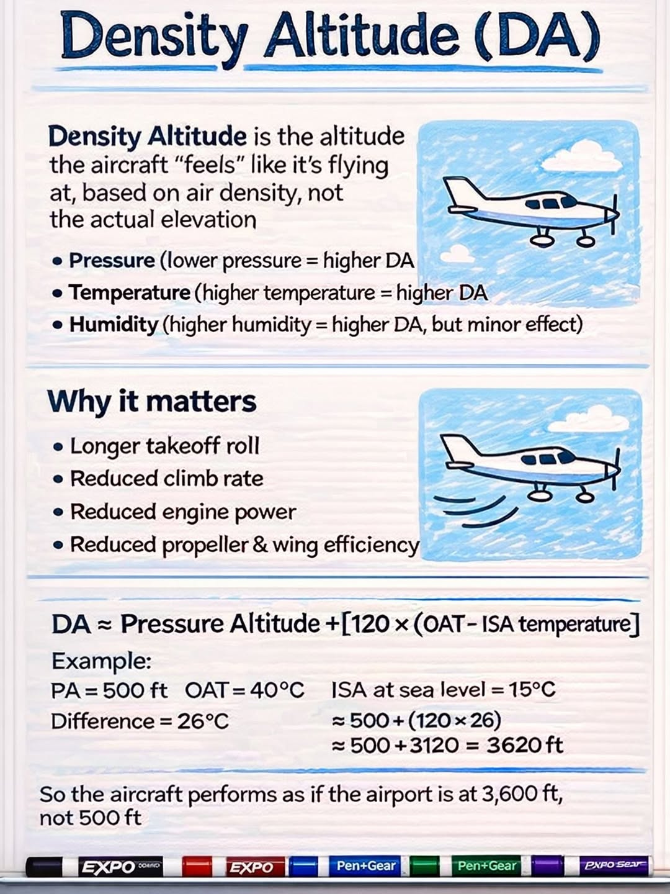
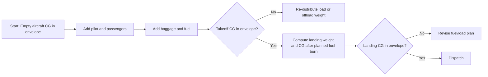
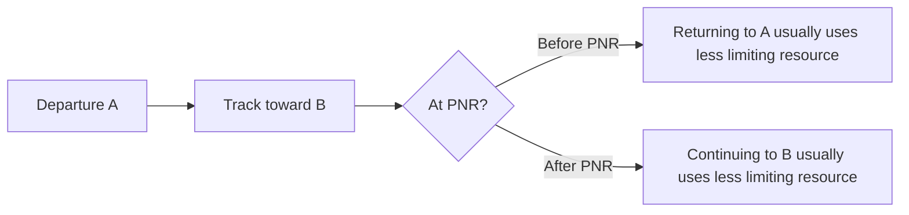
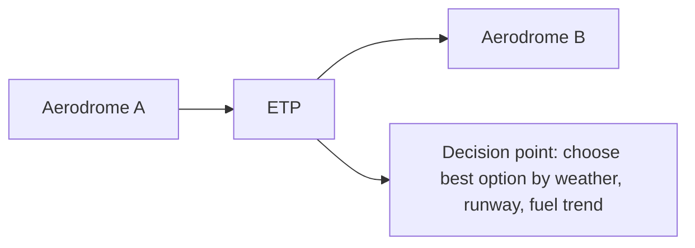
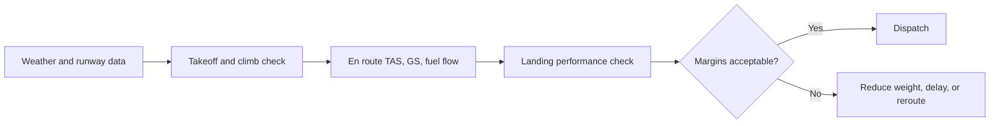

# Chapter 3 - Flight Performance and Planning

**Navigation:** [<- Previous Chapter 2](ch2_aircraft_general_knowledge_agk.md) | [Table of Contents](ppl_toc.md) | Chapter 3 | [Next -> Chapter 4](ch4_human_performance_and_limitations.md)

These notes are exam-focused for CASA PPL performance/planning. Use aircraft-specific POH/AFM charts and CASA regulatory assumptions exactly as stated in each scenario.

### How to use this chapter

| Label | Meaning |
|---|---|
| **CASA Primary** | Part 91 MOS fuel policy, CASA workbook assumptions, legal reserve rules in scenarios |
| **PHAK Secondary** | Performance theory (density altitude, W&B concepts); POH charts are always aircraft-specific |

**Study habits:** Trace a **takeoff distance** problem on the POH chart with pencil twice — zero-wind baseline, then wind correction. **Sketch** a W&B moment diagram when CG moves with fuel burn.

---

## 3.1 Performance Fundamentals

- Aircraft performance depends on four main groups:
  - Aerodynamics (lift/drag)
  - Propulsion (engine/propeller efficiency)
  - Environment (pressure altitude, temperature, wind, runway condition)
  - Mass/configuration (weight, CG, flap/gear state)
- Never use rule-of-thumb when a chart/table is provided.

---

## 3.2 Density Altitude and Why It Matters

> **Why this matters**
>
> High density altitude simultaneously hurts **engine power**, **prop thrust**, and **wing lift** — exam scenarios often stack hot day, high field, and heavy weight.

> **Ask yourself:** If takeoff distance increases, does your **climb gradient** over trees still clear obstacles on the POH chart?

<br />[Source](https://www.instagram.com/p/DXKgmDeEWZl/)

- High density altitude reduces:
  - Engine power
  - Propeller thrust
  - Wing lift at a given IAS (longer takeoff/landing distance due to TAS/ground speed effects)
- Typical causes: high temperature, high elevation, low pressure.
- Operational result:
  - Longer takeoff roll
  - Poorer climb rate and climb gradient
  - Reduced obstacle clearance margin.

---

## 3.3 Takeoff Performance

- Inputs to chart calculations commonly include:
  - Pressure altitude
  - OAT
  - Aircraft weight
  - Wind component
  - Runway slope/surface
  - Flap setting and obstacle requirement
- Distinguish:
  - Ground roll
  - Distance to 50 ft obstacle
- Apply corrections in required sequence per POH.

### Worked example: takeoff distance chart (C172-style POH logic)

> **Illustration only** — use your aircraft POH/AFM charts and correction order. Numbers below are for exam method practice.

**Given (departure):**

| Input | Value |
|---|---|
| Field elevation | 2,000 ft |
| QNH | 29.80 inHg (low pressure) |
| OAT | 32°C |
| Weight | 2,400 lb |
| Flaps | 10° (short-field chart if used) |
| Runway | Sealed level dry |
| Wind | 8 kt headwind |
| Requirement | Distance to clear **50 ft** obstacle |

**Step 1 — Pressure altitude (PA)**

```text
PA ≈ elevation + (1013 - QNH_hPa) × 30   (if QNH in hPa)
```

With QNH 29.80 inHg (~1009 hPa): PA ≈ 2000 + (1013 - 1009) × 30 ≈ **2,120 ft** (round per chart axis).

**Step 2 — Density altitude (DA) sense-check**

```text
DA ≈ PA + 120 × (OAT - ISA temp at PA)
```

ISA temp at 2,000 ft ≈ 15 - 2×2 = **11°C**. OAT 32°C → ISA + 21 → DA ≈ 2120 + 120×21 ≈ **4,640 ft** (performance will feel “much higher” than field elevation).

**Step 3 — Read base chart at weight**

- Enter takeoff chart at **PA ≈ 2,100 ft**, **OAT 32°C**, **weight 2,400 lb**.
- Example chart read (illustrative): ground roll **~1,050 ft**; distance over 50 ft **~1,850 ft**.

**Step 4 — Apply corrections in POH order** (typical sequence — verify POH)

| Correction | Example rule (illustrative) | On 1,850 ft |
|---|---|---:|
| Headwind 8 kt | Often ~−10% per 10 kt headwind (POH table) | −~15% → **~1,570 ft** |
| Dry sealed level | Baseline | — |
| If grass/wet | +20% to +50% etc. per POH | Add if applicable |

**Step 5 — Compare to runway + obstacle**

- Available runway length must exceed **obstacle distance**, not ground roll alone.
- Add **operational margin** (technique, wind gust, DA uncertainty).

**Exam traps in this workflow:** using **field elevation** instead of **PA**; skipping **temperature** line; applying **tailwind** as headwind; interpolating between grid lines incorrectly (see §3.11).

### High-yield planning checks
- Accelerate-stop and reject decision awareness (conceptual for PPL).
- Crosswind component compared against demonstrated or operational limits.
- Abort criteria before takeoff briefing.

### Real-life example 1: hot-day departure from inland aerodrome

- Scenario:
  - C172-type aircraft, two adults, near training-day fuel load.
  - Aerodrome elevation around 1,800 ft.
  - OAT 34 C by midday, light quartering tailwind on preferred runway.
  - Trees and rising terrain beyond departure end.
- Performance effect:
  - High temperature + elevation increases density altitude significantly.
  - Takeoff roll and distance to 50 ft obstacle both increase.
  - Initial climb gradient reduces, even if IAS targets are flown correctly.
- Practical decision:
  - Recompute using POH chart with actual OAT/wind/surface corrections.
  - If obstacle margin becomes thin, reduce weight (less fuel or baggage), wait for cooler time, or use a more favorable runway if available.
  - Brief a clear abort point (for example, "not airborne by X marker -> reject").

### Real-life example 2: short grass strip after overnight rain

- Scenario:
  - Light GA aircraft departing from a private strip.
  - Runway is short, grass surface, and still damp/soft after rain.
  - Light headwind appears favorable, but runway rolling resistance is high.
- Performance effect:
  - Ground roll can increase markedly on soft/wet grass even with headwind.
  - Acceleration is slower, so rotate point happens later than on sealed runway.
  - Obstacle clearance performance may become the limiting factor, not just lift-off.
- Practical decision:
  - Apply POH grass/soft-field corrections (if provided), or conservative margin if not explicitly charted.
  - Use soft-field technique exactly per POH and avoid performance assumptions from dry sealed runway operations.
  - If margins are weak, offload weight or delay departure until surface improves.

### Real-life example 3: crosswind-limited takeoff choice

- Scenario:
  - Adequate runway length, cool morning conditions.
  - Forecast and observed winds produce crosswind near pilot's personal limit.
  - Alternate runway has less crosswind but shorter available distance.
- Performance effect:
  - Longer runway does not help if controllability in crosswind is the main risk.
  - Shorter runway can still be acceptable if takeoff distance and obstacle margins remain valid.
- Practical decision:
  - Compare both options with the same disciplined process:
    - Crosswind component vs pilot/aircraft limit.
    - Takeoff and obstacle performance for actual runway.
    - Go/no-go trigger if tracking/control is unstable during roll.
  - Choose the runway that keeps both controllability and distance margins acceptable.

---

## 3.4 Climb and En Route Performance

- **Best angle (VX)** vs **best rate (VY)** purpose and trade-offs.
- Climb performance degrades with:
  - Altitude and temperature
  - Higher weight
  - Incorrect speed/mixture settings.
- Cruise planning:
  - TAS from performance chart
  - Fuel flow at selected power setting
  - Endurance and range computation.

---

## 3.5 Landing Performance

- Inputs similar to takeoff charts:
  - Weight
  - Pressure altitude
  - Temperature
  - Wind
  - Surface/slope
  - Flap/configuration
- Distinguish:
  - Landing ground roll
  - Distance over threshold obstacle.
- Add practical margins for runway condition, approach stability, and pilot technique variation.

### Worked example: landing distance chart (C172-style POH logic)

> **Illustration only** — confirm correction order and factors in your POH.

**Given (arrival):**

| Input | Value |
|---|---|
| Field elevation | 1,500 ft |
| QNH | 1018 hPa |
| OAT | 28°C |
| Landing weight | 2,200 lb |
| Flaps | Full |
| Runway | Sealed dry |
| Wind | 5 kt **tailwind** (exam favourite) |
| Requirement | Landing distance over 50 ft obstacle |

**Step 1 — Pressure altitude**

- QNH 1018 hPa → slightly below standard → PA ≈ **1,440 ft** (≈ elevation).

**Step 2 — Chart read (illustrative)**

- At PA ~1,500 ft, 28°C, 2,200 lb, full flap: ground roll **~550 ft**; over 50 ft **~1,250 ft**.

**Step 3 — Wind correction**

| Wind | Typical effect (illustrative) | On 1,250 ft |
|---|---|---:|
| **5 kt tailwind** | Often **+10% per 2 kt** or per POH table — large increase | **+25% to +50%** possible → **1,560–1,875 ft** |
| 5 kt headwind | Decrease | Opposite sign — exam trap |

**Step 4 — Decision**

- Chart assumed **zero wind**; **real tailwind** materially erodes margin.
- Wet runway, late flare, or unstabilised approach adds distance beyond chart.


### Real-life example 1: destination runway with wet surface

- Scenario:
  - Planned arrival at regional aerodrome with sealed runway.
  - Light rain has made the surface wet, with reported braking "fair."
  - Aircraft landing weight is near upper normal training range.
- Performance effect:
  - Wet surface generally increases landing roll and reduces braking effectiveness.
  - Even with legal distance, stopping margin can shrink quickly if touchdown is long.
- Practical decision:
  - Recalculate landing distance using POH correction and wet-runway margin policy.
  - Prioritize stabilized approach and touchdown in the aiming zone.
  - If expected margin is narrow, plan alternate with longer/drier runway before descent.

### Real-life example 2: tailwind temptation to avoid circuit delay

- Scenario:
  - Busy CTAF environment and pilot considers landing opposite preferred direction to save time.
  - Resulting tailwind component is small but non-zero.
- Performance effect:
  - Tailwind increases groundspeed at touchdown.
  - Landing roll increases disproportionately; float also tends to increase.
  - A "small" tailwind can erase safety margin on shorter strips.
- Practical decision:
  - Treat tailwind as a major performance penalty, not a convenience trade.
  - Use headwind runway unless operationally unsafe/impractical.
  - If tailwind landing is unavoidable, verify distance over obstacle and rollout margins with conservative buffer.

### Real-life example 3: unstable approach at otherwise suitable runway

- Scenario:
  - Runway length appears sufficient on paper.
  - On final, aircraft is high and slightly fast due to late descent setup.
  - Pilot is tempted to salvage landing because runway is "long enough."
- Performance effect:
  - Excess speed adds significant float distance and touchdown point moves down runway.
  - Actual landing distance can exceed chart assumption because POH numbers assume correct threshold crossing speed and technique.
- Practical decision:
  - Enforce stabilized approach gates.
  - If not stabilized by gate, go around early and set up again.
  - In real operations, approach quality is as important as chart math in landing distance outcomes.

---

## 3.6 Weight and Balance (W&B)

> **Sketch it:** Datum line, arms for front seats, baggage, and fuel — arrow showing CG shift as aft fuel burns.

- Core formulas:

```text
Moment = Weight × Arm
CG = Total moment / Total weight
```

- Verify:
  - MTOW and landing weight limits
  - Baggage/compartment limits
  - CG within envelope at each stage (takeoff/landing)
- Fuel burn shifts CG; check both departure and arrival conditions.

### CASA workbook exam convention

- AVGAS specific gravity commonly assumed as **0.72 kg/L** in exam workbook contexts.

### Common loading scenarios (exam patterns)

| Scenario | Loading pattern | Typical CG tendency | Risk |
|---|---|---|---|
| **Solo from front** | Pilot only, forward seats | More **forward** CG | Higher stall speed trend; nosewheel load |
| **Dual training** | Instructor + student front | Mid-forward | Usually benign if within envelope |
| **Two rear passengers** | Mass at aft arms | **Aft CG** shift | Reduced stability; easier pitch-up near stall |
| **Heavy baggage aft** | Baggage compartment full | **Aft CG** | Check aft limit at takeoff **and** landing |
| **Full fuel** | Fuel tanks per POH arms | Depends on tank location (172: often forward of aft seats) | May move CG forward at start |
| **Low fuel landing** | Fuel burned off | CG often moves **aft** if fuel was forward of CG | Aft limit check at landing critical |

### CG envelope shifts with fuel burn

**Rule:** removing weight at an arm **aft** of the aircraft CG moves the CG **forward**; removing weight **forward** of CG moves CG **aft**.

| Fuel tank location (conceptual) | As fuel burns | CG movement |
|---|---|---|
| Wing tanks (near mid-CG on 172) | Small shift | Monitor but often modest |
| Forward fuselage tank | Weight lost forward | CG drifts **aft** |
| Aft fuselage tank (rare on trainers) | Weight lost aft | CG drifts **forward** |

### Worked scenario A: aft limit risk (two rear passengers + baggage)

| Item | Weight (kg) | Arm (m) | Moment |
|---|---:|---:|---:|
| BEW | 680 | 2.30 | 1564 |
| Front seats (2) | 170 | 2.40 | 408 |
| Rear seats (2) | 140 | 3.20 | 448 |
| Baggage | 25 | 3.60 | 90 |
| Fuel (full) | 90 | 2.20 | 198 |
| **Takeoff** | **1105** | | **2708** |

- Takeoff CG = 2708 / 1105 = **2.45 m** → plot on envelope; may be **near aft limit**.
- Burn 45 kg fuel (arm 2.20): weight 1060, moment 2708 - 99 = 2609 → CG = **2.46 m** (often **further aft** if fuel was forward of CG).

### Worked scenario B: forward limit risk (solo + full fuel + forward baggage)

- Solo heavy pilot + full fuel + only forward loading → CG near **forward** limit.
- Rotation/runway performance may suffer; elevator authority at flare may be high.

### Worked scenario C: within envelope both ends

- Two occupants front, half fuel, no baggage → mid-envelope at takeoff; landing after burn → re-check still inside envelope.

### Graphical example: W&B loading and fuel-burn shift



### Worked W&B mini example (conceptual)

| Item | Weight (kg) | Arm (m) | Moment (kg-m) |
|---|---:|---:|---:|
| Empty aircraft | 680 | 2.30 | 1564.0 |
| Pilot + front passenger | 150 | 2.40 | 360.0 |
| Rear passenger | 70 | 3.20 | 224.0 |
| Baggage | 20 | 3.60 | 72.0 |
| Fuel at start | 90 | 2.20 | 198.0 |
| **Takeoff total** | **1010** | - | **2418.0** |

- Takeoff CG = 2418 / 1010 = **2.39 m** (must be checked against POH envelope).
- If 50 kg fuel is burned from a tank near arm 2.20 m:
  - Landing weight = 960 kg
  - Landing moment = 2418 - 110 = 2308 kg-m
  - Landing CG = 2308 / 960 = **2.40 m**
- Key point: CG moves with fuel burn; always verify both takeoff and landing conditions.

---

## 3.7 Fuel Planning and Reserves

> **CASA Primary:** Part 91 MOS / workbook fuel policy (fixed vs variable reserve, alternate fuel). **PHAK Secondary:** general fuel planning structure.

> **Real-world application**
>
> Plan fuel to a **target**, not a legal minimum — diversion, holding, and headwinds consume margin faster than the spreadsheet suggests.

> **Regulatory basis:** CASR **Part 91** and **Part 91 MOS** (Table 2) plus [CASA AC 91-15 — Guidelines for aircraft fuel requirements](https://www.casa.gov.au/guidelines-aircraft-fuel-requirements). Exam questions may use **workbook labels** or **Part 91 terms** — read the scenario.

### CASA fuel policy — terms you must distinguish

| Term (exam / workbook) | Part 91 MOS term | Meaning |
|---|---|---|
| **Fixed reserve** | **Final reserve fuel** | Prescribed **time** at holding/range speed after trip (and alternate/holding if applicable) — must remain on landing |
| **Variable reserve** | **Contingency fuel** | Extra fuel for unforeseen factors — often **% of trip fuel** where required |
| **Alternate fuel** | **Destination alternate fuel** | Fuel from destination (or decision point) to **alternate** incl. approach/missed approach as required |

**Typical piston aeroplane ≤ 5,700 kg MTOW (PPL training aircraft — C172, DA40 class):**

| Flight type | Final reserve (fixed) | Contingency (variable) |
|---|---|---|
| **Day VFR** | **30 minutes** | **Not required** (N/A in MOS Table 2 item) |
| **Night VFR** | **45 minutes** | **Not required** (N/A for this category item) |
| Larger / IFR categories | 45 minutes (typical) | **5% of trip fuel** (where applicable) |

Always use the **flight rules and aircraft category** stated in the question.

### Fuel planning building blocks

```text
Fuel required =
  Taxi / run-up
  + Trip fuel (planned route)
  + Holding fuel (if required)
  + Destination alternate fuel (if required)
  + Contingency fuel (variable reserve — if applicable)
  + Final reserve fuel (fixed reserve)
```

- **Trip fuel:** planned route consumption at planned power/RPM and fuel flow.
- **Alternate fuel:** only when an alternate is **required** (weather, aerodrome, rules in scenario).
- **Final reserve** is **protected** — not for planning “extra sightseeing.”
- **Operational uplift** above legal minimum is good airmanship but is not the same as legal compliance.

### When is alternate fuel required? (exam logic)

- Apply scenario rules: destination weather below minima, no instrument approach at destination when needed, isolated aerodrome policy, etc.
- Alternate fuel generally includes: **go-around/missed approach at destination + climb + cruise to alternate + approach at alternate** (use data given in exam).

### How to construct a fuel plan (step-by-step)

1. Calculate **trip fuel** (distance/GS or time × fuel flow).
2. Add **taxi/run-up**.
3. Determine if **alternate** is required → add **alternate fuel**.
4. Add **contingency (variable reserve)** if applicable to aircraft/flight type.
5. Add **final reserve (fixed reserve)** for flight type (30 min day / 45 min night for typical PPL piston).
6. Compare total to **usable fuel**; convert L → kg if W&B needs mass (× 0.72 workbook SG).
7. Brief in-flight checks and diversion triggers.

### Worked example: Day VFR (CASA workbook-style piston)

| Component | Calculation | Litres |
|---|---|---:|
| Taxi/run-up | Given | 6 |
| Trip | 2.0 hr × 32 L/hr | 64 |
| Contingency (variable) | Day VFR small piston — **N/A** | 0 |
| Final reserve (fixed) | **30 min** × 32 L/hr | 16 |
| Alternate | Not required in scenario | 0 |
| **Minimum fuel required** | | **86** |

- Usable onboard 100 L → margin 14 L (legal but thin for headwind — add operational buffer).

### Worked example: Night VFR with alternate

| Component | Calculation | Litres |
|---|---|---:|
| Taxi | | 6 |
| Trip | 1.5 hr × 32 L/hr | 48 |
| Alternate fuel | Given in question (e.g. cruise to alternate + approach) | 18 |
| Contingency | N/A for typical item | 0 |
| Final reserve (fixed) | **45 min** × 32 L/hr | 24 |
| **Total** | | **96** |

### Worked example: IFR / larger aircraft style (variable reserve applies)

| Component | Calculation | Litres |
|---|---|---:|
| Trip | 100 L | 100 |
| Contingency (variable) | **5%** × trip | 5 |
| Final reserve (fixed) | 45 min at flow | 24 |
| **Subtotal policy fuel** | | **129** (+ taxi/alternate as required) |

> **CASA Exam Cues — fuel policy**
>
> - **Fixed reserve = final reserve** (time-based, must remain on landing).
> - **Variable reserve = contingency** (% trip where applicable) — **not** the same as final reserve.
> - **Day VFR** training piston: often **30 min** final reserve, **no** 5% contingency.
> - **Night VFR**: often **45 min** final reserve — exam trap using 30 min.
> - Do not double-count: alternate fuel is **separate** from trip to destination.
> - Exam may give **zero wind** for nav but fuel must still cover **actual** headwind if you replan in flight (contingency/higher trip).

### Fuel planning quick table

| Component | Formula/Method | Day VFR example |
|---|---|---:|
| Taxi/start | Fixed allowance | 6 L |
| Trip | Time × fuel flow | 64 L |
| Alternate | Per scenario | 0 L |
| Variable reserve (contingency) | % trip if applicable | 0 L |
| Fixed reserve (final) | Reserve time × fuel flow | 16 L (30 min) |
| **Total required** | Sum | **86 L** |

---

## 3.8 Navigation Log and Time/Fuel Management

- A navigation log (nav log) is the pilot's planning-and-monitoring worksheet that links:
  - Route geometry (track, distance)
  - Wind and speed assumptions (heading, groundspeed)
  - Time control (ETE/ETA)
  - Fuel control (leg fuel, cumulative burn, reserve status)
- At PPL exam level, nav log questions usually test:
  - Unit discipline (minutes vs hours, kt vs NM)
  - Time calculations from groundspeed
  - Fuel trend updates when actual GS differs from planned
  - Decision timing (continue, divert, or turn back)

### Key definitions (exam-useful)

- **Leg:** one segment between two waypoints.
- **Track (TRK):** planned path over the ground for a leg.
- **Heading (HDG):** direction flown after wind correction to maintain planned track.
- **Groundspeed (GS):** actual speed over the ground (kt).
- **ETE (Estimated Time En Route):** planned time for a leg.
- **ETA (Estimated Time of Arrival):** expected arrival time at a waypoint/destination.
- **ATO/ATA (Actual Time Over/Actual Time of Arrival):** observed real crossing/arrival time used for updates.
- **Fuel flow:** planned fuel consumption rate (e.g., L/hr).
- **Leg fuel:** fuel expected/used on one leg.
- **Cumulative fuel used:** total burned from departure to current point.
- **Fuel remaining:** usable fuel onboard after cumulative burn.
- **Endurance:** time remaining at current/assumed fuel flow.

### Standard nav log construction workflow

1. Enter leg distance and planned track for each waypoint pair.
2. Apply forecast wind to obtain heading and planned GS.
3. Compute leg ETE from distance and GS.
4. Build ETAs from departure time plus cumulative ETE.
5. Compute planned leg fuel and cumulative planned fuel.
6. Carry forward planned fuel remaining and reserve check at each waypoint.

### Worked example 1: preflight nav log timing and fuel

- Scenario assumptions:
  - Departure time: 0930 UTC
  - Cruise fuel flow: 30 L/hr
  - Leg 1 distance: 48 NM, planned GS: 96 kt
  - Leg 2 distance: 72 NM, planned GS: 90 kt
- Calculations:
  - Leg 1 ETE = 48 / 96 = 0.50 hr = 30 min
  - Leg 2 ETE = 72 / 90 = 0.80 hr = 48 min
  - Destination ETA = 0930 + 30 + 48 = **1048 UTC**
  - Leg 1 fuel = 0.50 x 30 = 15 L
  - Leg 2 fuel = 0.80 x 30 = 24 L
  - Trip fuel total = **39 L**
- Exam point: keep minutes and decimal hours consistent; many errors come from mixing them.

### Worked example 2: in-flight groundspeed update

- Actual at first waypoint:
  - Planned ATO: 1000 UTC
  - Actual ATO: 1008 UTC (8 minutes late)
- Interpretation:
  - Actual GS on Leg 1 was lower than planned.
  - Remaining legs should be recalculated, not left as original plan.
- Quick update method (ratio approach):
  - Planned Leg 1 time = 30 min, actual = 38 min
  - Time ratio = 38/30 = 1.27 (about 27 percent slower than planned)
  - Apply caution: full ratio is a rough estimate only; best practice is recalc with current wind/GS estimate.
- If remaining planned time was 48 min:
  - Rough revised remaining = 48 x 1.27 = 61 min
  - Revised ETA about 1008 + 61 = **1109 UTC**
- Fuel effect at 30 L/hr:
  - Extra 13 min = 0.22 hr
  - Extra fuel about 0.22 x 30 = **6.6 L**
- Decision point:
  - Compare revised fuel-on-arrival against required reserve.
  - If reserve trend is eroding, divert early while options remain.

### Worked example 3: reserve protection decision trigger

- Scenario:
  - Usable fuel at departure: 110 L
  - Taxi/start: 5 L
  - Planned trip: 2.4 hr at 30 L/hr -> 72 L
  - Required reserve for scenario: 45 min -> 22.5 L
- Planned fuel on arrival:
  - 110 - 5 - 72 = **33 L** (reserve protected with 10.5 L margin)
- In-flight deterioration:
  - New expected trip time: 2.9 hr -> 87 L trip fuel
  - New expected arrival fuel: 110 - 5 - 87 = **18 L**
- Outcome:
  - Expected arrival fuel is now below required reserve (22.5 L).
  - Correct PPL-theory answer: **do not continue as planned; divert or adjust immediately**.

### Common nav log exam traps

- Using TAS where GS is required for time calculation.
- Forgetting to convert minutes to decimal hours for fuel math.
- Updating ETA but forgetting to update fuel and reserve status.
- Continuing to destination after reserve erosion is already evident.
- Rounding too early and compounding error across multiple legs.

---

## 3.9 ETP/PNR and Diversion Concepts (PPL level)

- **PNR**: point where continuing and returning have equivalent limiting resource outcome (often fuel/time logic).
- **ETP**: equal-time point between two alternates or destinations.
- These are planning/risk tools that help trigger timely diversion decisions.

### Graphical example: PNR logic on a two-way route



### Graphical example: ETP between two aerodromes



### Practical mini example (time-based ETP)

- Distance A to B: 180 NM.
- Groundspeed toward B: 90 kt.
- Groundspeed back to A (with headwind): 75 kt.
- Let distance from A to ETP be `x` (NM).
- Time to continue from ETP to B: `(180 - x) / 90`.
- Time to return from ETP to A: `x / 75`.
- At ETP, times are equal:

```text
(180 - x) / 90 = x / 75
```

- `x` ≈ 82 NM from A.
- Use: before 82 NM, return may be faster; after 82 NM, continue may be faster (subject to weather/runway/fuel constraints).

---

## 3.10 Key Definitions and Practical Examples

- **Density altitude:** pressure altitude corrected for non-standard temperature; indicates "how the aircraft feels" aerodynamically.
  - Example: hot day at inland aerodrome can create DA much higher than field elevation, degrading climb.
- **Takeoff distance over 50 ft:** total distance from brake release to crossing 50 ft.
  - Example: runway that appears long enough for ground roll may still be insufficient for obstacle-clearance requirement.
- **CG envelope:** approved center-of-gravity range for safe controllability/stability.
  - Example: aft-loaded aircraft may rotate easily but become unstable and harder to recover near stall.
- **Fixed reserve (final reserve fuel):** prescribed time-based fuel that must remain on landing (e.g. 30 min day VFR / 45 min night VFR for typical PPL piston).
  - Example: cannot “plan to land on fumes” if that would consume final reserve.
- **Variable reserve (contingency fuel):** extra fuel for unforeseen factors — often percentage of trip where applicable.
  - Example: 5% trip fuel on categories where MOS Table 2 requires contingency.
- **Alternate fuel:** fuel to proceed to nominated alternate when required by rules/scenario.
  - Example: destination below minima → plan destination + alternate + reserves.
- **Crosswind component:** wind component perpendicular to runway heading.
  - Example: runway headwind may still include high crosswind that exceeds pilot or aircraft limits.

### Scenario: high DA departure decision

- Planned departure at midday, high temperature, near-max weight, rising terrain ahead.
- Safer action: reduce weight and/or depart in cooler period, then recompute takeoff and climb gradient using POH charts.

---

## 3.11 Pre-Exam Revision (Must Know · Nice to Know · Common Traps)

> **Sketch it:** Wind triangle or nav log one leg; POH takeoff chart with wind correction annotated; W&B moment arm with fuel burn arrow.

### Must know

- Takeoff and landing distance from POH charts (including wind correction).
- Density altitude effect on performance (engine, prop, wing).
- W&B: moments, CG envelope, CG at **landing** after fuel burn.
- Nav log: time, fuel, GS, ETA; ETP/PNR concepts at PPL level.
- **CASA Primary** fuel: fixed (final) vs variable (contingency) reserve; alternate fuel when required.
- Zero-wind chart baseline vs actual wind correction.

### Nice to know

- Climb gradient and obstacle clearance concepts.
- ETP/PNR formula structure when workbook provides it.
- Interpolation discipline (two-step temperature/pressure).

### Common traps

| Area | Trap | Fix |
|---|---|---|
| Charts | Zero-wind baseline with actual wind given | Apply POH headwind/tailwind correction |
| Charts | Ground roll vs 50 ft obstacle distance | Answer the distance type asked |
| Charts | Field elevation vs pressure altitude on chart | Read POH axis labels |
| Fuel | 30 min reserve on night VFR when 45 min applies | Match MOS/scenario |
| Fuel | Fixed vs variable reserve confused | Label each leg on plan |
| W&B | CG checked only at departure | Recompute at landing weight |
| Units | kg/L, kt/NM mixed | Write units on every line |

- Using IAS when GS required for timing; rounding too early on interpolation.
- Legal minimum fuel vs operational target; workbook 0.72 kg/L without question basis.

---

## 3.12 Formula Pack and Graphics

### Core formulas

```text
Time (hr) = Distance (NM) / GS (kt)
Fuel used = Fuel flow × Time
Groundspeed = Distance / Time
Moment = Weight × Arm
CG = Sum(moments) / Sum(weights)
```

### Useful conversion and planning formulas

```text
Fuel mass (kg) ≈ Fuel volume (L) × SG
```

For CASA workbook style AVGAS assumptions:

```text
Fuel mass (kg) ≈ Fuel volume (L) × 0.72
```

```text
PA ≈ elevation + (1013 - QNH_hPa) × 30
DA ≈ PA + 120 × (OAT - ISA temp)
```

### Graphic: performance planning flow



### Performance sensitivity table

| Parameter change | Takeoff roll | Climb rate | Landing distance |
|---|---|---|---|
| Higher temperature | Increases | Decreases | Usually increases |
| Higher pressure altitude | Increases | Decreases | Usually increases |
| Higher weight | Increases | Decreases | Increases |
| Tailwind | Increases significantly | N/A climb after takeoff | Increases significantly |
| Wet/soft runway | Increases | N/A | Increases |

---

## References

### CASA Primary

- CASA RPL/PPL/CPL Aeroplane Workbook: <https://www.casa.gov.au/rpl-ppl-and-cpl-aeroplane-workbook>
- CASA AC 91-15 — Guidelines for aircraft fuel requirements: <https://www.casa.gov.au/guidelines-aircraft-fuel-requirements>
- Part 91 MOS (fuel Table 2): <https://www.legislation.gov.au/>
- Aircraft **POH/AFM** performance and W&B sections

### PHAK Secondary / supplementary

- FAA PHAK (performance and W&B chapters): <https://www.faa.gov/regulations_policies/handbooks_manuals/aviation/phak>
- ICAO Doc 8168 (PANS-OPS, procedural context): <https://www.icao.int/>
- EASA Easy Access Rules (Air Operations): <https://www.easa.europa.eu/en/document-library/easy-access-rules>

---

**Navigation:** [<- Previous Chapter 2](ch2_aircraft_general_knowledge_agk.md) | [Table of Contents](ppl_toc.md) | Chapter 3 | [Next -> Chapter 4](ch4_human_performance_and_limitations.md)

