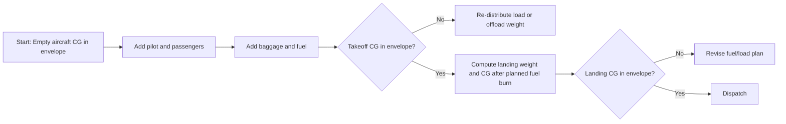
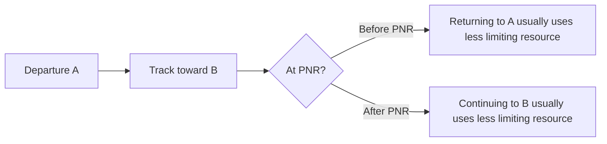
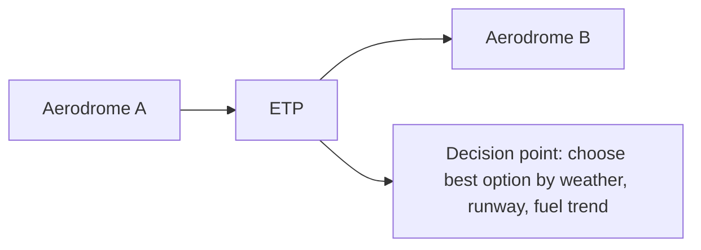
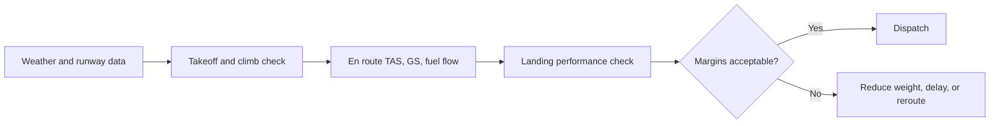

# Chapter 3 - Flight Performance and Planning

**Navigation:** [<- Previous Chapter 2](ch2_aircraft_general_knowledge_agk.md) | [Table of Contents](ppl_toc.md) | Chapter 3 | [Next -> Chapter 4](ch4_human_performance_and_limitations.md)

These notes are exam-focused for CASA PPL performance/planning. Use aircraft-specific POH/AFM charts and CASA regulatory assumptions exactly as stated in each scenario.

---

## 3.1 Performance Fundamentals

- Aircraft performance depends on four main groups:
  - Aerodynamics (lift/drag)
  - Propulsion (engine/propeller efficiency)
  - Environment (pressure altitude, temperature, wind, runway condition)
  - Mass/configuration (weight, CG, flap/gear state)
- Never use rule-of-thumb when a chart/table is provided.

---

## 3.2 Density Altitude and Why It Matters

<br />[Source](https://www.instagram.com/p/DXKgmDeEWZl/)

- High density altitude reduces:
  - Engine power
  - Propeller thrust
  - Wing lift at a given IAS (longer takeoff/landing distance due to TAS/ground speed effects)
- Typical causes: high temperature, high elevation, low pressure.
- Operational result:
  - Longer takeoff roll
  - Poorer climb rate and climb gradient
  - Reduced obstacle clearance margin.

---

## 3.3 Takeoff Performance

- Inputs to chart calculations commonly include:
  - Pressure altitude
  - OAT
  - Aircraft weight
  - Wind component
  - Runway slope/surface
  - Flap setting and obstacle requirement
- Distinguish:
  - Ground roll
  - Distance to 50 ft obstacle
- Apply corrections in required sequence per POH.

### High-yield planning checks
- Accelerate-stop and reject decision awareness (conceptual for PPL).
- Crosswind component compared against demonstrated or operational limits.
- Abort criteria before takeoff briefing.

### Real-life example 1: hot-day departure from inland aerodrome

- Scenario:
  - C172-type aircraft, two adults, near training-day fuel load.
  - Aerodrome elevation around 1,800 ft.
  - OAT 34 C by midday, light quartering tailwind on preferred runway.
  - Trees and rising terrain beyond departure end.
- Performance effect:
  - High temperature + elevation increases density altitude significantly.
  - Takeoff roll and distance to 50 ft obstacle both increase.
  - Initial climb gradient reduces, even if IAS targets are flown correctly.
- Practical decision:
  - Recompute using POH chart with actual OAT/wind/surface corrections.
  - If obstacle margin becomes thin, reduce weight (less fuel or baggage), wait for cooler time, or use a more favorable runway if available.
  - Brief a clear abort point (for example, "not airborne by X marker -> reject").

### Real-life example 2: short grass strip after overnight rain

- Scenario:
  - Light GA aircraft departing from a private strip.
  - Runway is short, grass surface, and still damp/soft after rain.
  - Light headwind appears favorable, but runway rolling resistance is high.
- Performance effect:
  - Ground roll can increase markedly on soft/wet grass even with headwind.
  - Acceleration is slower, so rotate point happens later than on sealed runway.
  - Obstacle clearance performance may become the limiting factor, not just lift-off.
- Practical decision:
  - Apply POH grass/soft-field corrections (if provided), or conservative margin if not explicitly charted.
  - Use soft-field technique exactly per POH and avoid performance assumptions from dry sealed runway operations.
  - If margins are weak, offload weight or delay departure until surface improves.

### Real-life example 3: crosswind-limited takeoff choice

- Scenario:
  - Adequate runway length, cool morning conditions.
  - Forecast and observed winds produce crosswind near pilot's personal limit.
  - Alternate runway has less crosswind but shorter available distance.
- Performance effect:
  - Longer runway does not help if controllability in crosswind is the main risk.
  - Shorter runway can still be acceptable if takeoff distance and obstacle margins remain valid.
- Practical decision:
  - Compare both options with the same disciplined process:
    - Crosswind component vs pilot/aircraft limit.
    - Takeoff and obstacle performance for actual runway.
    - Go/no-go trigger if tracking/control is unstable during roll.
  - Choose the runway that keeps both controllability and distance margins acceptable.

---

## 3.4 Climb and En Route Performance

- **Best angle (VX)** vs **best rate (VY)** purpose and trade-offs.
- Climb performance degrades with:
  - Altitude and temperature
  - Higher weight
  - Incorrect speed/mixture settings.
- Cruise planning:
  - TAS from performance chart
  - Fuel flow at selected power setting
  - Endurance and range computation.

---

## 3.5 Landing Performance

- Inputs similar to takeoff charts:
  - Weight
  - Pressure altitude
  - Temperature
  - Wind
  - Surface/slope
  - Flap/configuration
- Distinguish:
  - Landing ground roll
  - Distance over threshold obstacle.
- Add practical margins for runway condition, approach stability, and pilot technique variation.

### Real-life example 1: destination runway with wet surface

- Scenario:
  - Planned arrival at regional aerodrome with sealed runway.
  - Light rain has made the surface wet, with reported braking "fair."
  - Aircraft landing weight is near upper normal training range.
- Performance effect:
  - Wet surface generally increases landing roll and reduces braking effectiveness.
  - Even with legal distance, stopping margin can shrink quickly if touchdown is long.
- Practical decision:
  - Recalculate landing distance using POH correction and wet-runway margin policy.
  - Prioritize stabilized approach and touchdown in the aiming zone.
  - If expected margin is narrow, plan alternate with longer/drier runway before descent.

### Real-life example 2: tailwind temptation to avoid circuit delay

- Scenario:
  - Busy CTAF environment and pilot considers landing opposite preferred direction to save time.
  - Resulting tailwind component is small but non-zero.
- Performance effect:
  - Tailwind increases groundspeed at touchdown.
  - Landing roll increases disproportionately; float also tends to increase.
  - A "small" tailwind can erase safety margin on shorter strips.
- Practical decision:
  - Treat tailwind as a major performance penalty, not a convenience trade.
  - Use headwind runway unless operationally unsafe/impractical.
  - If tailwind landing is unavoidable, verify distance over obstacle and rollout margins with conservative buffer.

### Real-life example 3: unstable approach at otherwise suitable runway

- Scenario:
  - Runway length appears sufficient on paper.
  - On final, aircraft is high and slightly fast due to late descent setup.
  - Pilot is tempted to salvage landing because runway is "long enough."
- Performance effect:
  - Excess speed adds significant float distance and touchdown point moves down runway.
  - Actual landing distance can exceed chart assumption because POH numbers assume correct threshold crossing speed and technique.
- Practical decision:
  - Enforce stabilized approach gates.
  - If not stabilized by gate, go around early and set up again.
  - In real operations, approach quality is as important as chart math in landing distance outcomes.

---

## 3.6 Weight and Balance (W&B)

- Core formulas:
  - Moment = Weight x Arm
  - CG = Total Moment / Total Weight
- Verify:
  - MTOW and landing weight limits
  - Baggage/compartment limits
  - CG within envelope at each stage (takeoff/landing)
- Fuel burn shifts CG; check both departure and arrival conditions.

### CASA workbook exam convention
- AVGAS specific gravity commonly assumed as **0.72 kg/L** in exam workbook contexts.

### Graphical example: W&B loading and fuel-burn shift



### Worked W&B mini example (conceptual)

| Item | Weight (kg) | Arm (m) | Moment (kg-m) |
|---|---:|---:|---:|
| Empty aircraft | 680 | 2.30 | 1564.0 |
| Pilot + front passenger | 150 | 2.40 | 360.0 |
| Rear passenger | 70 | 3.20 | 224.0 |
| Baggage | 20 | 3.60 | 72.0 |
| Fuel at start | 90 | 2.20 | 198.0 |
| **Takeoff total** | **1010** | - | **2418.0** |

- Takeoff CG = 2418 / 1010 = **2.39 m** (must be checked against POH envelope).
- If 50 kg fuel is burned from a tank near arm 2.20 m:
  - Landing weight = 960 kg
  - Landing moment = 2418 - 110 = 2308 kg-m
  - Landing CG = 2308 / 960 = **2.40 m**
- Key point: CG moves with fuel burn; always verify both takeoff and landing conditions.

---

## 3.7 Fuel Planning and Reserves

- Fuel planning combines:
  - Taxi/start allowance
  - Trip fuel
  - Reserve/legal minima
  - Contingency/diversion as required by scenario
- Differentiate:
  - Fuel required by regulation
  - Operationally prudent uplift.
- For exam questions, apply stated policy basis (e.g., Part 91 assumptions if specified).

### How to construct a fuel plan (step-by-step)

1. Define route and timing assumptions:
   - Planned distance, forecast wind, cruising level, and expected groundspeed.
2. Calculate trip fuel:
   - Use planned time en route and cruise fuel flow from POH or school planning data.
3. Add fixed allowances:
   - Start/taxi/run-up fuel.
4. Add legally required reserve fuel:
   - Apply the exact regulatory or exam policy basis given in the question.
5. Add operational buffers:
   - Contingency for forecast uncertainty and practical rerouting.
6. Add alternate/diversion fuel if required by scenario:
   - Include approach, missed approach, and transit to alternate if applicable.
7. Compute total required fuel, then compare with usable onboard:
   - Confirm both volume and mass (if W&B is in kg).
8. Validate in-flight decision points:
   - Set minimum fuel checks by waypoint/time and define diversion triggers.

### Fuel plan example (PPL VFR training scenario)

- Assumptions:
  - Planned flight time: 2.0 hr
  - Cruise fuel flow: 32 L/hr
  - Taxi/start/run-up: 6 L
  - Regulatory reserve (example for study): 45 min at cruise flow
  - Contingency buffer: 10 L
- Calculation:
  - Trip fuel = 2.0 x 32 = 64 L
  - Reserve fuel = 0.75 x 32 = 24 L
  - Total required = taxi 6 + trip 64 + reserve 24 + contingency 10 = **104 L**
- Dispatch check:
  - If usable onboard is 120 L, margin above required = 16 L.
  - If forecast headwind increases and trip time rises by 20 min:
    - Extra trip fuel = 0.33 x 32 = 10.6 L
    - New total expected use = about 115 L
  - Decision: still legal in this example, but buffer is now thin, so set earlier diversion trigger.

### Fuel planning quick table

| Component | Formula/Method | Example value |
|---|---|---:|
| Taxi/start | Fixed allowance | 6 L |
| Trip | Time x fuel flow | 64 L |
| Reserve | Reserve time x fuel flow | 24 L |
| Contingency | Policy or operational buffer | 10 L |
| **Total required** | Sum of all components | **104 L** |

---

## 3.8 Navigation Log and Time/Fuel Management

- A navigation log (nav log) is the pilot's planning-and-monitoring worksheet that links:
  - Route geometry (track, distance)
  - Wind and speed assumptions (heading, groundspeed)
  - Time control (ETE/ETA)
  - Fuel control (leg fuel, cumulative burn, reserve status)
- At PPL exam level, nav log questions usually test:
  - Unit discipline (minutes vs hours, kt vs NM)
  - Time calculations from groundspeed
  - Fuel trend updates when actual GS differs from planned
  - Decision timing (continue, divert, or turn back)

### Key definitions (exam-useful)

- **Leg:** one segment between two waypoints.
- **Track (TRK):** planned path over the ground for a leg.
- **Heading (HDG):** direction flown after wind correction to maintain planned track.
- **Groundspeed (GS):** actual speed over the ground (kt).
- **ETE (Estimated Time En Route):** planned time for a leg.
- **ETA (Estimated Time of Arrival):** expected arrival time at a waypoint/destination.
- **ATO/ATA (Actual Time Over/Actual Time of Arrival):** observed real crossing/arrival time used for updates.
- **Fuel flow:** planned fuel consumption rate (e.g., L/hr).
- **Leg fuel:** fuel expected/used on one leg.
- **Cumulative fuel used:** total burned from departure to current point.
- **Fuel remaining:** usable fuel onboard after cumulative burn.
- **Endurance:** time remaining at current/assumed fuel flow.

### Standard nav log construction workflow

1. Enter leg distance and planned track for each waypoint pair.
2. Apply forecast wind to obtain heading and planned GS.
3. Compute leg ETE from distance and GS.
4. Build ETAs from departure time plus cumulative ETE.
5. Compute planned leg fuel and cumulative planned fuel.
6. Carry forward planned fuel remaining and reserve check at each waypoint.

### Worked example 1: preflight nav log timing and fuel

- Scenario assumptions:
  - Departure time: 0930 UTC
  - Cruise fuel flow: 30 L/hr
  - Leg 1 distance: 48 NM, planned GS: 96 kt
  - Leg 2 distance: 72 NM, planned GS: 90 kt
- Calculations:
  - Leg 1 ETE = 48 / 96 = 0.50 hr = 30 min
  - Leg 2 ETE = 72 / 90 = 0.80 hr = 48 min
  - Destination ETA = 0930 + 30 + 48 = **1048 UTC**
  - Leg 1 fuel = 0.50 x 30 = 15 L
  - Leg 2 fuel = 0.80 x 30 = 24 L
  - Trip fuel total = **39 L**
- Exam point: keep minutes and decimal hours consistent; many errors come from mixing them.

### Worked example 2: in-flight groundspeed update

- Actual at first waypoint:
  - Planned ATO: 1000 UTC
  - Actual ATO: 1008 UTC (8 minutes late)
- Interpretation:
  - Actual GS on Leg 1 was lower than planned.
  - Remaining legs should be recalculated, not left as original plan.
- Quick update method (ratio approach):
  - Planned Leg 1 time = 30 min, actual = 38 min
  - Time ratio = 38/30 = 1.27 (about 27 percent slower than planned)
  - Apply caution: full ratio is a rough estimate only; best practice is recalc with current wind/GS estimate.
- If remaining planned time was 48 min:
  - Rough revised remaining = 48 x 1.27 = 61 min
  - Revised ETA about 1008 + 61 = **1109 UTC**
- Fuel effect at 30 L/hr:
  - Extra 13 min = 0.22 hr
  - Extra fuel about 0.22 x 30 = **6.6 L**
- Decision point:
  - Compare revised fuel-on-arrival against required reserve.
  - If reserve trend is eroding, divert early while options remain.

### Worked example 3: reserve protection decision trigger

- Scenario:
  - Usable fuel at departure: 110 L
  - Taxi/start: 5 L
  - Planned trip: 2.4 hr at 30 L/hr -> 72 L
  - Required reserve for scenario: 45 min -> 22.5 L
- Planned fuel on arrival:
  - 110 - 5 - 72 = **33 L** (reserve protected with 10.5 L margin)
- In-flight deterioration:
  - New expected trip time: 2.9 hr -> 87 L trip fuel
  - New expected arrival fuel: 110 - 5 - 87 = **18 L**
- Outcome:
  - Expected arrival fuel is now below required reserve (22.5 L).
  - Correct PPL-theory answer: **do not continue as planned; divert or adjust immediately**.

### Common nav log exam traps

- Using TAS where GS is required for time calculation.
- Forgetting to convert minutes to decimal hours for fuel math.
- Updating ETA but forgetting to update fuel and reserve status.
- Continuing to destination after reserve erosion is already evident.
- Rounding too early and compounding error across multiple legs.

---

## 3.9 ETP/PNR and Diversion Concepts (PPL level)

- **PNR**: point where continuing and returning have equivalent limiting resource outcome (often fuel/time logic).
- **ETP**: equal-time point between two alternates or destinations.
- These are planning/risk tools that help trigger timely diversion decisions.

### Graphical example: PNR logic on a two-way route



### Graphical example: ETP between two aerodromes



### Practical mini example (time-based ETP)

- Distance A to B: 180 NM.
- Groundspeed toward B: 90 kt.
- Groundspeed back to A (with headwind): 75 kt.
- Let distance from A to ETP be `x`.
- Time to continue from ETP to B = (180 - x) / 90.
- Time to return from ETP to A = x / 75.
- At ETP, times are equal:
  - (180 - x) / 90 = x / 75
  - x = about 82 NM from A.
- Use: before 82 NM, return may be faster; after 82 NM, continue may be faster (subject to weather/runway/fuel constraints).

---

## 3.10 Key Definitions and Practical Examples

- **Density altitude:** pressure altitude corrected for non-standard temperature; indicates "how the aircraft feels" aerodynamically.
  - Example: hot day at inland aerodrome can create DA much higher than field elevation, degrading climb.
- **Takeoff distance over 50 ft:** total distance from brake release to crossing 50 ft.
  - Example: runway that appears long enough for ground roll may still be insufficient for obstacle-clearance requirement.
- **CG envelope:** approved center-of-gravity range for safe controllability/stability.
  - Example: aft-loaded aircraft may rotate easily but become unstable and harder to recover near stall.
- **Reserve fuel:** legally required minimum fuel carried beyond trip fuel.
  - Example: if forecast headwind increases en route, reserve may be eroded and diversion should be made early.
- **Crosswind component:** wind component perpendicular to runway heading.
  - Example: runway headwind may still include high crosswind that exceeds pilot or aircraft limits.

### Scenario: high DA departure decision

- Planned departure at midday, high temperature, near-max weight, rising terrain ahead.
- Safer action: reduce weight and/or depart in cooler period, then recompute takeoff and climb gradient using POH charts.

---
## 3.11 Common Exam Traps

- Mixing units (kg/lb, L/gal, kt/km/h, ft/m).
- Using IAS when TAS/GS is required for timing.
- Applying wind correction sign incorrectly (headwind/tailwind).
- Forgetting slope/surface corrections.
- Checking CG only at departure, not at landing.
- Confusing legal reserve with target reserve.

---

## 3.12 Rapid Revision Checklist (Pre-Exam)

- Can compute takeoff and landing distance from a multi-step chart.
- Can explain density altitude impact without memorized myths.
- Can complete W&B and verify CG at all stages.
- Can produce a full nav log with fuel/endurance checks.
- Can apply stated legal fuel policy assumptions in scenario questions.

---

## 3.13 Formula Pack and Graphics

### Core formulas

```text
Time (hr) = Distance (NM) / GS (kt)
```

```text
Fuel used = Fuel flow × Time
```

```text
Groundspeed = Distance / Time
```

```text
Moment = Weight × Arm
```

```text
CG = Sum(moments) / Sum(weights)
```

### Useful conversion and planning formulas

```text
Fuel mass (kg) ≈ Fuel volume (L) × SG
```

For CASA workbook style AVGAS assumptions:

```text
Fuel mass (kg) ≈ Fuel volume (L) × 0.72
```

_(Plain-text formulas render reliably on GitHub Pages; math plugins are not required.)_

### Graphic: performance planning flow



### Performance sensitivity table

| Parameter change | Takeoff roll | Climb rate | Landing distance |
|---|---|---|---|
| Higher temperature | Increases | Decreases | Usually increases |
| Higher pressure altitude | Increases | Decreases | Usually increases |
| Higher weight | Increases | Decreases | Increases |
| Tailwind | Increases significantly | N/A climb after takeoff | Increases significantly |
| Wet/soft runway | Increases | N/A | Increases |

---

## References (Primary)

- FAA PHAK (especially performance and W&B chapters): <https://www.faa.gov/regulations_policies/handbooks_manuals/aviation/phak>
- CASA RPL/PPL/CPL Aeroplane Workbook: <https://www.casa.gov.au/rpl-ppl-and-cpl-aeroplane-workbook>
- ICAO Doc 8168 (PANS-OPS, procedural context): <https://www.icao.int/>
- EASA Easy Access Rules (Air Operations): <https://www.easa.europa.eu/en/document-library/easy-access-rules>

---

**Navigation:** [<- Previous Chapter 2](ch2_aircraft_general_knowledge_agk.md) | [Table of Contents](ppl_toc.md) | Chapter 3 | [Next -> Chapter 4](ch4_human_performance_and_limitations.md)

