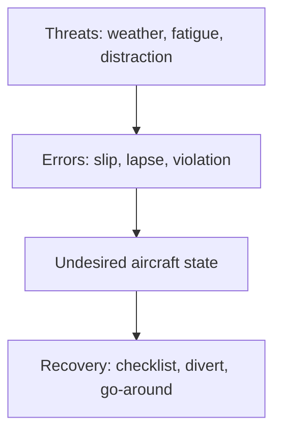
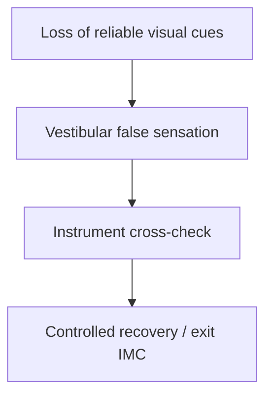
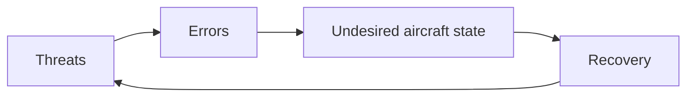
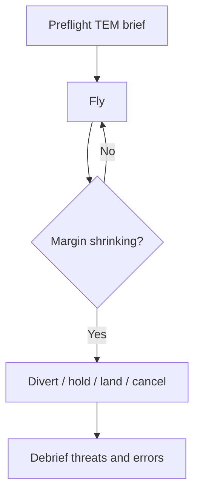
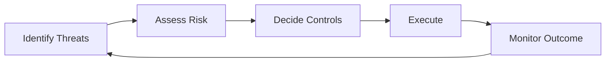

# Chapter 4 - Human Performance and Limitations

**Navigation:** [<- Previous Chapter 3](ch3_flight_performance_and_planning.md) | [Table of Contents](ppl_toc.md) | Chapter 4 | [Next -> Chapter 5](ch5_meteorology.md)

These notes are exam-focused for CASA PPL human factors. They connect physiology, psychology, and practical in-flight decision making.

### How to use this chapter

| Label | Meaning |
|---|---|
| **CASA Primary** | CASA safety publications, exam scenario culture (TEM, CRM, conservative decisions) |
| **PHAK Secondary** | FAA PHAK aeromedical and ADM chapters for physiology and illusion theory |

**Study habits:** For each illusion or stressor, learn **one cockpit countermeasure**, not just the name. **Sketch** a TEM loop (threat → error → state → recovery) for a scenario you flew recently.

---

## 4.1 Human Factors Big Picture

> **Why this matters**
>
> Most PPL accidents involve **decision and human performance** — exams test whether you recognise threats early and choose recovery (divert, go-around, land) over continuation.

**Definition — human factors:** study of how people interact with systems (aircraft, weather, ATC, procedures); in aviation, focus on reducing human-error-related accidents.

### Why this subject matters for PPL

| Fact | Implication for pilots |
|---|---|
| Most accidents involve human factors | Technical skill alone is insufficient |
| Limitations are predictable | Fatigue, stress, and illusion can be managed with systems |
| Performance changes in flight | Same pilot may be sharp preflight and degraded on late approach |

### Defences (exam-friendly list)

- **Checklists and SOPs** — reduce memory errors.
- **Briefings** — threat and error anticipation (TEM).
- **Margins** — personal minima above legal limits.
- **CRM / TEM** — even single-pilot: brief threats, trap errors, use all resources (see §4.6 and §4.9).

- [CASA — safety management / human factors](https://www.casa.gov.au/safety-management)
- [FAA PHAK — aeronautical decision-making](https://www.faa.gov/regulations_policies/handbooks_manuals/aviation/phak/chapter-2-aeronautical-decision-making)
- [ICAO — human factors](https://www.icao.int/safety/humanfactors)



---

## 4.2 Physiology and Altitude Effects

> **Ask yourself:** Tingling fingers and dizziness after stress — hypoxia or **hyperventilation**? What is the **first** treatment for each?

**Definition — hypoxia:** insufficient oxygen reaching body tissues to function normally.

### Hypoxia types (conceptual — PPL level)

| Type | Cause (simplified) | Example context |
|---|---|---|
| **Hypoxic** | Reduced partial pressure of oxygen at altitude | Unpressurized flight without supplemental O2 |
| **Hypemic** | Reduced oxygen-carrying capacity of blood | Carbon monoxide exposure (exhaust leak) |
| **Stagnant / histotoxic** | Awareness for theory | Less emphasis at PPL; know names exist |

### Hypoxia signs (often subtle early)

- Poor judgment, euphoria (“I feel fine”), cyanosis (late), headache, visual narrowing, slowed reactions.
- **Danger:** pilot may not recognize impairment — use altitude limits, oxygen, and descent per POH/regulations.

### Hyperventilation

**Definition:** abnormally rapid/deep breathing lowering **CO2**, causing dizziness, tingling, muscle spasm, anxiety.

| | Hypoxia | Hyperventilation |
|---|---|---|
| Typical trigger | Altitude, CO | Stress, fear, high workload |
| Key fix | Descend, O2 if fitted | Slow controlled breathing, reduce workload |
| Exam trap | Symptoms overlap | Do not only descend if cause is anxiety at low altitude |

### Trapped gas (barotrauma risk)

- **Ears / sinuses:** cannot equalize → pain, vertigo risk.
- **GI / teeth:** expansion on climb, discomfort.
- **Rule:** do not fly with blocked sinuses, ear infection, or unresolved dental/air trapping issues.

### Decompression sickness (awareness)

- Associated with rapid altitude decrease in pressurized context or diving before flying.
- PPL relevance: **“don't fly after diving”** and understand pressurization is uncommon in basic training aircraft.

- [FAA PHAK — aeromedical factors](https://www.faa.gov/regulations_policies/handbooks_manuals/aviation/phak/chapter-17-aeromedical-factors)
- [CASA — medical certification](https://www.casa.gov.au/licences-and-certification/medical)

---

## 4.3 Vision and Night/Low-Contrast Performance

### Day vs night vision

| Feature | Day (photopic) | Night (scotopic) |
|---|---|---|
| Retina region | Central (cones) — detail, colour | Peripheral (rods) — movement, low light |
| Scan technique | Direct look at object | Off-centre viewing for dim objects |
| Adaptation | Seconds | ~20–30 min full dark adaptation |

**Definition — dark adaptation:** increased sensitivity after time in low light; destroyed by bright white light (use red lighting where possible).

### Common visual illusions

| Illusion | Definition | Trigger | Countermeasure |
|---|---|---|---|
| **Empty field myopia** | Eyes focus at ~1–2 m with no detail | Featureless haze/over water | Structured scan, instruments |
| **Autokinesis** | Stationary light appears to move | Single light at night | Cross-check with instruments / other references |
| **False horizon** | Sloping cloud or terrain mistaken for horizon | Night, haze | Trust attitude instrument |
| **Black-hole approach** | Approach over dark terrain feels too high | Few ground lights | Stabilized profile, VASI/PAPI, instruments |

### Practical actions

- Structured **instrument and external scan**.
- **Stable approach criteria** (Chapter 7).
- Avoid fixation; brief approach lighting and terrain.

- [FAA PHAK — vision](https://www.faa.gov/regulations_policies/handbooks_manuals/aviation/phak/chapter-17-aeromedical-factors)

---

## 4.4 Spatial Disorientation and Vestibular Illusions

**Definition — spatial disorientation:** failure to sense aircraft attitude, motion, or altitude correctly; **vestibular system** (inner ear) can mislead when visual cues are weak.

### Why vestibular cues fail in flight

- Prolonged turns, accelerations, and decelerations are not sensed accurately without visual reference.
- **IMC / night** — high risk if pilot relies on body sensations instead of instruments.

### Common illusions

| Illusion | What you feel | What is true | Countermeasure |
|---|---|---|---|
| **The leans** | Wings level after unnoticed bank | Still in bank | Level using attitude instrument |
| **Coriolis** | Strong tumbling after head movement in turn | Conflicting canal signals | Avoid abrupt head movement; trust instruments |
| **Somatogravic** | Pitch-up sensation on acceleration | Level or climbing less than felt | Cross-check attitude and airspeed |
| **Graveyard spiral** | Sustained undetected bank feels “normal” | Turning and losing height | Instrument scan; recover to straight and level |

### Core countermeasures

1. **Trust validated instruments** (AI, turn coordinator, altimeter, airspeed).
2. **Instrument scan discipline** — regular, ordered pattern.
3. **Avoid abrupt head movement** in IMC/night.
4. If inadvertently in IMC: **180° turn / climb to VMC** per training and regulations (Chapter 1 / 7).

- [FAA PHAK — spatial disorientation](https://www.faa.gov/regulations_policies/handbooks_manuals/aviation/phak/chapter-17-aeromedical-factors)



---

## 4.5 Stress, Fatigue, and Workload

> **Real-world application**
>
> A “legal” duty day after poor sleep still produces **tunnel vision** and checklist slips — personal minimums should include rest, not just hours.

> **Ask yourself:** Are you fixing problems faster than new ones appear? That is rising **workload** — simplify (vectors, divert, land).

**Definition — stress:** body’s response to perceived demand or threat; **acute** (short-term) vs **chronic** (ongoing).

**Definition — fatigue:** decreased capacity due to sleep loss, long duty, or cumulative flying over days.

**Definition — workload:** perceived demand vs available mental capacity; overload causes errors.

| Factor | Typical effect | Management |
|---|---|---|
| **Acute stress** | Tunnel vision, rushed decisions | Aviate–navigate–communicate; simplify tasks |
| **Chronic stress** | Reduced baseline judgment | Rest, avoid flying when overloaded in life |
| **Fatigue** | Slow reactions, missed checklist items | Sleep, limit duty, cancel or divert |
| **High workload** | Task shedding, fixation | Delay tasks, use passenger, go-around |

### Fatigue — types and signs (exam-useful)

| Type | Cause | Signs |
|---|---|---|
| **Acute** | Short sleep, long day | Yawning, micro-sleeps, irritability |
| **Cumulative** | Several poor nights | Slower decisions, normalised risk |
| **Circadian** | Early start / late finish | Low alertness at body-clock lows |

- Fatigue degrades: scan quality, radio discipline, weather interpretation, willingness to divert.

### Stress and decision pressure

| Pressure source | Effect on decisions |
|---|---|
| Schedule / passengers | **Plan continuation bias** — press on when unsafe |
| Cost / pride | Reluctance to divert or cancel |
| Recent experience | “It was fine last time” underestimation |
| Getting close to goal | **Get-there-itis** — destination pull overrides margins |

### Real scenario: get-there-itis on a marginal VFR day

**Setup**

- Saturday flight to a coastal aerodrome for a family event; return same day.
- Morning TAF: **BECMG** lower cloud afternoon; alternate aerodrome 30 NM inland has better forecast.
- Preflight: legal VMC at departure and ETA, but **personal minima** only just met.

**En route (threats building)**

| Time | Observation | TEM view |
|---|---|---|
| +45 min | Scattered cloud lowering; vis 8 km | **Threat:** deteriorating trend |
| +60 min | Passenger: “We’ll make it, right?” | **Threat:** social pressure |
| +75 min | METAR at destination: BKN025, vis 5 km | **Threat:** approaching personal limits |
| Pilot thought | “If I turn back now I disappoint everyone” | **Error precursor:** plan continuation |

**Hazardous attitudes likely involved**

- **Plan continuation / invulnerability:** “It’ll clear before we get there.”
- **Macho:** “I can handle a bit of cloud.”
- **Anti-authority (soft):** ignoring own written minima because “legal is OK.”

**Better ADM / TEM outcome**

1. **Perceive** trend (METAR sequence, not single snapshot).
2. **Process** options: divert inland now vs hold vs turn back vs enter deteriorating coastal strip.
3. **Perform:** **Divert early** to inland alternate with stable weather; notify event hosts; preserve fuel and options.
4. **Trap error:** briefed **decision point** before departure (“if destination BKN below X or vis below Y → alternate Z”).

**Exam answer pattern:** identify get-there-itis + name threats + state **divert/land/cancel** as correct action, not “continue because still legal.”

### Real scenario: fatigue after a long training day

- Dual student and instructor on third flight of day; last circuit approach.
- Symptoms: slow radio calls, floated landing, missed checklist item.
- Correct action: **terminate flying**, debrief on ground; instructor models **no further circuits** when fatigued.
- Link: fatigue → **error** → **undesired state** (unstable approach) → **recovery** (go-around if airborne, stop flying if not).

### Real scenario: acute stress after weather surprise

- En route VFR, unexpected build-up ahead; pilot feels chest tight and rushes frequency changes.
- Risk: **hyperventilation** (Ch 4.2) + fixation.
- Correct: aviate, fly clear of weather, **controlled breathing**, simplify — one problem at a time; consider **PAN PAN** if needed (Ch 1).

### Prioritization (exam standard)

1. **Aviate** — aircraft control first.
2. **Navigate** — position and terrain.
3. **Communicate** — when workload allows.

- [FAA PHAK — stress and fatigue](https://www.faa.gov/regulations_policies/handbooks_manuals/aviation/phak/chapter-17-aeromedical-factors)

---

## 4.6 Decision Making and Error Management

> **CASA Primary:** TEM/CRM in scenario answers (threat → error → undesired state → **recovery**). **PHAK Secondary:** DECIDE and hazardous-attitude models.

**Definition — ADM (aeronautical decision-making):** structured process to make safe choices under pressure.

### DECIDE model (example framework)

| Step | Meaning | Pilot action |
|---|---|---|
| **D**etect | Notice a change or hazard | Weather, traffic, system fault |
| **E**stimate | Assess significance | Threat to safety? |
| **C**hoose | Options | Continue, divert, land, go-around |
| **I**dentify | Best solution | Match to margins and skill |
| **D**o | Execute | Commit without delay when needed |
| **E**valuate | Did it work? | Reassess continuously |

### 3P model (Perceive — Process — Perform)

- **Perceive** hazards.
- **Process** impact and options.
- **Perform** best action and monitor.

### TEM (Threat and Error Management) — core framework

**Definition — TEM:** proactive method to identify **threats**, prevent or trap **errors**, and avoid **undesired aircraft states** before they become accidents.



| TEM element | Definition | Examples |
|---|---|---|
| **Threat** | Condition that increases risk if unmanaged | Weather, terrain, fatigue, short runway, passenger pressure |
| **Error** | Pilot action/inaction that reduces margin | Skipped checklist, late divert, wrong fuel tank |
| **Undesired aircraft state** | Aircraft in a risky but recoverable condition | Low fuel, unstable approach, inadvertent IMC |
| **Recovery** | Deliberate action restoring margin | Go-around, divert, level-off, PAN PAN |

### Threat categories (single-pilot)

| Category | Examples | Management |
|---|---|---|
| **Environmental** | Wind, cloud, icing, density altitude | Briefing, personal minima, alternates |
| **Organizational / external** | Schedule pressure, school test deadline | Say no; reschedule |
| **Personal** | Fatigue, stress, illness | IM SAFE; cancel |
| **Latent (hidden)** | Out-of-date chart, unfamiliar aerodrome | Preflight discipline |

### Error types (conceptual — exam awareness)

| Type | Description | Example |
|---|---|---|
| **Slip** | Skill-based mistake — right idea, wrong execution | Flipped switch |
| **Lapse** | Memory failure | Missed fuel selector check |
| **Violation** | Deliberate deviation from procedure | Skipping run-up “this time” |

### TEM countermeasures

| Strategy | What it means |
|---|---|
| **Avoid** | Do not launch into threat (cancel flight) |
| **Trap** | Checklist, SOP, passenger challenge phrase |
| **Mitigate** | Extra margin (fuel, wider weather) |
| **Recover** | Go-around, divert, 180° out of IMC |

### Situational awareness (SA)

```text
SA = perception + comprehension + projection
```

- **Perception:** notice raw data (cloud lowering, fuel, traffic).
- **Comprehension:** understand what it means for your flight.
- **Projection:** anticipate what happens next if you do nothing.

### TEM + CRM together (single-pilot)

- **CRM** uses people and tools; **TEM** structures how you think about risk.
- Single-pilot: **you** are both crew members — use **self-brief**, **spoken callouts**, and **written decision triggers** (see §4.9).

- [FAA PHAK — ADM](https://www.faa.gov/regulations_policies/handbooks_manuals/aviation/phak/chapter-2-aeronautical-decision-making)
- [CASA — safety management](https://www.casa.gov.au/safety-management)

---

## 4.7 Hazardous Attitudes and Antidotes

**Definition — hazardous attitude:** habitual thought pattern that leads to poor risk assessment.

| Attitude | Typical behaviour | Antidote (FAA mnemonic) |
|---|---|---|
| **Anti-authority** | “Don't tell me what to do” | Follow the rules — they are usually right |
| **Impulsivity** | “Do something fast now” | Not so fast — think first |
| **Invulnerability** | “It won't happen to me” | It could happen to me |
| **Macho** | “I can handle anything” | Taking chances is foolish |
| **Resignation** | “What's the use?” | I'm not helpless — I can make a difference |

### Exam technique

- Read scenario dialogue or actions → match attitude → state antidote and safer behaviour.

### Example

- Pilot ignores forecast crosswind limit: **macho / invulnerability** → antidote: take chances is foolish / it could happen to me → cancel or use experienced instructor/wait for conditions.

---

## 4.8 Medical Fitness, Substances, and Self-Assessment

**Definition — medical fitness:** physical and mental state suitable for safe flight; includes CASA medical certificate requirements and day-of-flight self-assessment.

### Substances and performance

| Substance / condition | Effect | Guidance |
|---|---|---|
| **Alcohol** | Impaired judgment, coordination | Legal limits and “bottle to throttle” rules — know current CASA requirements |
| **Sedatives / sleeping aids** | Residual drowsiness | Do not fly until fully clear per medical advice |
| **Antihistamines** | Drowsiness (many “sedating” types) | Use non-sedating only if approved for flying |
| **Pain medication** | Variable — opioids impair | Medical advice before flying |
| **Dehydration** | Headache, reduced concentration | Drink water; limit caffeine excess |
| **Heat stress** | Fatigue, irritability | Hydrate, ventilate, delay flight |

### IM SAFE checklist (personal preflight)

| Letter | Check |
|---|---|
| **I**llness | Am I sick or infectious? |
| **M**edication | New or affecting drugs? |
| **S**tress | Life/work stress overwhelming? |
| **A**lcohol | Within limits and fit? |
| **F**atigue | Adequate sleep? |
| **E**ating / emotion | Fed, hydrated, emotionally stable? |

- [CASA — medical certification](https://www.casa.gov.au/licences-and-certification/medical)
- [FAA PHAK — aeromedical](https://www.faa.gov/regulations_policies/handbooks_manuals/aviation/phak/chapter-17-aeromedical-factors)

---

## 4.9 CRM and TEM in Single-Pilot Operations

**Definition — CRM (Crew Resource Management):** disciplined use of **all available resources** — people, information, equipment, and procedures — to make safe decisions and manage workload.

**Definition — SRM (Single-Pilot Resource Management):** CRM applied when you are the only pilot; you must actively manage **yourself** as well as external resources.

> **Exam point:** CRM and TEM are **not** only for airliners. CASA PPL scenarios expect you to use both on a solo VFR flight.

### Why single-pilot CRM matters

| Without CRM | With CRM |
|---|---|
| Silent fixation on problem | Verbalise: “Aviate, then navigate” |
| Passenger distraction ignored | Brief passenger roles before flight |
| Reluctance to use ATC | Request traffic/weather when unsure |
| Pride blocks divert | Pre-briefed triggers make divert “normal” |

### CRM resources for the solo PPL pilot

| Resource | Single-pilot use | TEM link |
|---|---|---|
| **Yourself (two roles)** | Self-challenge: “What am I missing?” | Trap errors |
| **Passengers** | Lookout, time check, don’t distract on final | Reduce workload; manage social **threat** |
| **ATC / FIS / NAIPS** | Weather updates, SAR awareness | Environmental threat data |
| **Checklists / SOPs** | Standardise high-risk phases | Trap slips and lapses |
| **Avionics / GPS** | Navigation backup — cross-check chart | Mitigate nav error |
| **Personal minima** | Written limits stricter than legal | Avoid threats before launch |
| **Ground support** | Instructor, mentor by phone on long trips | Decision support |

### Single-pilot CRM techniques

1. **Brief out loud** — threats, alternates, max crosswind, fuel triggers (even alone).
2. **Passenger briefing** — sterile cockpit on final; “tell me if you see traffic or cloud.”
3. **Decision altitudes/times** — “If not visual by X, divert to Y.”
4. **Challenge phrase** — passenger or self: “Is this still within minima?”
5. **Use ATC** — not a failure to ask for help; professional resource.
6. **After-action review** — what threatened, what errors were close, what to change.

### TEM workflow for a typical solo cross-country

| Phase | Threats to brief | Error traps | Recovery plan |
|---|---|---|---|
| Preflight | Weather trend, fatigue, short runway | Rushed preflight | Cancel/delay |
| Taxi / takeoff | Crosswind, distraction | Skipped checks | Abort |
| En route | Enclosed cloud, fuel headwind | Late divert decision | 180°, land, PAN |
| Approach | Unstable, get-there-itis | Press-on below minima | Go-around, alternate |
| Landing | Traffic, runway length | Long float | Go-around |



### CRM + hazardous attitudes

- Passenger pressure + schedule → combine **CRM assertiveness** with antidotes (§4.7).
- Example script: “We’re diverting to Camden for weather — safety decision, not negotiable in flight.”

### Real scenario: using CRM to beat get-there-itis

- Before flight: write on nav log — **“If dest BKN < 3000 ft or vis < 8 km → divert to XYZ.”**
- En route: passenger monitors time; pilot gets METAR via phone/ATC.
- Trigger hit: pilot announces diversion — uses **ATC** for traffic clearance to alternate.
- **TEM recovery** before **undesired state** (scud running or fuel-low trap at coast).

- [CASA — safety management / human factors](https://www.casa.gov.au/safety-management)
- [FAA PHAK — aeronautical decision-making / SRM](https://www.faa.gov/regulations_policies/handbooks_manuals/aviation/phak/chapter-2-aeronautical-decision-making)

---

## 4.10 Key Definitions and Practical Examples

### Core definitions (revision table)

| Term | Definition |
|---|---|
| **Hypoxia** | Insufficient oxygen to tissues |
| **Hyperventilation** | Over-breathing lowering CO2; mimics hypoxia |
| **Spatial disorientation** | Incorrect sense of attitude/motion |
| **Situational awareness** | Perceive, understand, and anticipate |
| **TEM** | Manage threats and errors before undesired state |
| **CRM / SRM** | Use all resources; single-pilot includes self-management |
| **Get-there-itis** | Pressure to reach destination despite shrinking margins |
| **Plan continuation bias** | Tendency to continue original plan despite new risks |
| **Hazardous attitude** | Risk-increasing mindset pattern |

### Practical examples

**Hypoxia**

- At altitude without oxygen, pilot feels unusually confident and skips checklist → descend, use O2 per POH, land if needed.

**Hyperventilation**

- After weather scare, rapid breathing and tingling fingers at 2,000 ft → slow breathing, calm workload, confirm with pulse oximeter if available.

**Situational awareness**

- En route, pilot notes cloud base lowering on successive METARs → diverts before destination becomes trapped.

**TEM**

- Threat: fatigue + crosswind. Error trap: brief earlier go-around gate and stricter personal crosswind limit.

**Get-there-itis (marginal VFR)**

- Coastal event deadline; weather trending down; correct action: **divert early** using pre-briefed trigger — not “press on because still legal.”

**CRM (single-pilot)**

- Use passenger for METAR readout and time checks; call FIS for trend; verbalise divert decision — resources reduce solo bias.

**Hazardous attitude**

- “I've done this strip at night before, always fine” → invulnerability → reassess with current weather and recency.

### Scenario: illusion management

- Night approach over dark terrain; sensation of being too high.
- Correct response: trust **attitude instrument** and **stabilized approach criteria**; do not chase false visual picture.

- Cross-reference: Chapter 7 (stabilized approach, go-around).

---

## 4.11 Pre-Exam Revision (Must Know · Nice to Know · Common Traps)

> **Sketch it:** TEM loop for one real flight; table of four illusions with **instrument countermeasure** each.

### Must know

- Hypoxia vs hyperventilation signs and **different** immediate actions.
- At least four spatial/visual illusions and cockpit mitigations.
- TEM: threat → error → undesired state → **recovery** (go-around, divert, land).
- CRM/SRM for **single-pilot** (resources, sterile cockpit, self-brief).
- Get-there-itis and plan continuation — scenario answer usually **do not continue**.
- Hazardous attitudes and antidotes.

### Nice to know

- DECIDE model; Endsley situational awareness formula.
- G-force, spatial disorientation detail beyond PPL core.
- Personal minimums framework (legal + personal + dynamic).

### Common traps

- Confusing hyperventilation treatment with hypoxia treatment.
- Memorizing illusion names without countermeasures.
- Assuming confidence equals competence under stress.
- Ignoring cumulative fatigue over multiple days.
- Answering “continue” when scenario shows **get-there-itis**.
- Treating **CRM** as multi-crew only.
- Confusing **threat** (external) with **error** (pilot mistake).
- Forgetting **recovery** after undesired state.

---

## 4.12 Graphics and Quick Reference Tables

### Graphic: TEM and ADM loop



### Human performance degradation cues

| Domain | Early cue | Likely effect if unmanaged | Practical countermeasure |
|---|---|---|---|
| Fatigue | Slower thinking, fixation | Procedural errors | Slow down, checklist discipline, reduce workload |
| Stress | Tunnel vision | Poor prioritization | Aviate-navigate-communicate reset |
| Hypoxia risk | Poor judgment, euphoria | Decision quality collapse | Descend, oxygen as fitted, reassess |
| Hyperventilation | Tingling, dizziness | Loss of control precision | Controlled breathing and task simplification |

### Night illusion countermeasure table

| Illusion | Typical trigger | Primary correction |
|---|---|---|
| Autokinesis | Isolated light at night | Move scan, confirm with instruments |
| False horizon | Sloping cloud/terrain lights | Trust attitude instrument |
| Black-hole approach | Dark approach environment | Stabilized profile and instrument cross-check |
| The leans | Slow unnoticed bank changes | Instrument scan discipline |

### Personal minimums framework (example)

1. Legal minimums (non-negotiable baseline).
2. Personal margins (wind, visibility, workload).
3. Dynamic factors (fatigue, recent experience, stress).
4. Trigger point for no-go or diversion.

### Formula pack (conceptual)

Endsley-style situational awareness (exam overview):

```text
SA = perception + comprehension + projection
```

---

## References

### CASA Primary

- CASA safety publications and human factors guidance: <https://www.casa.gov.au/safety-management>
- CASA RPL/PPL/CPL Aeroplane Workbook (scenario conventions): <https://www.casa.gov.au/rpl-ppl-and-cpl-aeroplane-workbook>

### PHAK Secondary / supplementary

- FAA PHAK (ADM and aeromedical sections): <https://www.faa.gov/regulations_policies/handbooks_manuals/aviation/phak>
- ICAO Human Factors digest resources: <https://www.icao.int/safety/humanfactors>
- EASA pilot human factors resources: <https://www.easa.europa.eu/>

---

**Navigation:** [<- Previous Chapter 3](ch3_flight_performance_and_planning.md) | [Table of Contents](ppl_toc.md) | Chapter 4 | [Next -> Chapter 5](ch5_meteorology.md)

