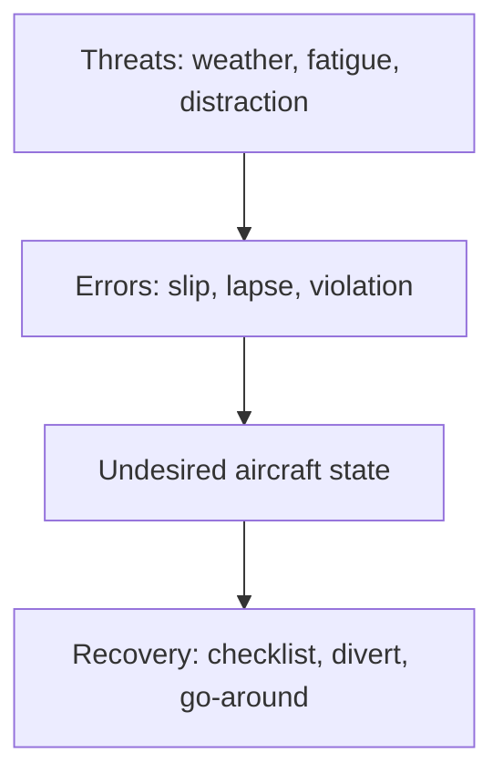
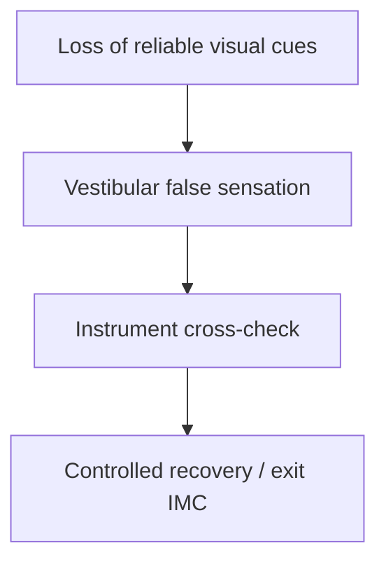
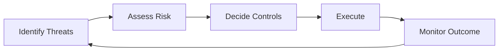

# Chapter 4 - Human Performance and Limitations

**Navigation:** [<- Previous Chapter 3](ch3_flight_performance_and_planning.md) | [Table of Contents](ppl_toc.md) | Chapter 4 | [Next -> Chapter 5](ch5_meteorology.md)

These notes are exam-focused for CASA PPL human factors. They connect physiology, psychology, and practical in-flight decision making.

---

## 4.1 Human Factors Big Picture

**Definition — human factors:** study of how people interact with systems (aircraft, weather, ATC, procedures); in aviation, focus on reducing human-error-related accidents.

### Why this subject matters for PPL

| Fact | Implication for pilots |
|---|---|
| Most accidents involve human factors | Technical skill alone is insufficient |
| Limitations are predictable | Fatigue, stress, and illusion can be managed with systems |
| Performance changes in flight | Same pilot may be sharp preflight and degraded on late approach |

### Defences (exam-friendly list)

- **Checklists and SOPs** — reduce memory errors.
- **Briefings** — threat and error anticipation (TEM).
- **Margins** — personal minima above legal limits.
- **CRM** — even single-pilot: use resources, communicate, delegate lookout.

- [CASA — safety management / human factors](https://www.casa.gov.au/safety-management)
- [FAA PHAK — aeronautical decision-making](https://www.faa.gov/regulations_policies/handbooks_manuals/aviation/phak/chapter-2-aeronautical-decision-making)
- [ICAO — human factors](https://www.icao.int/safety/humanfactors)



---

## 4.2 Physiology and Altitude Effects

**Definition — hypoxia:** insufficient oxygen reaching body tissues to function normally.

### Hypoxia types (conceptual — PPL level)

| Type | Cause (simplified) | Example context |
|---|---|---|
| **Hypoxic** | Reduced partial pressure of oxygen at altitude | Unpressurized flight without supplemental O2 |
| **Hypemic** | Reduced oxygen-carrying capacity of blood | Carbon monoxide exposure (exhaust leak) |
| **Stagnant / histotoxic** | Awareness for theory | Less emphasis at PPL; know names exist |

### Hypoxia signs (often subtle early)

- Poor judgment, euphoria (“I feel fine”), cyanosis (late), headache, visual narrowing, slowed reactions.
- **Danger:** pilot may not recognize impairment — use altitude limits, oxygen, and descent per POH/regulations.

### Hyperventilation

**Definition:** abnormally rapid/deep breathing lowering **CO2**, causing dizziness, tingling, muscle spasm, anxiety.

| | Hypoxia | Hyperventilation |
|---|---|---|
| Typical trigger | Altitude, CO | Stress, fear, high workload |
| Key fix | Descend, O2 if fitted | Slow controlled breathing, reduce workload |
| Exam trap | Symptoms overlap | Do not only descend if cause is anxiety at low altitude |

### Trapped gas (barotrauma risk)

- **Ears / sinuses:** cannot equalize → pain, vertigo risk.
- **GI / teeth:** expansion on climb, discomfort.
- **Rule:** do not fly with blocked sinuses, ear infection, or unresolved dental/air trapping issues.

### Decompression sickness (awareness)

- Associated with rapid altitude decrease in pressurized context or diving before flying.
- PPL relevance: **“don't fly after diving”** and understand pressurization is uncommon in basic training aircraft.

- [FAA PHAK — aeromedical factors](https://www.faa.gov/regulations_policies/handbooks_manuals/aviation/phak/chapter-17-aeromedical-factors)
- [CASA — medical certification](https://www.casa.gov.au/licences-and-certification/medical)

---

## 4.3 Vision and Night/Low-Contrast Performance

### Day vs night vision

| Feature | Day (photopic) | Night (scotopic) |
|---|---|---|
| Retina region | Central (cones) — detail, colour | Peripheral (rods) — movement, low light |
| Scan technique | Direct look at object | Off-centre viewing for dim objects |
| Adaptation | Seconds | ~20–30 min full dark adaptation |

**Definition — dark adaptation:** increased sensitivity after time in low light; destroyed by bright white light (use red lighting where possible).

### Common visual illusions

| Illusion | Definition | Trigger | Countermeasure |
|---|---|---|---|
| **Empty field myopia** | Eyes focus at ~1–2 m with no detail | Featureless haze/over water | Structured scan, instruments |
| **Autokinesis** | Stationary light appears to move | Single light at night | Cross-check with instruments / other references |
| **False horizon** | Sloping cloud or terrain mistaken for horizon | Night, haze | Trust attitude instrument |
| **Black-hole approach** | Approach over dark terrain feels too high | Few ground lights | Stabilized profile, VASI/PAPI, instruments |

### Practical actions

- Structured **instrument and external scan**.
- **Stable approach criteria** (Chapter 7).
- Avoid fixation; brief approach lighting and terrain.

- [FAA PHAK — vision](https://www.faa.gov/regulations_policies/handbooks_manuals/aviation/phak/chapter-17-aeromedical-factors)

---

## 4.4 Spatial Disorientation and Vestibular Illusions

**Definition — spatial disorientation:** failure to sense aircraft attitude, motion, or altitude correctly; **vestibular system** (inner ear) can mislead when visual cues are weak.

### Why vestibular cues fail in flight

- Prolonged turns, accelerations, and decelerations are not sensed accurately without visual reference.
- **IMC / night** — high risk if pilot relies on body sensations instead of instruments.

### Common illusions

| Illusion | What you feel | What is true | Countermeasure |
|---|---|---|---|
| **The leans** | Wings level after unnoticed bank | Still in bank | Level using attitude instrument |
| **Coriolis** | Strong tumbling after head movement in turn | Conflicting canal signals | Avoid abrupt head movement; trust instruments |
| **Somatogravic** | Pitch-up sensation on acceleration | Level or climbing less than felt | Cross-check attitude and airspeed |
| **Graveyard spiral** | Sustained undetected bank feels “normal” | Turning and losing height | Instrument scan; recover to straight and level |

### Core countermeasures

1. **Trust validated instruments** (AI, turn coordinator, altimeter, airspeed).
2. **Instrument scan discipline** — regular, ordered pattern.
3. **Avoid abrupt head movement** in IMC/night.
4. If inadvertently in IMC: **180° turn / climb to VMC** per training and regulations (Chapter 1 / 7).

- [FAA PHAK — spatial disorientation](https://www.faa.gov/regulations_policies/handbooks_manuals/aviation/phak/chapter-17-aeromedical-factors)



---

## 4.5 Stress, Fatigue, and Workload

**Definition — stress:** body’s response to perceived demand or threat; **acute** (short-term) vs **chronic** (ongoing).

**Definition — fatigue:** decreased capacity due to sleep loss, long duty, or cumulative flying over days.

**Definition — workload:** perceived demand vs available mental capacity; overload causes errors.

| Factor | Typical effect | Management |
|---|---|---|
| **Acute stress** | Tunnel vision, rushed decisions | Aviate–navigate–communicate; simplify tasks |
| **Chronic stress** | Reduced baseline judgment | Rest, avoid flying when overloaded in life |
| **Fatigue** | Slow reactions, missed checklist items | Sleep, limit duty, cancel or divert |
| **High workload** | Task shedding, fixation | Delay tasks, use passenger, go-around |

### Prioritization (exam standard)

1. **Aviate** — aircraft control first.
2. **Navigate** — position and terrain.
3. **Communicate** — when workload allows.

- [FAA PHAK — stress and fatigue](https://www.faa.gov/regulations_policies/handbooks_manuals/aviation/phak/chapter-17-aeromedical-factors)

---

## 4.6 Decision Making and Error Management

**Definition — ADM (aeronautical decision-making):** structured process to make safe choices under pressure.

### DECIDE model (example framework)

| Step | Meaning | Pilot action |
|---|---|---|
| **D**etect | Notice a change or hazard | Weather, traffic, system fault |
| **E**stimate | Assess significance | Threat to safety? |
| **C**hoose | Options | Continue, divert, land, go-around |
| **I**dentify | Best solution | Match to margins and skill |
| **D**o | Execute | Commit without delay when needed |
| **E**valuate | Did it work? | Reassess continuously |

### 3P model (Perceive — Process — Perform)

- **Perceive** hazards.
- **Process** impact and options.
- **Perform** best action and monitor.

### TEM (Threat and Error Management)

| Element | Definition |
|---|---|
| **Threat** | Event outside pilot control (weather, traffic, runway length) |
| **Error** | Pilot action/inaction that increases risk |
| **Undesired state** | Reduced safety margin (unstable approach, low fuel) |
| **Recovery** | Deliberate correction (go-around, divert) |

### Situational awareness (SA)

```text
SA = perception + comprehension + projection
```

- **Perception:** notice raw data (cloud lowering, fuel, traffic).
- **Comprehension:** understand what it means for your flight.
- **Projection:** anticipate what happens next if you do nothing.

- [FAA PHAK — ADM](https://www.faa.gov/regulations_policies/handbooks_manuals/aviation/phak/chapter-2-aeronautical-decision-making)

---

## 4.7 Hazardous Attitudes and Antidotes

**Definition — hazardous attitude:** habitual thought pattern that leads to poor risk assessment.

| Attitude | Typical behaviour | Antidote (FAA mnemonic) |
|---|---|---|
| **Anti-authority** | “Don't tell me what to do” | Follow the rules — they are usually right |
| **Impulsivity** | “Do something fast now” | Not so fast — think first |
| **Invulnerability** | “It won't happen to me” | It could happen to me |
| **Macho** | “I can handle anything” | Taking chances is foolish |
| **Resignation** | “What's the use?” | I'm not helpless — I can make a difference |

### Exam technique

- Read scenario dialogue or actions → match attitude → state antidote and safer behaviour.

### Example

- Pilot ignores forecast crosswind limit: **macho / invulnerability** → antidote: take chances is foolish / it could happen to me → cancel or use experienced instructor/wait for conditions.

---

## 4.8 Medical Fitness, Substances, and Self-Assessment

**Definition — medical fitness:** physical and mental state suitable for safe flight; includes CASA medical certificate requirements and day-of-flight self-assessment.

### Substances and performance

| Substance / condition | Effect | Guidance |
|---|---|---|
| **Alcohol** | Impaired judgment, coordination | Legal limits and “bottle to throttle” rules — know current CASA requirements |
| **Sedatives / sleeping aids** | Residual drowsiness | Do not fly until fully clear per medical advice |
| **Antihistamines** | Drowsiness (many “sedating” types) | Use non-sedating only if approved for flying |
| **Pain medication** | Variable — opioids impair | Medical advice before flying |
| **Dehydration** | Headache, reduced concentration | Drink water; limit caffeine excess |
| **Heat stress** | Fatigue, irritability | Hydrate, ventilate, delay flight |

### IM SAFE checklist (personal preflight)

| Letter | Check |
|---|---|
| **I**llness | Am I sick or infectious? |
| **M**edication | New or affecting drugs? |
| **S**tress | Life/work stress overwhelming? |
| **A**lcohol | Within limits and fit? |
| **F**atigue | Adequate sleep? |
| **E**ating / emotion | Fed, hydrated, emotionally stable? |

- [CASA — medical certification](https://www.casa.gov.au/licences-and-certification/medical)
- [FAA PHAK — aeromedical](https://www.faa.gov/regulations_policies/handbooks_manuals/aviation/phak/chapter-17-aeromedical-factors)

---

## 4.9 CRM in Single-Pilot Operations

**Definition — CRM (Crew Resource Management):** use of all available resources (people, equipment, information, procedures) to achieve safe flight.

### Single-pilot CRM (still applies)

| Resource | How to use |
|---|---|
| **Passengers** | Traffic lookout, read checklist items, monitor time/fuel |
| **ATC / FIS** | Weather updates, traffic information, assistance |
| **Automation / avionics** | Reduce workload but cross-check — “manage, not trust blindly” |
| **Preflight briefing** | Threats, alternates, decision triggers |
| **Time management** | Phase checks; avoid rushed descents and approaches |

### Communication discipline

- Clear, concise radio calls; read back when required.
- **Assertiveness:** speak up (to self or passenger) when margins shrink — “we divert now.”

- [CASA — human factors / CRM context](https://www.casa.gov.au/safety-management)
- [FAA — single-pilot resource management materials](https://www.faa.gov/regulations_policies/handbooks_manuals/aviation/phak/chapter-2-aeronautical-decision-making)

---

## 4.10 Key Definitions and Practical Examples

### Core definitions (revision table)

| Term | Definition |
|---|---|
| **Hypoxia** | Insufficient oxygen to tissues |
| **Hyperventilation** | Over-breathing lowering CO2; mimics hypoxia |
| **Spatial disorientation** | Incorrect sense of attitude/motion |
| **Situational awareness** | Perceive, understand, and anticipate |
| **TEM** | Manage threats and errors before undesired state |
| **Hazardous attitude** | Risk-increasing mindset pattern |
| **CRM** | Effective use of all available resources |

### Practical examples

**Hypoxia**

- At altitude without oxygen, pilot feels unusually confident and skips checklist → descend, use O2 per POH, land if needed.

**Hyperventilation**

- After weather scare, rapid breathing and tingling fingers at 2,000 ft → slow breathing, calm workload, confirm with pulse oximeter if available.

**Situational awareness**

- En route, pilot notes cloud base lowering on successive METARs → diverts before destination becomes trapped.

**TEM**

- Threat: fatigue + crosswind. Error trap: brief earlier go-around gate and stricter personal crosswind limit.

**Hazardous attitude**

- “I've done this strip at night before, always fine” → invulnerability → reassess with current weather and recency.

### Scenario: illusion management

- Night approach over dark terrain; sensation of being too high.
- Correct response: trust **attitude instrument** and **stabilized approach criteria**; do not chase false visual picture.

- Cross-reference: Chapter 7 (stabilized approach, go-around).

---
## 4.11 Common Human Factors Exam Traps

- Confusing hyperventilation treatment with hypoxia treatment.
- Memorizing illusion names without knowing practical countermeasures.
- Assuming confidence equals competence under stress.
- Ignoring cumulative fatigue over multiple days.
- Treating ADM as theory only rather than operational behavior.

---

## 4.12 Rapid Revision Checklist (Pre-Exam)

- Can identify hypoxia/hyperventilation signs and immediate actions.
- Can explain at least four spatial/visual illusions and mitigations.
- Can apply TEM/ADM logic to a scenario question.
- Can identify hazardous attitudes and antidotes.
- Can justify a conservative no-go/diversion decision on human factors grounds.

---

## 4.13 Graphics and Quick Reference Tables

### Graphic: TEM and ADM loop



### Human performance degradation cues

| Domain | Early cue | Likely effect if unmanaged | Practical countermeasure |
|---|---|---|---|
| Fatigue | Slower thinking, fixation | Procedural errors | Slow down, checklist discipline, reduce workload |
| Stress | Tunnel vision | Poor prioritization | Aviate-navigate-communicate reset |
| Hypoxia risk | Poor judgment, euphoria | Decision quality collapse | Descend, oxygen as fitted, reassess |
| Hyperventilation | Tingling, dizziness | Loss of control precision | Controlled breathing and task simplification |

### Night illusion countermeasure table

| Illusion | Typical trigger | Primary correction |
|---|---|---|
| Autokinesis | Isolated light at night | Move scan, confirm with instruments |
| False horizon | Sloping cloud/terrain lights | Trust attitude instrument |
| Black-hole approach | Dark approach environment | Stabilized profile and instrument cross-check |
| The leans | Slow unnoticed bank changes | Instrument scan discipline |

### Personal minimums framework (example)

1. Legal minimums (non-negotiable baseline).
2. Personal margins (wind, visibility, workload).
3. Dynamic factors (fatigue, recent experience, stress).
4. Trigger point for no-go or diversion.

### Formula pack (conceptual)

Endsley-style situational awareness (exam overview):

```text
SA = perception + comprehension + projection
```

---

## References (Primary)

- FAA PHAK (ADM and aeromedical sections): <https://www.faa.gov/regulations_policies/handbooks_manuals/aviation/phak>
- ICAO Human Factors digest resources: <https://www.icao.int/safety/humanfactors>
- EASA pilot human factors resources: <https://www.easa.europa.eu/>
- CASA safety publications and human factors guidance: <https://www.casa.gov.au/safety-management>

---

**Navigation:** [<- Previous Chapter 3](ch3_flight_performance_and_planning.md) | [Table of Contents](ppl_toc.md) | Chapter 4 | [Next -> Chapter 5](ch5_meteorology.md)

