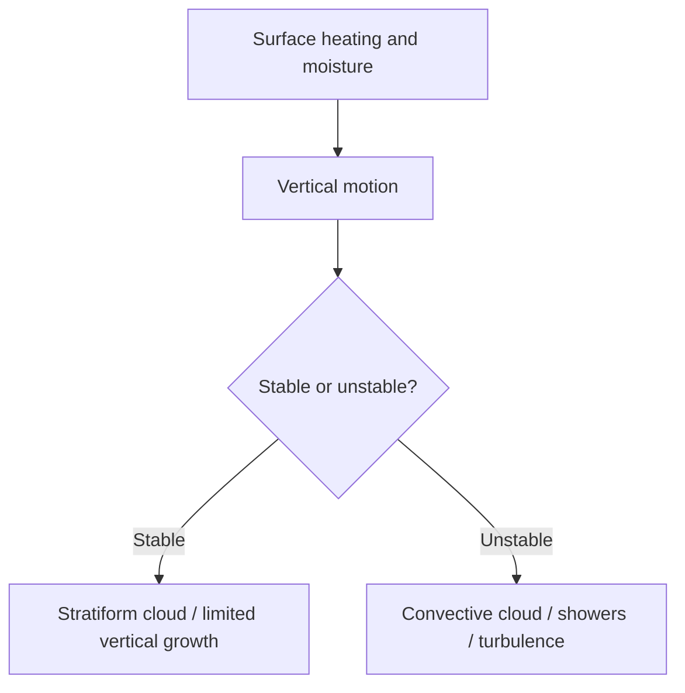
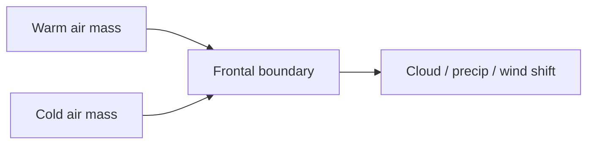
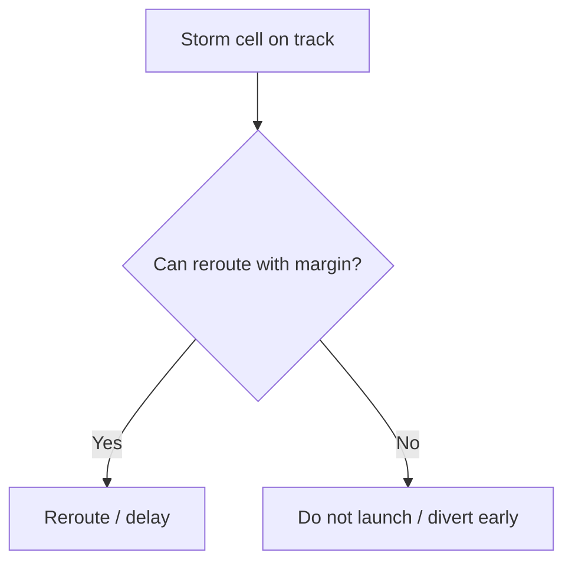
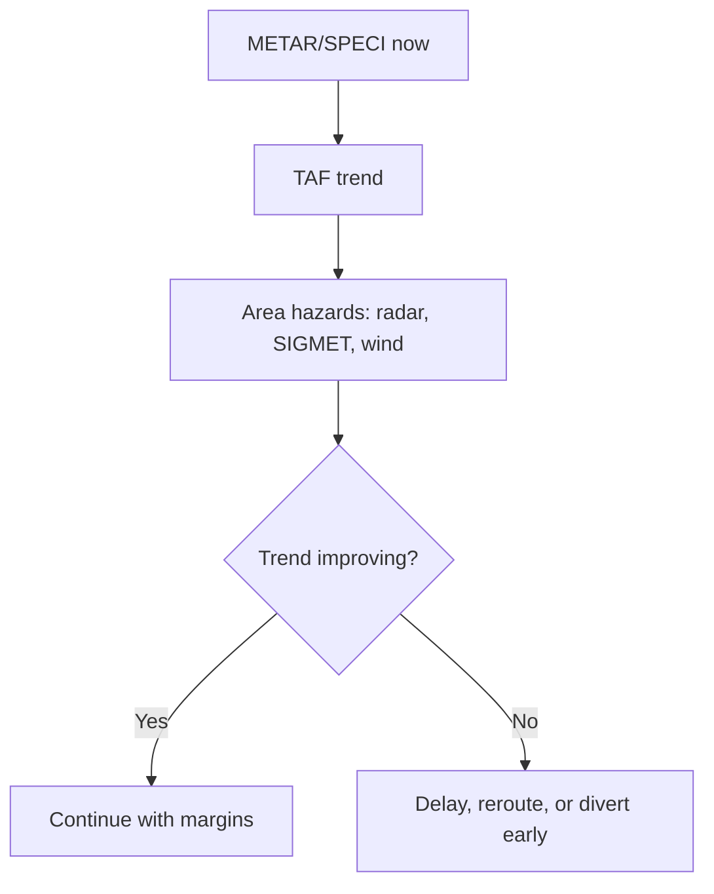

# Chapter 5 - Meteorology

**Navigation:** [<- Previous Chapter 4](ch4_human_performance_and_limitations.md) | [Table of Contents](ppl_toc.md) | Chapter 5 | [Next -> Chapter 6](ch6_navigation.md)

These notes are exam-focused for CASA PPL meteorology, with operational interpretation emphasis for VFR decision making.

---

## 5.1 Atmosphere Fundamentals

**Definition — atmosphere:** the envelope of gases surrounding Earth; weather occurs mainly in the **troposphere** (surface to about 10–16 km, higher at equator).

### Composition (exam awareness)

| Gas | Approx. proportion | Relevance |
|---|---:|---|
| Nitrogen | ~78% | Inert bulk of atmosphere |
| Oxygen | ~21% | Supports combustion; human respiration |
| Water vapour | Variable | Drives clouds, humidity, latent heat |
| Trace gases | Small % | CO2, etc. |

### Pressure, temperature, and density

| Concept | Definition | Operational link |
|---|---|---|
| **Atmospheric pressure** | Weight of air column above a point; decreases with altitude | Altimeter, QNH, performance |
| **Temperature lapse** | Temperature usually decreases with height in troposphere | Stability, cloud type |
| **Density** | Mass of air per volume; affected by pressure, temperature, humidity | Engine/prop/wing performance (density altitude — Chapter 3) |

- **ISA (International Standard Atmosphere):** reference model (15°C at sea level, 1013.25 hPa, standard lapse rates) used for performance charts and comparisons.
- **QNH / QFE:** subscale settings for altimeter — QNH gives height above mean sea level; critical for terrain clearance and circuit height discipline.

- [FAA PHAK — atmosphere / weather intro](https://www.faa.gov/regulations_policies/handbooks_manuals/aviation/phak/chapter-12-aviation-weather)
- [Bureau of Meteorology — aviation weather](http://www.bom.gov.au/aviation/)



---

## 5.2 Pressure Systems and Wind

**Definition — pressure gradient:** change in pressure over distance; air tends to move from higher to lower pressure (wind).

**Definition — Coriolis effect:** apparent deflection of moving air due to Earth’s rotation; in the **Southern Hemisphere**, flow is deflected to the **left**.

**Definition — gradient wind:** wind parallel to isobars aloft, balanced by pressure gradient and Coriolis (friction small).

**Definition — surface wind:** modified by friction and terrain; typically crosses isobars toward low pressure at surface.

### Southern Hemisphere high and low (memory)

| System | Surface wind circulation (SH) | Typical weather |
|---|---|---|
| **High (anticyclone)** | Clockwise, outward | Subsidence, often clearer, stable |
| **Low (cyclone / depression)** | Anticlockwise, inward | Rising air, cloud, precipitation |

- **Stronger isobar spacing** → stronger pressure gradient → stronger wind.
- **Sea breeze / land breeze:** local pressure/temperature differences near coasts — can shift wind direction during the day.

- [FAA PHAK — wind and pressure systems](https://www.faa.gov/regulations_policies/handbooks_manuals/aviation/phak/chapter-12-aviation-weather)
- [BOM — isobar and synoptic chart help](http://www.bom.gov.au/weather/charts/)

---

## 5.3 Stability, Lapse Rates, and Vertical Motion

**Definition — atmospheric stability:** resistance of a parcel of air to vertical displacement; determines whether lifted air continues rising or returns.

**Definition — lapse rate:** rate at which temperature decreases with height.

| Lapse rate type | Typical value (conceptual) | Meaning |
|---|---|---|
| **Environmental lapse rate (ELR)** | ~2°C per 1000 ft (variable) | Actual atmosphere at a time/place |
| **Dry adiabatic lapse rate (DALR)** | ~3°C per 1000 ft | Cooling of unsaturated rising parcel |
| **Saturated adiabatic lapse rate (SALR)** | ~1.5–2°C per 1000 ft (varies) | Cooling of saturated rising parcel |

### Stable vs unstable (parcel test — exam logic)

| Condition | Parcel behaviour | Typical cloud / flight |
|---|---|---|
| **Stable** | Parcel resists further rise | Stratiform layers, smoother air possible |
| **Unstable** | Parcel continues rising once lifted | Cumulus/CB, showers, turbulence |
| **Conditionally unstable** | Stable if dry, unstable if saturated | Common in real weather |

### Inversion

**Definition — inversion:** temperature **increases** with height over a layer (reverse of normal lapse).

| Effect | Pilot relevance |
|---|---|
| Traps haze, smoke, pollution | Reduced visibility below inversion |
| Suppresses vertical mixing | Fog/stratus can persist |
| Wind shear at boundary | Approach/departure handling changes |

- [FAA PHAK — stability and clouds](https://www.faa.gov/regulations_policies/handbooks_manuals/aviation/phak/chapter-12-aviation-weather)

---

## 5.4 Moisture, Cloud, and Precipitation

### Key moisture terms

| Term | Definition | Exam / ops cue |
|---|---|---|
| **Relative humidity (RH)** | Water vapour present as % of saturation at that temperature | High RH → fog/low cloud risk |
| **Dew point (Td)** | Temperature to which air must cool to become saturated | Small T − Td spread → condensation risk |
| **Saturation** | Air holding maximum water vapour at that temperature | Cloud/fog formation |

```text
Dew point spread = T − Td
```

Small spread → high humidity and increased fog/low cloud risk.

### Lifting mechanisms (how clouds form)

| Mechanism | Definition | Example |
|---|---|---|
| **Convective** | Surface heating causes buoyant rise | Afternoon cumulus, thunderstorms |
| **Orographic** | Air forced up terrain slope | Cloud/rain on windward slopes |
| **Frontal** | Warm air lifted over cold air (or forced at front) | Wide cloud bands, precipitation |
| **Convergence** | Airflows meet and rise | Pre-frontal lines, sea-breeze convergence |

### Cloud families (operations)

| Family | Appearance / development | Typical hazards |
|---|---|---|
| **Stratiform** | Layered, widespread | Low ceiling, reduced visibility, steady precip |
| **Cumuliform** | Heap-like, vertical growth | Showers, turbulence, rapid changes |
| **Cumulonimbus (CB)** | Deep vertical storm cloud | Severe turbulence, hail, lightning, wind shear |

- [FAA PHAK — moisture and precipitation](https://www.faa.gov/regulations_policies/handbooks_manuals/aviation/phak/chapter-12-aviation-weather)
- [WMO cloud atlas (reference)](https://cloudatlas.wmo.int/)

---

## 5.5 Fronts and Air Masses

**Definition — air mass:** large body of air with relatively uniform temperature and moisture properties (e.g. maritime tropical, continental polar).

**Definition — front:** boundary zone between two air masses with contrasting properties.

### Front types (PPL summary)

| Front | Movement / structure | Typical weather |
|---|---|---|
| **Cold** | Cold air undercuts warm air | Showery precip, gusts, wind shift, CB possible |
| **Warm** | Warm air overrides cold air | Layered cloud, widespread precip, low stratus risk |
| **Occluded** | Cold front catches warm front | Mixed, complex cloud and wind patterns |
| **Stationary** | Little net movement | Prolonged cloud/precip along boundary |

### Typical frontal hazards

- Cloud and precipitation bands reducing VMC.
- **Wind shift and gusts** at passage.
- **Embedded convection** along cold fronts in unstable air.
- **Visibility** reduction in rain, drizzle, and low cloud.

### Exam and operational point

- Single chart time is a snapshot; **trend** (METAR sequence, TAF `FM`/`BECMG`/`TEMPO`) matters more than one observation.
- Plan alternates on **forecast movement**, not only current weather at destination.

- [BOM — fronts and synoptic features](http://www.bom.gov.au/lam/fronts/)
- [FAA PHAK — air masses and fronts](https://www.faa.gov/regulations_policies/handbooks_manuals/aviation/phak/chapter-12-aviation-weather)



---

## 5.6 Fog, Visibility, and Low Cloud

**Definition — fog:** cloud with base at the surface; visibility below 1000 m in aviation context (exact definitions vary by authority — use exam/AIP context).

**Definition — visibility:** greatest distance at which objects can be identified against background.

### Fog types

| Type | Definition | Typical setup | Persistence |
|---|---|---|---|
| **Radiation** | Ground radiates heat; clear night + light wind cools air to dew point | Inland valleys, moist soil | Burns off after sunrise heating |
| **Advection** | Warm moist air moves over colder surface | Coast, cold current, sea fog | Can last all day |
| **Upslope** | Moist air lifted and cooled up slope | Hills, ranges | Until wind/conditions change |
| **Steam / evaporation** | Cold air over warmer water | Lakes, harbours in cold season | Localised, variable |

### Low stratus vs fog

| | Fog | Low stratus |
|---|---|---|
| Base | At surface | Above surface |
| Operational effect | Runway/aerodrome obscured | Low ceiling; may be VFR marginal |

### Other visibility reducers

- Haze, smoke, dust, precipitation, low sun glare.
- **VFR principle:** legal minima are minimums; use personal margins above them.

### Practical pilot actions: radiation fog example

- Scenario: pre-dawn departure from inland aerodrome after clear, calm night; T/Td spread has collapsed and visibility is dropping.
- Actions:
  - Delay and monitor trend (METAR/SPECI, webcams, field reports).
  - Check alternates and expected dissipation time.
  - Do not scud-run below minima; wait for sustained improvement.
  - Re-brief for post-fog low cloud and wind changes.
  - If destination fogs in while en route: **divert early** with fuel/time margins.

- [FAA PHAK — fog and visibility](https://www.faa.gov/regulations_policies/handbooks_manuals/aviation/phak/chapter-12-aviation-weather)

---

## 5.7 Thunderstorms and Severe Convective Hazards

**Definition — thunderstorm:** moist, unstable air with strong vertical motion producing cumulonimbus, lightning, and often heavy precipitation.

### Lifecycle stages

| Stage | Characteristics | Hazard trend |
|---|---|---|
| **Cumulus** | Growing tower | Turbulence building |
| **Mature** | Precipitation, downdrafts, lightning | Peak hazard |
| **Dissipating** | Downdraft-dominated | Gust fronts, wind shear still dangerous |

### Major threats (avoid penetration)

| Hazard | Definition / effect |
|---|---|
| **Severe turbulence** | Violent up/downdrafts | Loss of control risk |
| **Hail** | Ice pellets in strong updrafts | Airframe/engine damage |
| **Lightning** | Electrical discharge | Avionics, fuel system risk |
| **Microburst / downburst** | Intense downdraft spreading at surface | Large performance loss on approach/departure |
| **Gust front** | Outflow boundary ahead of storm | Sudden wind shift and shear |
| **Heavy precip** | Reduced visibility, icing in cold levels | Diversion, spatial disorientation |

### Avoidance principle

- **Strategic avoidance:** plan route and timing to stay clear by large margins (20+ NM from severe cells is a common training guideline; verify school/operator policy).
- Do not attempt to “thread” between mature cells under VFR.

- [BOM — thunderstorms](http://www.bom.gov.au/info/thunder/)
- [FAA AC 00-24 — thunderstorm avoidance](https://www.faa.gov/documentLibrary/media/Advisory_Circular/AC_00-24C.pdf)



---

## 5.8 Wind Shear and Turbulence

**Definition — turbulence:** irregular air movement causing bumpiness and attitude/airspeed fluctuations.

**Definition — wind shear:** change in wind speed and/or direction over a short distance (horizontal or vertical).

**Definition — LLWS (low-level wind shear):** wind shear in the lower levels of the atmosphere — critical on approach and departure.

### Turbulence sources

| Source | Cause | Typical location / time |
|---|---|---|
| **Mechanical** | Wind over terrain, buildings, trees | Downwind of ridges, approach to strips |
| **Thermal** | Uneven surface heating | Afternoon convective bumps |
| **Frontal / convective** | Strong vertical motion at fronts/storms | Near CB, gust fronts |
| **Mountain wave / rotor** | Airflow over mountains | Lee side of ranges, rotors below wave |

### LLWS cues

- Rapid airspeed fluctuations on approach.
- Wind shift reported on ATIS/METAR (e.g. `WS` group where used).
- Frontal passage, nocturnal inversion break, thunderstorm outflow.

| Phase | Risk | Mitigation |
|---|---|---|
| Takeoff / initial climb | Performance loss after rotation | Know winds; delay if outflow suspected |
| Approach / landing | Sudden sink or airspeed drop | Stabilized approach; go-around; extra margin |

- [FAA PHAK — wind shear and turbulence](https://www.faa.gov/regulations_policies/handbooks_manuals/aviation/phak/chapter-12-aviation-weather)

---

## 5.9 Icing (PPL Conceptual Depth)

**Definition — aircraft icing:** accretion of ice on airframe, engine intakes, or instruments when flying in visible moisture below freezing.

### Icing categories

| Type | Where | Effect |
|---|---|---|
| **Structural** | Wings, tail, prop | Reduced lift, increased drag, stall speed rise |
| **Induction** | Carburettor / intake | Power loss (carb ice — Chapter 2) |
| **Instrument** | Pitot/static, antennas | Erroneous ASI/altitude/VSI |

### Typical icing conditions (conceptual)

- **Visible moisture** (cloud, drizzle, rain in cold layer).
- **Temperature** at or below 0°C (supercooled droplets can exist slightly above 0°C in cloud).
- Light GA without certified icing protection: **avoid** forecast icing layers.

### Operational message

- Check freezing level and cloud tops in briefing; stay VMC and clear of icing layers when possible.
- If unexpected icing: exit icing conditions (climb/descend/turn), inform ATC, divert.

- See Chapter 2 (AGK) for system failures and carb icing.
- [FAA PHAK — icing](https://www.faa.gov/regulations_policies/handbooks_manuals/aviation/phak/chapter-12-aviation-weather)
- [CASA icing safety material](https://www.casa.gov.au/safety-management)

| Severity (conceptual) | Appearance | Pilot action |
|---|---|---|
| Trace / light | Small accumulation rate | Monitor; exit if increasing |
| Moderate | Rate requires repeated escape | Leave conditions promptly |
| Severe | Beyond escape by normal manoeuvre | Avoid at planning stage |

---

## 5.10 Weather Products and Interpretation

### 5.10.0 METAR vs TAF comparison table

| Feature | METAR (and SPECI) | TAF |
|---|---|---|
| Product type | Observation (actual reported conditions) | Forecast (expected future conditions) |
| Primary purpose | Describe current aerodrome weather | Predict aerodrome weather over validity period |
| Time basis | Single observation time (`DDHHMMZ`) | Issue time + validity window (`DDHH/DDHH`) |
| Update pattern | Routine intervals; SPECI on significant change | Issued at scheduled forecast cycles; amended when needed |
| Geographic scope | Specific aerodrome/station | Specific aerodrome/station |
| Core elements | Wind, visibility, weather, cloud, temperature/dew point, QNH | Forecast wind, visibility, weather, cloud with change groups |
| Change indication | May include trend groups (`NOSIG`, `BECMG`, `TEMPO`) in some formats | Uses forecast change groups (`FM`, `BECMG`, `TEMPO`, `PROB`) |
| Decision value for pilots | "What is happening now?" | "What is likely to happen during my flight window?" |
| Typical exam trap | Treating observed conditions as a forecast | Treating temporary/probability groups as prevailing all period |

### 5.10.1 METAR/SPECI - what each field means

- **METAR:** routine aerodrome weather observation at scheduled intervals.
- **SPECI:** special observation issued when significant weather changes occur between METAR times.
- Typical structure (order matters):
  - Report type: `METAR` or `SPECI`
  - Station identifier: e.g., `YSSY`
  - Time group (UTC): e.g., `301100Z` (day 30, 1100 UTC)
  - Wind: e.g., `23012KT`, variable wind `VRB03KT`, gusts `23012G22KT`
  - Visibility: e.g., `9999` (10 km or more), lower values in meters
  - Runway visual range (when included): `Rxx/....`
  - Weather phenomena: `-RA`, `+TSRA`, `BR`, `FG`, `HZ`, `DZ`, `GR`
  - Cloud: `FEW`, `SCT`, `BKN`, `OVC` with heights (hundreds of feet AGL), and cloud type when relevant (e.g., `CB`, `TCU`)
  - Temperature/dew point: e.g., `18/16`
  - QNH: e.g., `Q1016`
  - Recent weather and wind shear groups may appear in some formats
  - Trend section (where provided by state practice): `NOSIG`, `BECMG`, `TEMPO`, etc.

### 5.10.2 METAR quick decode example

- Example string:
  - `METAR YSSY 301100Z 21008KT 9999 -RA SCT020 BKN035 19/17 Q1014`
- Interpretation:
  - Sydney report at 1100 UTC
  - Wind from 210 at 8 kt
  - Visibility 10 km or more
  - Light rain
  - Scattered cloud at 2,000 ft, broken at 3,500 ft
  - Temperature 19 C, dew point 17 C (small spread indicates high humidity)
  - QNH 1014 hPa.

### 5.10.3 TAF - what each field means

- **TAF:** aerodrome forecast valid for a defined period.
- Typical structure:
  - Header and station identifier
  - Issue time (UTC)
  - Validity period (from/to UTC)
  - Forecast prevailing wind, visibility, weather, cloud
  - Change groups:
    - `FM` (from): rapid/step change from stated time
    - `BECMG`: gradual change in window
    - `TEMPO`: temporary fluctuations, expected to occur for short periods
    - `PROB30/PROB40`: probability groups (where used in local format)
    - `INTER` may appear in some systems as intermittent condition indicator
- TAF is forecast guidance, not observation; always compare against current METAR/SPECI.

### 5.10.4 TAF quick decode example

- Example string:
  - `TAF YSCB 301100Z 3012/0100 33010KT 9999 SCT030`
  - `TEMPO 3014/3018 4000 SHRA BKN020`
  - `FM302200 02012KT 9999 SCT040`
- Interpretation:
  - Issued at 1100 UTC for Canberra
  - Valid from day 30 1200 UTC to day 01 0000 UTC
  - Initial prevailing: wind 330/10 kt, visibility 10 km+, scattered cloud 3,000 ft
  - Temporarily between 1400-1800 UTC: visibility 4 km in showers, broken cloud 2,000 ft
  - From 2200 UTC: wind shifts to 020/12 kt and cloud lifts/scatters.

### 5.10.5 Practical METAR/TAF use in flight planning

- Do not read a single line in isolation. Build a weather picture:
  - Current conditions (METAR/SPECI)
  - Near-term forecast change timing (TAF groups)
  - En route and area-scale hazards (SIGMET/area forecasts/radar/satellite)
- High-value checks before VFR go/no-go:
  - Ceiling and visibility trend at departure, destination, and alternates
  - Wind trend vs runway and crosswind limits
  - Convective/fog timing overlap with planned arrival window
  - Temperature/dew-point spread trend for fog/low cloud risk.

### 5.10.6 Common METAR/TAF exam mistakes

- Confusing report issue time with validity period.
- Treating `TEMPO` as prevailing condition.
- Missing that `FM` replaces prior conditions from that time onward.
- Ignoring cloud amount significance (`BKN`/`OVC`) for practical ceiling.
- Not converting Zulu times correctly to local operation timeline.

---

## 5.11 Practical VFR Weather Decision Framework

- Before flight:
  - Is weather legal?
  - Is weather operationally safe for your experience and aircraft?
  - Are alternates/diversion options robust?
- In flight:
  - Update using observations and ATC/FIS information
  - Decide early; avoid pressing into deteriorating conditions
  - Keep terrain/airspace escape options.

---

## 5.12 Common Meteorology Exam Traps

- Confusing weather minima legality with safe go/no-go judgment.
- Focusing on single weather report instead of trend.
- Ignoring temperature/dew point spread significance.
- Misreading forecast time groups and validity periods.
- Underestimating convective outflow and gust front effects.

---

## 5.13 Rapid Revision Checklist (Pre-Exam)

- Can explain stable vs unstable air and resulting cloud/weather.
- Can identify frontal weather implications from chart/symbol context.
- Can decode METAR/TAF and extract operational risk.
- Can explain thunderstorm hazards beyond lightning.
- Can apply a conservative diversion/no-go decision to scenario questions.

---

## 5.14 Meteorology Formula Pack and Graphics

### Core formulas (exam-useful)

$$
\text{Dew point spread} = T - T_{\mathrm{d}}
$$

Small spread suggests high humidity and increased fog/low cloud risk.

$$
\text{Pressure altitude} \approx \text{Elevation} + (1013 - QNH) \times 30
$$

(QNH in hPa, altitude in ft; approximation for quick mental checks.)

$$
\text{Density altitude} \approx \text{Pressure altitude} + 120 \times (OAT - T_{\mathrm{ISA}})
$$

(Approximation useful for planning sense-checks; POH charts remain primary.)

### Graphic: weather decision trend logic



### Front and hazard quick table

| Front type | Typical cloud/precip pattern | Common pilot hazard |
|---|---|---|
| Cold front | Convective bands, showery rain | Turbulence, gust fronts, wind shift |
| Warm front | Layered cloud, widespread precip | Low cloud and visibility deterioration |
| Occluded front | Mixed widespread weather | Complex wind/ceiling evolution |
| Stationary front | Persistent cloud/precip zones | Long-duration poor VFR conditions |

### Cloud family and turbulence expectation

| Cloud family | Vertical development | Turbulence risk |
|---|---|---|
| Stratiform | Low to moderate | Usually lower, but can be moderate in strong flow |
| Cumuliform | Moderate to strong | Often moderate to severe in convective phases |
| Cumulonimbus | Very strong | Severe turbulence, hail, lightning, microburst risk |

---

## References (Primary)

- FAA PHAK (weather chapters and weather services context): <https://www.faa.gov/regulations_policies/handbooks_manuals/aviation/phak>
- ICAO meteorological service framework (Annex 3): <https://www.icao.int/>
- CASA weather and flight planning guidance: <https://www.casa.gov.au/>
- EASA weather information and operations resources: <https://www.easa.europa.eu/>

---

**Navigation:** [<- Previous Chapter 4](ch4_human_performance_and_limitations.md) | [Table of Contents](ppl_toc.md) | Chapter 5 | [Next -> Chapter 6](ch6_navigation.md)

