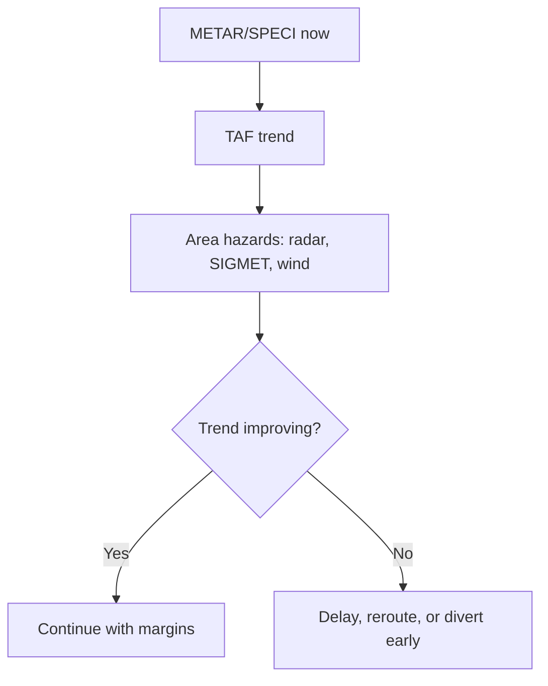

# Chapter 5 - Meteorology

**Navigation:** [<- Previous Chapter 4](ch4_human_performance_and_limitations.md) | [Table of Contents](ppl_toc.md) | Chapter 5 | [Next -> Chapter 6](ch6_navigation.md)

These notes are exam-focused for CASA PPL meteorology, with operational interpretation emphasis for VFR decision making.

---

## 5.1 Atmosphere Fundamentals

- Atmospheric composition and pressure behavior underpin all weather interpretation.
- Key concepts:
  - Pressure decreases with altitude
  - Temperature usually decreases with altitude in troposphere
  - Density depends on pressure and temperature
- ISA is a reference model used in performance calculations.

---

## 5.2 Pressure Systems and Wind

- Pressure gradient drives wind; Coriolis and friction modify direction/speed.
- Around pressure systems (Southern Hemisphere patterns should be understood for exam context).
- Stronger gradient -> stronger wind.
- Surface wind differs from gradient wind due to friction and terrain channeling.

---

## 5.3 Stability, Lapse Rates, and Vertical Motion

- Stability determines cloud type and turbulence tendency.
- Stable air favors stratiform cloud and smoother conditions.
- Unstable air favors convective cloud, showers, and turbulence.
- Inversions:
  - Can trap haze/smoke/pollutants
  - Can suppress convection
  - May create wind shear across inversion boundary.

---

## 5.4 Moisture, Cloud, and Precipitation

- Key moisture terms:
  - Relative humidity
  - Dew point
  - Saturation
- Cloud formation mechanisms:
  - Convective lifting
  - Orographic lifting
  - Frontal lifting
  - Convergence
- Cloud families and implications:
  - Cumuliform: vertical development, turbulence/showers
  - Stratiform: widespread cloud, reduced visibility/base.

---

## 5.5 Fronts and Air Masses

- Front types: cold, warm, occluded, quasi-stationary.
- Typical hazards:
  - Cloud/precip bands
  - Wind shifts/gusts
  - Turbulence and embedded convection
  - Visibility deterioration
- Frontal timing uncertainty matters; trend and movement are more valuable than single snapshot data.

---

## 5.6 Fog, Visibility, and Low Cloud

- **Radiation fog (definition):** fog formed overnight when ground loses heat by radiation under clear skies and light winds, cooling air to dew point.
  - Typical setup: clear night, moist surface, light wind, valley/low-lying terrain.
  - Typical burn-off: after sunrise as surface heating increases.
- **Advection fog (definition):** warm, moist air moving over colder surface and cooling to dew point.
  - More persistent than radiation fog; can continue all day.
- **Upslope fog (definition):** moist air forced upslope and cooled adiabatically to saturation.
- **Steam/evaporation fog (definition):** cold air over warmer water/wet surface causing rapid near-surface saturation.
- **Low stratus vs fog:** fog is cloud at surface; low stratus has cloud base above surface but creates similar operational limits.
- Visibility can degrade from haze, smoke, dust, precipitation, and low sun angle.
- For VFR, legal minima are minimums, not targets; operational margins should be higher.

### Practical pilot actions: radiation fog example

- Scenario: pre-dawn departure from inland aerodrome after clear, calm night; T/Td spread has collapsed and visibility is dropping.
- Pilot actions:
  - Delay departure and monitor trend (METAR/SPECI updates, webcams/field observations).
  - Check nearby alternates for conditions and expected fog dissipation timing.
  - Avoid "scud running" below minima; wait for sustained improvement, not a short temporary break.
  - Re-brief takeoff/alternate plan because post-fog conditions can include low cloud layers and changing winds.
  - If already airborne and destination develops fog: divert early while fuel/time margins are strong.

---

## 5.7 Thunderstorms and Severe Convective Hazards

- Thunderstorm lifecycle: cumulus, mature, dissipating.
- Major threats:
  - Severe turbulence
  - Hail
  - Lightning
  - Microburst/downburst and gust fronts
  - Heavy precipitation and rapid visibility loss
- Avoidance principle:
  - Strategic avoidance, not tactical threading between cells.

---

## 5.8 Wind Shear and Turbulence

- Turbulence sources:
  - Mechanical (terrain/obstacles)
  - Thermal (surface heating)
  - Frontal/convective
  - Mountain wave/rotor
- LLWS cues:
  - Significant wind changes over short vertical distance
  - Frontal passages, nocturnal inversions, thunderstorms.

---

## 5.9 Icing (PPL Conceptual Depth)

- Structural, induction, and instrument icing categories.
- Conditions: visible moisture plus suitable temperature range.
- Operational message:
  - Plan to avoid icing environments in light GA without robust anti-ice capability.

Note: See Chapter 2 for more icing secenarios.

---

## 5.10 Weather Products and Interpretation

### 5.10.0 METAR vs TAF comparison table

| Feature | METAR (and SPECI) | TAF |
|---|---|---|
| Product type | Observation (actual reported conditions) | Forecast (expected future conditions) |
| Primary purpose | Describe current aerodrome weather | Predict aerodrome weather over validity period |
| Time basis | Single observation time (`DDHHMMZ`) | Issue time + validity window (`DDHH/DDHH`) |
| Update pattern | Routine intervals; SPECI on significant change | Issued at scheduled forecast cycles; amended when needed |
| Geographic scope | Specific aerodrome/station | Specific aerodrome/station |
| Core elements | Wind, visibility, weather, cloud, temperature/dew point, QNH | Forecast wind, visibility, weather, cloud with change groups |
| Change indication | May include trend groups (`NOSIG`, `BECMG`, `TEMPO`) in some formats | Uses forecast change groups (`FM`, `BECMG`, `TEMPO`, `PROB`) |
| Decision value for pilots | "What is happening now?" | "What is likely to happen during my flight window?" |
| Typical exam trap | Treating observed conditions as a forecast | Treating temporary/probability groups as prevailing all period |

### 5.10.1 METAR/SPECI - what each field means

- **METAR:** routine aerodrome weather observation at scheduled intervals.
- **SPECI:** special observation issued when significant weather changes occur between METAR times.
- Typical structure (order matters):
  - Report type: `METAR` or `SPECI`
  - Station identifier: e.g., `YSSY`
  - Time group (UTC): e.g., `301100Z` (day 30, 1100 UTC)
  - Wind: e.g., `23012KT`, variable wind `VRB03KT`, gusts `23012G22KT`
  - Visibility: e.g., `9999` (10 km or more), lower values in meters
  - Runway visual range (when included): `Rxx/....`
  - Weather phenomena: `-RA`, `+TSRA`, `BR`, `FG`, `HZ`, `DZ`, `GR`
  - Cloud: `FEW`, `SCT`, `BKN`, `OVC` with heights (hundreds of feet AGL), and cloud type when relevant (e.g., `CB`, `TCU`)
  - Temperature/dew point: e.g., `18/16`
  - QNH: e.g., `Q1016`
  - Recent weather and wind shear groups may appear in some formats
  - Trend section (where provided by state practice): `NOSIG`, `BECMG`, `TEMPO`, etc.

### 5.10.2 METAR quick decode example

- Example string:
  - `METAR YSSY 301100Z 21008KT 9999 -RA SCT020 BKN035 19/17 Q1014`
- Interpretation:
  - Sydney report at 1100 UTC
  - Wind from 210 at 8 kt
  - Visibility 10 km or more
  - Light rain
  - Scattered cloud at 2,000 ft, broken at 3,500 ft
  - Temperature 19 C, dew point 17 C (small spread indicates high humidity)
  - QNH 1014 hPa.

### 5.10.3 TAF - what each field means

- **TAF:** aerodrome forecast valid for a defined period.
- Typical structure:
  - Header and station identifier
  - Issue time (UTC)
  - Validity period (from/to UTC)
  - Forecast prevailing wind, visibility, weather, cloud
  - Change groups:
    - `FM` (from): rapid/step change from stated time
    - `BECMG`: gradual change in window
    - `TEMPO`: temporary fluctuations, expected to occur for short periods
    - `PROB30/PROB40`: probability groups (where used in local format)
    - `INTER` may appear in some systems as intermittent condition indicator
- TAF is forecast guidance, not observation; always compare against current METAR/SPECI.

### 5.10.4 TAF quick decode example

- Example string:
  - `TAF YSCB 301100Z 3012/0100 33010KT 9999 SCT030`
  - `TEMPO 3014/3018 4000 SHRA BKN020`
  - `FM302200 02012KT 9999 SCT040`
- Interpretation:
  - Issued at 1100 UTC for Canberra
  - Valid from day 30 1200 UTC to day 01 0000 UTC
  - Initial prevailing: wind 330/10 kt, visibility 10 km+, scattered cloud 3,000 ft
  - Temporarily between 1400-1800 UTC: visibility 4 km in showers, broken cloud 2,000 ft
  - From 2200 UTC: wind shifts to 020/12 kt and cloud lifts/scatters.

### 5.10.5 Practical METAR/TAF use in flight planning

- Do not read a single line in isolation. Build a weather picture:
  - Current conditions (METAR/SPECI)
  - Near-term forecast change timing (TAF groups)
  - En route and area-scale hazards (SIGMET/area forecasts/radar/satellite)
- High-value checks before VFR go/no-go:
  - Ceiling and visibility trend at departure, destination, and alternates
  - Wind trend vs runway and crosswind limits
  - Convective/fog timing overlap with planned arrival window
  - Temperature/dew-point spread trend for fog/low cloud risk.

### 5.10.6 Common METAR/TAF exam mistakes

- Confusing report issue time with validity period.
- Treating `TEMPO` as prevailing condition.
- Missing that `FM` replaces prior conditions from that time onward.
- Ignoring cloud amount significance (`BKN`/`OVC`) for practical ceiling.
- Not converting Zulu times correctly to local operation timeline.

---

## 5.11 Practical VFR Weather Decision Framework

- Before flight:
  - Is weather legal?
  - Is weather operationally safe for your experience and aircraft?
  - Are alternates/diversion options robust?
- In flight:
  - Update using observations and ATC/FIS information
  - Decide early; avoid pressing into deteriorating conditions
  - Keep terrain/airspace escape options.

---

## 5.12 Common Meteorology Exam Traps

- Confusing weather minima legality with safe go/no-go judgment.
- Focusing on single weather report instead of trend.
- Ignoring temperature/dew point spread significance.
- Misreading forecast time groups and validity periods.
- Underestimating convective outflow and gust front effects.

---

## 5.13 Rapid Revision Checklist (Pre-Exam)

- Can explain stable vs unstable air and resulting cloud/weather.
- Can identify frontal weather implications from chart/symbol context.
- Can decode METAR/TAF and extract operational risk.
- Can explain thunderstorm hazards beyond lightning.
- Can apply a conservative diversion/no-go decision to scenario questions.

---

## 5.14 Meteorology Formula Pack and Graphics

### Core formulas (exam-useful)

$$
\text{Dew point spread} = T - T_{\mathrm{d}}
$$

Small spread suggests high humidity and increased fog/low cloud risk.

$$
\text{Pressure altitude} \approx \text{Elevation} + (1013 - QNH) \times 30
$$

(QNH in hPa, altitude in ft; approximation for quick mental checks.)

$$
\text{Density altitude} \approx \text{Pressure altitude} + 120 \times (OAT - T_{\mathrm{ISA}})
$$

(Approximation useful for planning sense-checks; POH charts remain primary.)

### Graphic: weather decision trend logic

### Front and hazard quick table

| Front type | Typical cloud/precip pattern | Common pilot hazard |
|---|---|---|
| Cold front | Convective bands, showery rain | Turbulence, gust fronts, wind shift |
| Warm front | Layered cloud, widespread precip | Low cloud and visibility deterioration |
| Occluded front | Mixed widespread weather | Complex wind/ceiling evolution |
| Stationary front | Persistent cloud/precip zones | Long-duration poor VFR conditions |

### Cloud family and turbulence expectation

| Cloud family | Vertical development | Turbulence risk |
|---|---|---|
| Stratiform | Low to moderate | Usually lower, but can be moderate in strong flow |
| Cumuliform | Moderate to strong | Often moderate to severe in convective phases |
| Cumulonimbus | Very strong | Severe turbulence, hail, lightning, microburst risk |

---

## References (Primary)

- FAA PHAK (weather chapters and weather services context): <https://www.faa.gov/regulations_policies/handbooks_manuals/aviation/phak>
- ICAO meteorological service framework (Annex 3): <https://www.icao.int/>
- CASA weather and flight planning guidance: <https://www.casa.gov.au/>
- EASA weather information and operations resources: <https://www.easa.europa.eu/>

---

**Navigation:** [<- Previous Chapter 4](ch4_human_performance_and_limitations.md) | [Table of Contents](ppl_toc.md) | Chapter 5 | [Next -> Chapter 6](ch6_navigation.md)

