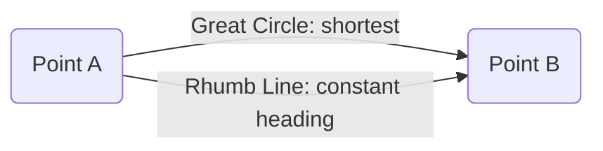
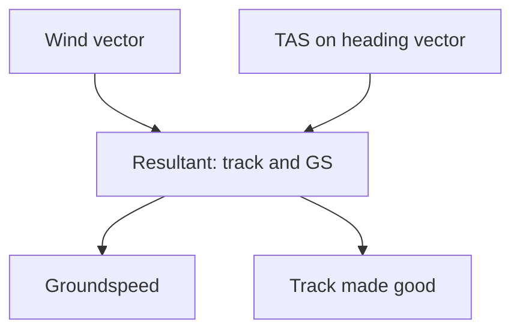
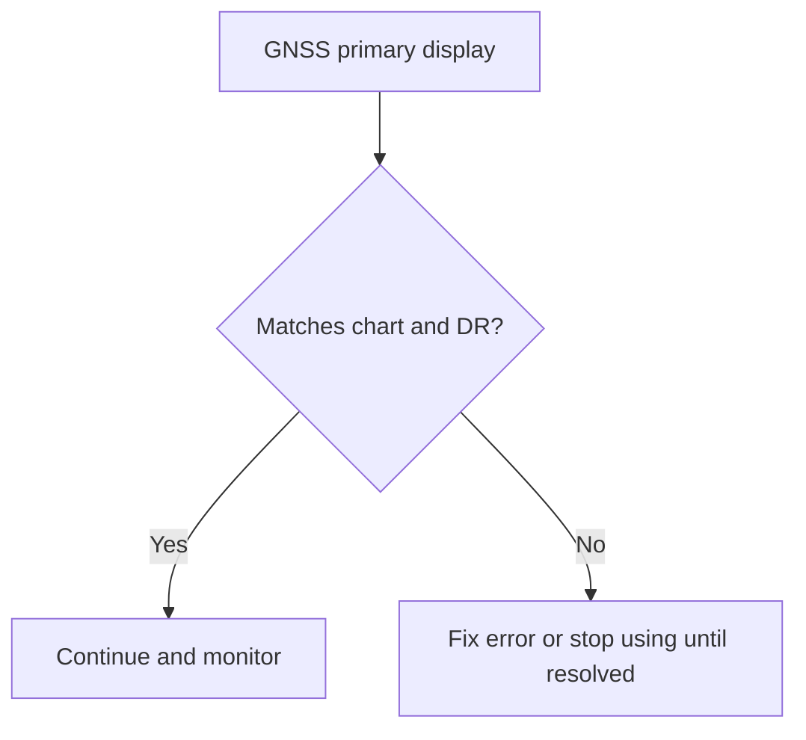
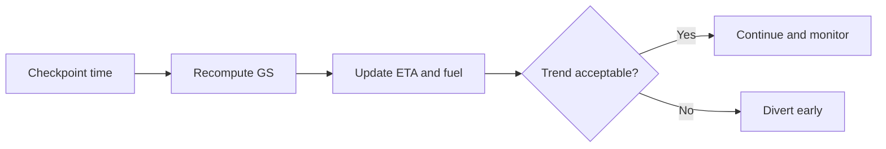
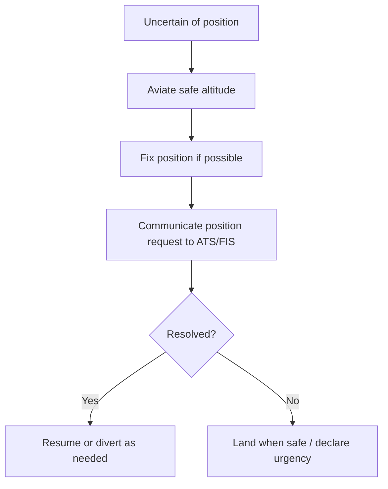

# Chapter 6 - Navigation

**Navigation:** [<- Previous Chapter 5](ch5_meteorology.md) | [Table of Contents](ppl_toc.md) | Chapter 6 | [Next -> Chapter 7](ch7_operational_procedures.md)

This chapter is an expanded exam-and-flight-practice reference for PPL navigation. It combines core theory, formula memory aids, worked examples, and cockpit decision flow.

---

## 6.1 Earth Geometry and Direction Basics

### Why this matters

Navigation starts with a geometric model of Earth. Most exam mistakes in this area come from mixing latitude and longitude distance rules.

### Core concepts

- **Great Circle (GC):** shortest path between two points on a sphere.
- **Rhumb Line (RL/Loxodrome):** crosses all meridians at a constant angle (constant track).
- **Meridians:** lines from pole to pole (longitude).
- **Parallels:** east-west circles (latitude), only equator is a great circle.

### Graphic: GC vs RL concept



### Key constants

| Quantity | Value | Notes |
|---|---:|---|
| 1 deg latitude | 60 NM | Always true (for navigation use) |
| Earth circumference | 21,600 NM | 360 deg x 60 NM |
| 1 NM | 1.852 km | ICAO standard |
| 1 kt | 1 NM/h | Speed unit in navigation |

---

## 6.2 Latitude, Longitude, and Distance Calculations

### Latitude distance

$$
\text{Distance (NM)} = \Delta \text{Lat (deg)} \times 60
$$

or in minutes:

$$
\text{Distance (NM)} = \Delta \text{Lat (min)}
$$

### Longitude distance (Departure)

$$
\text{Departure (NM)} = \Delta \lambda \text{ (min)} \times \cos(\text{Mean Lat})
$$

Where:
- $\Delta \lambda$ is longitude difference in minutes.
- Mean latitude is used for the segment.

### Worked example

- $\Delta \lambda = 30^\circ 12' = 1812'$
- Mean Lat $= 37^\circ$
- Departure $= 1812 \times \cos 37^\circ \approx 1447$ NM

### Exam trap

- Forgetting the cosine factor in departure formula is one of the most common errors.

---

## 6.3 Time Discipline (UTC, ETA, ETO)

- Plan and report in **UTC**.
- Recompute **ETA/ETO** whenever actual groundspeed differs from planned.
- In SAR context, precise reporting time matters as much as position.

### Quick formulas

$$
\text{Time (hr)} = \frac{\text{Distance (NM)}}{\text{GS (kt)}}
$$

$$
\text{Fuel used} = \text{Fuel flow} \times \text{Time}
$$

---

## 6.4 Dead Reckoning, Wind Triangle, Tracks, and Headings

### Dead reckoning (DR)

**Definition — dead reckoning:** navigation from a **known position** using **heading**, **time**, and **speed** (and wind correction) to estimate a new position.

| DR element | Source |
|---|---|
| Last known position | Fix from map, GNSS, pilotage, or radio aid |
| Heading | Compass / planned TH or MH |
| Time | Elapsed since fix (UTC discipline) |
| Speed | TAS converted to **GS** via wind triangle |
| Wind | Forecast or observed — applied as WCA |

**DR loop (each leg)**

1. Mark position and time at fix.
2. Determine **true track** on chart to next checkpoint.
3. Solve **wind triangle** → true heading and groundspeed.
4. Convert TH → MH → CH (variation/deviation).
5. Fly heading; note time overhead checkpoint.
6. Compare actual position to planned — apply **1-in-60** if off track (§6.7).

### Definitions (wind triangle)

- **Track (TRK/TT):** intended or actual path over the ground.
- **Heading (HDG/TH/MH/CH):** direction the aircraft nose points (true, magnetic, or compass).
- **Drift:** lateral displacement from wind; **drift angle** is heading–track difference.
- **WCA (wind correction angle):** angle applied into wind to hold planned track.
- **TAS:** speed through the air. **GS:** speed over the ground (wind triangle resultant).

### Graphic: wind triangle logic



**Memory:** three vectors — **wind**, **TAS/heading**, **ground track/GS** — close the triangle.

### Step-by-step wind triangle + DR (worked example)

**Given (leg briefing data)**

| Item | Value |
|---|---|
| True track (TT) | **090°** (east) |
| Distance | **60 NM** |
| TAS | **100 kt** |
| Wind | **180° / 20 kt** (wind **from** the south) |
| Variation | **12° E** |
| Deviation | **−3°** (west on card) |
| WCA (from flight computer / plot) | **11° L** (into wind from left) |

**Step 1 — True heading (TH)**

- Wind from the **left** → correct **left** (north side of eastbound track).
- `TH = TT − WCA = 090° − 11° = **079°T**`

**Step 2 — Magnetic and compass headings**

- East variation (12°E): `MH = TH − variation = 079° − 12° = **067°M**`
- Deviation −3°: `CH = MH − deviation = 067° − (−3°) = **070°C**`

**Step 3 — Groundspeed (GS)**

- With ~20 kt crosswind on 100 kt TAS, computer/plot GS ≈ **98 kt** (small reduction from pure crosswind case).
- Always take GS from **E6B / approved plot**, not guess, in real flight.

**Step 4 — Time en route (ETE) and ETA**

```text
ETE (hr) = Distance / GS = 60 / 98 ≈ 0.61 hr ≈ 37 minutes
```

- If departure fix at **0300 UTC**, ETA next checkpoint ≈ **0337 UTC**.

**Step 5 — DR position check**

- After 37 min on heading **070°C**, you should be near checkpoint (allowing for minor wind change).
- If landmark early/late → revise GS and ETA for next leg (§6.13).

**Step 6 — If off track in flight**

- At halfway (30 NM), you are **2 NM right** of track.
- Track error ≈ `2 × 60 / 30 = 4°` → adjust heading 4° left into error (§6.7).

### Sign reminders

- Wind from **right** → correct **right** (add WCA to TH in typical notation).
- Wind from **left** → correct **left**.
- Never confuse **wind direction** (FROM) with **track** (direction of travel over ground).

> **CASA Exam Cues — DR and wind triangle**
>
> - Exam expects **order**: TT → WCA → TH → MH → CH → GS → ETE.
> - Wind is almost always given as **direction wind is FROM**.
> - **GS** for time calculation, not TAS, unless question asks airborne time only.
> - Show **variation/deviation** steps separately — easy marks lost on sign.

---

## 6.5 Compass, Variation, and Deviation

### Types of north

| Type | Meaning | Used for |
|---|---|---|
| True North | Geographic pole reference | Charts, true tracks |
| Magnetic North | Earth magnetic field reference | Magnetic headings/bearings |
| Compass North | Aircraft compass indication | Compass steering |

### Conversion chain

$$
\text{True} \pm \text{Variation} = \text{Magnetic} \pm \text{Deviation} = \text{Compass}
$$

Memory aid: **True Virgins Make Dull Company**.

### Worked conversion

- $CH = 345^\circ$
- Deviation $= -7^\circ$ (west)
- $MH = 338^\circ$
- Variation $= +27^\circ$ (west)
- $TH = 005^\circ$

---

## 6.6 Earth Convergence and Conversion Angle

### Earth convergence

$$
Cv = \Delta \lambda \times \sin(\text{Mean Lat})
$$

Where:
- $Cv$ = angle between meridians over longitude interval.
- $\Delta \lambda$ in degrees.

### Conversion angle (commonly used with Lambert assumptions)

$$
CA = \frac{1}{2} Cv
$$

### RL from GC relationship

$$
RL = GC \pm CA
$$

### Worked example

- $\Delta \lambda = 90^\circ,\; \text{Mean Lat}=45^\circ$
- $Cv = 90 \times \sin 45^\circ \approx 64^\circ$
- $CA \approx 32^\circ$

---

## 6.7 1-in-60 Rule and Track Error Correction

### Formula set

$$
\text{Track Error (deg)} \approx \frac{\text{Off-track (NM)} \times 60}{\text{Distance flown (NM)}}
$$

$$
\text{Closing Angle (deg)} \approx \frac{\text{Off-track (NM)} \times 60}{\text{Distance to go (NM)}}
$$

$$
\text{Total correction} \approx \text{Track Error} + \text{Closing Angle}
$$

### Fast mental anchor

- 1 NM off after 60 NM flown ~= 1 deg error.

### Worked example

- 4 NM right of track after 80 NM flown:
  - Track error $= 4 \times 60 / 80 = 3^\circ$
- 40 NM to destination:
  - Closing angle $= 4 \times 60 / 40 = 6^\circ$
- Total correction left $= 9^\circ$

---

## 6.8 Wind Components and Runway Use

Given angle $\theta$ between runway heading and wind direction:

$$
\text{Crosswind} = W \times \sin\theta
$$

$$
\text{Head/Tailwind} = W \times \cos\theta
$$

### Clock code estimates

| Relative angle | Factor |
|---:|---:|
| 15 deg | 0.25 |
| 30 deg | 0.50 |
| 45 deg | 0.70 to 0.75 |
| 60 deg or more | ~1.00 (for crosswind mental estimate) |

### Operational reminders

- Crosswind and tailwind must be checked against aircraft/operation limits.
- Headwind usually improves takeoff/landing performance but still verify distance data.

---

## 6.9 Chart Projections (Exam Focus)

### Mercator

- Conformal (angles preserved locally).
- Rhumb lines plot as straight lines.
- Scale distortion increases with latitude.

### Lambert Conformal Conic

- Standard aviation enroute chart projection.
- Good compromise over mid-latitudes.
- GC and RL can both appear nearly straight over moderate ranges.

### Polar stereographic

- Used for high latitudes.
- Useful where meridian convergence is extreme.

### Comparison table

| Projection | Straight line on chart | Best use | Main trap |
|---|---|---|---|
| Mercator | Rhumb line | Low-mid lat marine/general nav | Assuming straight line is shortest |
| Lambert | Approx GC over operational ranges | Aviation enroute charts | Forgetting residual distortion |
| Polar stereographic | Depends on grid/plot method | Polar operations | Ignoring grid reference conversions |

---

## 6.10 Grid Navigation and Grivation (Advanced awareness)

At high latitudes, true/magnetic references become difficult due to meridian convergence and magnetic behavior. Grid references provide a stable operational framework.

- **Grid Convergence:** difference between Grid North and True North.
- **Grivation:** difference between Grid North and Magnetic North.

$$
\text{Grivation} = \text{Grid Convergence} + \text{Variation}
$$

Use these terms for conceptual exam questions, even if not heavily used in basic PPL route flying.

---

## 6.11 Radio Navigation Essentials (PPL level)

### NDB/ADF

- ADF needle indicates relative bearing to station.
- Convert relative bearing to QDM/QDR style understanding with heading context.
- Errors: night effect, coastal refraction, thunderstorms, mountainous terrain.

### VOR

- Radials are **from** the station.
- Correct TO/FROM interpretation is critical.
- Tracking and intercept logic should be practiced, not memorized only.

### DME

- Reads slant range, not always horizontal distance.
- Largest slant-range error when high and near station.

---

## 6.12 GNSS/GPS Practical Use and Risk Management

**Definition — GNSS:** Global Navigation Satellite System (e.g. GPS, GLONASS, Galileo) used for position, track, and time.

### Core operating points

- Verify **active flight plan**, waypoint sequence, and **active leg**.
- Check **CDI** scale/sensitivity and mode (ENR vs APR).
- Cross-check against chart, DR, and terrain — **one source is not enough**.

### RAIM (Receiver Autonomous Integrity Monitoring)

**Definition — RAIM:** function in many IFR-approved GPS receivers that checks **consistency between satellites** to detect faulty information; integrity may be **unavailable** if insufficient satellites or geometry.

| Aspect | PPL exam takeaway |
|---|---|
| Purpose | Detect misleading position data before it becomes hazardous |
| Limitation | Needs enough satellites in good geometry — **NOTAM** may warn RAIM outages |
| VFR | Awareness; know when GPS may be less trustworthy |

### SBAS and LPV (Australia context)

**Definition — SBAS (Satellite Based Augmentation System):** broadcasts **corrections** via geostationary satellites to improve accuracy and provide **integrity** (e.g. **WAAS** USA, **EGNOS** Europe; Australia has pursued **Southern Positioning Augmentation Network (SouthPAN)** for regional SBAS capability — confirm current status in briefing material).

| Term | Meaning |
|---|---|
| **SBAS** | Augmented GNSS with higher accuracy/integrity than basic GPS |
| **LPV (Localizer Performance with Vertical guidance)** | SBAS-based approach with lateral and vertical guidance (where published and aircraft/equipment certified) |
| **LNAV / LNAV+V** | GPS approach types with different guidance levels — know your aircraft AFM/POH limits |

- PPL VFR: you may not fly LPV approaches without appropriate rating/aircraft approval — exam may test **concept** only.

### GNSS limitations (operational and exam)

| Limitation | Risk | Mitigation |
|---|---|---|
| **Signal interference / jamming** | Position loss or drift | Revert to DR, map, pilotage; report if suspected |
| **Database not current** | Wrong waypoints, airspace, terrain | Check cycle date; update before flight |
| **Wrong waypoint active** | Fly to incorrect point | Brief and verify ident on ground and in flight |
| **Multipath (low level)** | Position errors near terrain/buildings | Cross-check visually; delay reliance until clean signal |
| **Over-reliance** | Loss of SA if screen fails | DR + chart backup every leg |
| **RAIM NOT available** | Reduced integrity period | Plan alternate nav; delay IFR GPS approach if applicable |
| **Cold start / re-routing errors** | Temporary misleading CDI | Confirm capture before committing |



### Pilot discipline

- GNSS is a **primary situational aid**, not single-source truth.
- Continue **map / terrain / time** cross-check (pilotage + DR).
- Confirm **database currency** and **NOTAM** (GPS outages, RAIM) before flight.

- [CASA — GNSS and navigation safety context](https://www.casa.gov.au/safety-management)
- [FAA PHAK — navigation systems](https://www.faa.gov/regulations_policies/handbooks_manuals/aviation/phak)

---

## 6.13 Navigation Log and In-Flight Replanning

### Minimum useful nav log fields

| Leg item | Why it matters |
|---|---|
| Planned track and heading | Baseline steering reference |
| Distance and planned GS | Planned ETE and fuel |
| Actual time overhead checkpoints | Real GS trend |
| Revised ETA and fuel remaining | Diversion decision quality |
| Frequencies and airspace notes | Workload and compliance management |

### In-flight update loop



---

## 6.14 Lost Procedure and Repositioning

### Priority order (always)

1. **Aviate** — safe altitude, terrain clearance, stable aircraft control.
2. **Navigate** — establish position (GNSS, pilotage, radio aids, DR back-check).
3. **Communicate** — ATS/FIS/CTAF; do not delay while guessing position.

Same hierarchy as emergency radio work: **Aviate, Navigate, Communicate** (Chapter 7).

### Typical practical sequence

| Step | Action |
|---|---|
| 1 | Note **time UTC**, fuel remaining, last known position (if any) |
| 2 | Climb if safe/legal for visibility, radio, and terrain clearance |
| 3 | Circle or hold briefly to reduce workload — avoid random headings |
| 4 | Identify features: roads, coast, towns; cross-check GNSS vs chart |
| 5 | Use aids: VOR/NDB/ATC radar assistance where available |
| 6 | Commit to **divert**, **land**, or **known track** — set hard fuel/time limit |
| 7 | If still uncertain → **communicate** PAN PAN or MAYDAY as appropriate (Chapter 1) |



### Link to Air Law — SAR and flight notification

Getting lost is not automatically a **distress** event, but it can become one if fuel, weather, or terrain margins erode. Your **legal and SAR context** matters:

| Air Law topic | Relevance when lost | See |
|---|---|---|
| **SARTIME** | If you do not arrive and have **not cancelled** SARTIME, **search and rescue action may be initiated** at the nominated UTC time | [Chapter 1 — SARTIME/SARWATCH](ch1_air_law.md) |
| **SARWATCH** | IFR reporting flights — failure to report triggers SAR logic | Chapter 1 |
| **CENSAR cancellation** | Landing safely is not enough for VFR SARTIME — **cancel with CENSAR (1800 814 931)** or approved method | Chapter 1 |
| **Distress (MAYDAY) / urgency (PAN PAN)** | Use when safety margin is gone — lost with low fuel, deteriorating weather, or unable to guarantee terrain clearance | Chapter 1 §1.5 |
| **Position reports** | Giving ATS an accurate position helps SAR and reduces search area | Chapter 1 — ATS |

**Operational SAR-minded habits**

- Lodge realistic **SARTIME** with margin; update or cancel after **diversion**.
- If lost and past planned ETA: **call ATS/FIS early** — you are not “bothering” them; you are activating the safety system.
- Provide: callsign, **last known position**, heading, altitude, endurance, persons on board, intentions.
- If you land at non-planned aerodrome: **cancel SARTIME** and notify someone expecting you.

**Exam scenario pattern:** pilot lost, fuel adequate, VMC — correct answer includes **maintain control**, **fix position**, **communicate for help**, and **awareness of SARTIME/notification obligations** — not silent continued wandering.

- [Airservices — SARTIME](https://www.airservicesaustralia.com/industry-info/pilot-tools/sartime/)
- [CASA — flight plans and SARTIME](https://www.casa.gov.au/resources-and-education/education-and-training/out-n-back/episode-25-flight-plans-and-sartime)

---

## 6.15 Human Factors and Error Management

Common traps:

- Confirmation bias ("I must be here").
- Fixation on one source (e.g., GNSS only).
- Late correction due to poor time discipline.

Countermeasures:

- Use time-track-distance triangle every leg.
- Run periodic gross-error checks.
- Brief diversion gates before departure.

---

## 6.16 Formula Pack (Quick Revision)

| Topic | Formula |
|---|---|
| Latitude distance | $D = \Delta Lat(\deg) \times 60$ |
| Departure | $Dep = \Delta Long(\min) \times \cos(\text{Mean Lat})$ |
| Time | $t = D/GS$ |
| Fuel used | $Fuel = FF \times t$ |
| Earth convergence | $Cv = \Delta \lambda \times \sin(\text{Mean Lat})$ |
| Conversion angle | $CA = 0.5 \times Cv$ |
| 1-in-60 track error | $TE = Off \times 60 / Flown$ |
| Closing angle | $CA_{close} = Off \times 60 / ToGo$ |
| Crosswind | $XW = W \sin\theta$ |
| Head/tailwind | $HW/TW = W \cos\theta$ |

---

## 6.17 Common Exam Traps

- Mixing true/magnetic/compass references in one calculation chain.
- Wrong east/west sign application for variation or deviation.
- Using **TAS** instead of **GS** for ETE/ETA.
- Wind direction: confusing **FROM** vs **TO** when plotting triangle.
- Forgetting cosine in longitude distance.
- Assuming straight line on all charts means shortest path.
- Applying 1-in-60 with distance-to-go when question asks distance-flown.
- Trusting GNSS without procedural cross-check.
- Ignoring **RAIM** / database currency in GPS approach or integrity questions.
- Lost procedure answer omits **communicate** or **SARTIME cancellation** when scenario includes notification.

---

## 6.18 Quick Study Plan (High Retention)

1. Memorize formula pack by writing from memory daily.
2. Do mixed 10-question blocks: wind, conversion, chart, timing.
3. Explain each result in words ("why this sign?", "why this correction?").
4. Rework all wrong questions after 48 hours.
5. Practice one full **DR leg** (TT → WCA → headings → GS → ETE) from memory weekly.
6. Practice tidy wind-triangle drawing under time pressure.

---

## References

- FAA Pilot's Handbook of Aeronautical Knowledge (Navigation chapters): <https://www.faa.gov/regulations_policies/handbooks_manuals/aviation/phak>
- ICAO Annex 4 (Aeronautical Charts): <https://www.icao.int/>
- CASA Visual Navigation Guide and VFR resources: <https://www.casa.gov.au/>
- Airservices SARTIME: <https://www.airservicesaustralia.com/industry-info/pilot-tools/sartime/>
- EASA ATPL Learning Objectives (General Navigation): <https://www.easa.europa.eu/>

---

**Navigation:** [<- Previous Chapter 5](ch5_meteorology.md) | [Table of Contents](ppl_toc.md) | Chapter 6 | [Next -> Chapter 7](ch7_operational_procedures.md)

