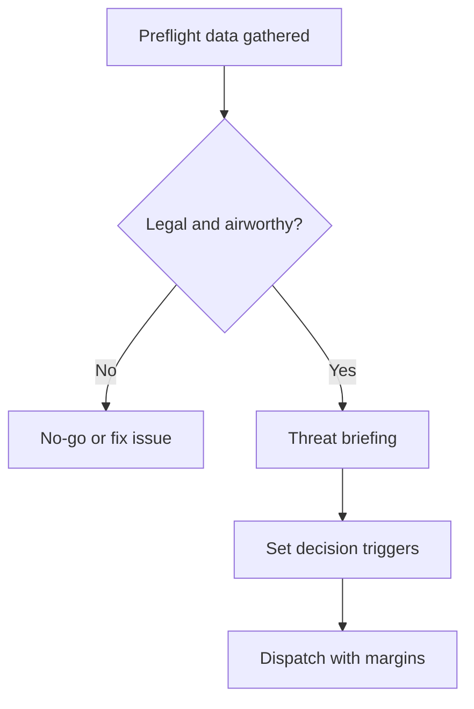
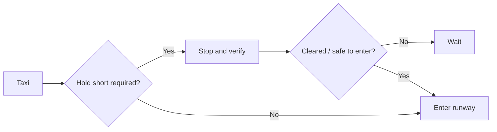
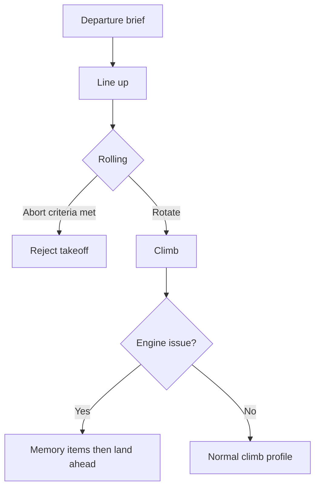
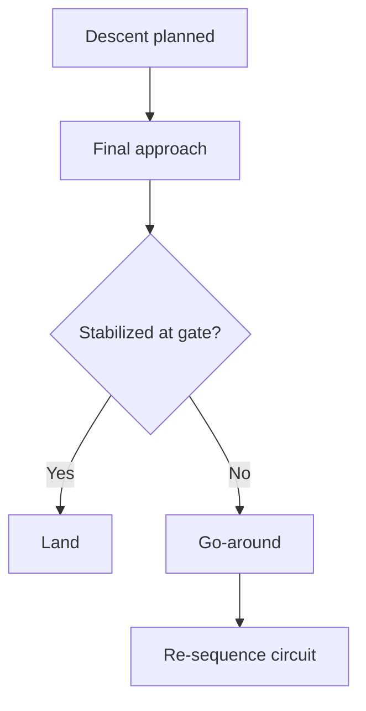
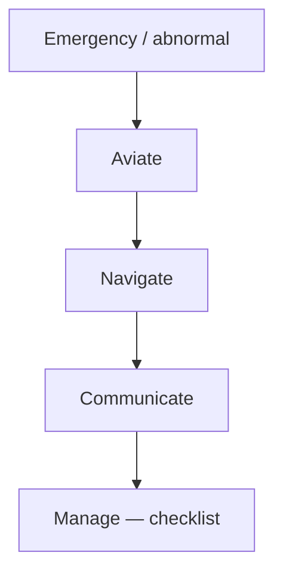
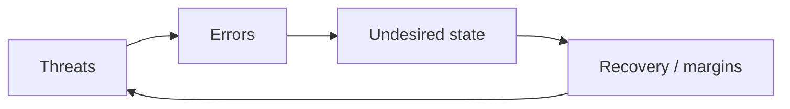
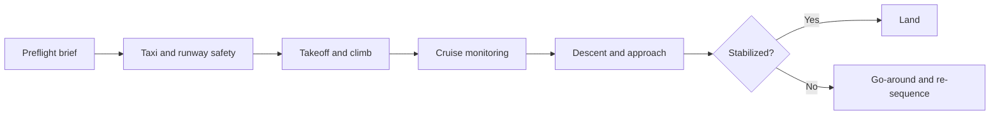

# Chapter 7 - Operational Procedures

**Navigation:** [<- Previous Chapter 6](ch6_navigation.md) | [Table of Contents](ppl_toc.md) | Chapter 7

These notes are exam-focused for CASA PPL operational procedures with practical, scenario-based emphasis.

---

## 7.1 Preflight Actions and Threat Briefing

**Definition — preflight:** all actions before engine start that confirm the flight is legal, airworthy, and operationally safe.

**Definition — threat briefing:** a short, structured discussion of foreseeable hazards and how they will be managed (part of TEM; see 7.11).

### Legal and operational readiness checklist

| Item | Definition / what to verify | Reference |
|---|---|---|
| Pilot documents and fitness | Licence, medical, recency, and personal fitness to fly | [CASA licensing](https://www.casa.gov.au/licences-and-certification) |
| Aircraft status and defects | Maintenance release current; known defects assessed and recorded | [CASA maintenance overview](https://www.casa.gov.au/standard-page/aircraft-maintenance) |
| Weather / NOTAM / airspace | Forecast trend, hazards, restrictions, and route suitability | [NAIPS / briefing services](https://www.airservicesaustralia.com/pilots/flight-briefing-services) |
| Fuel / oil quantity and quality | Usable fuel, correct grade, samples, and oil within limits | POH/AFM; [FAA PHAK — fuel systems](https://www.faa.gov/regulations_policies/handbooks_manuals/aviation/phak/chapter-7-aircraft-systems) |
| W&B and performance margins | CG in envelope; takeoff/landing/climb within POH limits | Chapter 3 notes; [FAA PHAK — W&B](https://www.faa.gov/regulations_policies/handbooks_manuals/aviation/phak/chapter-10-weight-and-balance) |

### Threat briefing topics (exam-useful)

- **Weather threats:** lowering ceiling, wind shift, convective development, fog timing.
- **Terrain / airspace:** controlled airspace transitions, CTAF discipline, high ground on track.
- **Runway / crosswind:** runway length, surface, crosswind component vs limits.
- **Alternate / diversion:** named alternate, fuel/time triggers, and communication plan.



---

## 7.2 Walk-Around and Cockpit Preparation

**Definition — walk-around (exterior inspection):** systematic visual and tactile check of aircraft exterior and visible systems before flight.

**Definition — cockpit preparation:** configuring flight deck for safe, efficient operation (documents, avionics, controls, safety equipment).

### External inspection principles

- Use the same sequence every time (nose → wing → tail → opposite side) to avoid omissions.
- Check control surfaces, hinges, locks removed, pitot/static covers off, tires, brakes, oil/fuel caps secure.
- [FAA PHAK — preflight inspection concepts](https://www.faa.gov/regulations_policies/handbooks_manuals/aviation/phak/chapter-2-aeronautical-decision-making) (decision-making and preparation context).

### Fuel checks

| Check | Definition | Why it matters |
|---|---|---|
| Correct grade | Fuel type matches POH/placard (e.g. AVGAS vs Jet-A) | Wrong grade can cause engine failure |
| Sufficient quantity | Usable fuel meets trip + reserve + contingency | Fuel exhaustion vs starvation (Chapter 2) |
| Contamination-free sample | Clear sample from lowest drain point(s) | Water/sediment can stop engine |

### Cockpit setup

- Documents: licence, medical, charts, POH, maintenance release, flight notification where required.
- Avionics: frequencies, nav database/waypoints, altimeter subscale (QNH).
- Controls: full and free movement; trim set for takeoff; fuel selector per POH.
- Safety equipment: fire extinguisher, first aid, survival kit (route-dependent), ELT status.

---

## 7.3 Passenger Briefing and Cabin Safety

**Definition — passenger briefing:** required safety information given so occupants can protect themselves and not distract the pilot during critical phases.

**Definition — sterile cockpit:** period when only flight-related communication and actions are permitted (see 7.12).

### Minimum briefing content

| Topic | What to explain | Exam cue |
|---|---|---|
| Seat belts / harnesses | When fastened, how to adjust, keep fastened until pilot says otherwise | Before taxi or as soon as seated |
| Doors / windows / egress | How to open in emergency; do not open in flight unless instructed | Unlatched door can be serious hazard |
| Sterile cockpit | No non-essential talk during taxi, takeoff, approach, landing | Reduces pilot workload errors |
| Equipment location | Sick bag, fire extinguisher, ELT (if relevant) | Passenger may assist in emergency |

- Carriage of passengers has legal and recency requirements (Chapter 1 Air Law).
- [CASA safety promotion — human factors](https://www.casa.gov.au/safety-management) (CRM and passenger distraction context).

---

## 7.4 Ground Operations and Runway Safety

**Definition — taxi:** movement of aircraft on surface under its own power, excluding takeoff/landing roll.

**Definition — runway incursion:** any occurrence at an aerodrome involving incorrect presence of aircraft, vehicle, or person on the protected area of a surface designated for landing/takeoff.

### Taxi discipline

- Maintain **active lookout** (scan ahead, sides, mirrors if fitted).
- Use **appropriate taxi speed** — slow enough to stop before conflict; fast taxi reduces reaction time.
- Use POH recommended configuration (e.g. flaps up, trim set).

### Runway incursion prevention

| Technique | Definition / application |
|---|---|
| Readback | Repeat runway/hold-short clearances; confirm understanding |
| Hold short compliance | Stop before hold line until cleared to enter/cross |
| Sterile cockpit | Near runway: focus on position, markings, and ATC/CTAF |
| Positional awareness | Know runway in use, taxi route, and hot spots from ERSA/AIP |

- [FAA Runway Safety](https://www.faa.gov/airports/runway_safety) (concepts apply internationally).
- [ICAO runway incursion prevention](https://www.icao.int/safety/airnavigation/Pages/runway-safety.aspx)

### Surface hazards

- **Propwash / jet blast:** high-energy airflow behind aircraft; can flip light aircraft, damage equipment, or injure people.
- **Soft/wet surfaces:** reduced braking and directional control during taxi.



---

## 7.5 Takeoff and Climb Procedures

**Definition — takeoff brief:** verbal or mental summary of runway, configuration, speeds, and failure actions before line-up.

**Definition — rejected takeoff (abort):** stopping on runway before becoming airborne when performance/safety criteria are not met.

### Departure brief elements

| Element | Typical content |
|---|---|
| Runway / wind | Active runway, crosswind component, surface condition |
| Configuration | Flap setting, mixture, fuel pump, trim |
| Abort plan | Speed or distance gate; "reject if not airborne by …" |
| Engine failure actions | Memory items by phase (below Vr, after lift-off) per POH |

### Technique awareness (POH-specific)

- **Short-field takeoff:** maximize obstacle clearance — often Vx, minimum ground roll technique.
- **Soft-field takeoff:** keep weight off nose wheel; lift early in ground effect if POH permits.
- **Noise abatement:** comply with published procedures only when safety margins remain acceptable.

- [FAA PHAK — takeoff/climb performance](https://www.faa.gov/regulations_policies/handbooks_manuals/aviation/phak/chapter-11-aircraft-performance)
- [FAA PHAK — airport operations](https://www.faa.gov/regulations_policies/handbooks_manuals/aviation/phak/chapter-15-airport-operations)



---

## 7.6 Cruise Procedures and En Route Management

**Definition — cruise scan:** recurring instrument and external scan pattern that monitors aircraft systems, navigation, fuel, traffic, and weather.

### Cruise scan domains

| Domain | What to monitor | Typical action if abnormal |
|---|---|---|
| Engine instruments | RPM/MP, oil, temps, fuel flow | Troubleshoot per POH; divert if trend worsens |
| Fuel | Tank selection, quantity trend, time checks | Update ETA/endurance; divert early |
| Navigation | Track, time over waypoints, chart/GNSS | Correct heading; revise ETA/fuel |
| Traffic / weather | See-and-avoid; cloud/visibility trend | Alter course/altitude; divert |

### Escape options

- Maintain awareness of suitable aerodromes, terrain clearance, and weather windows along track.
- Pre-brief **diversion triggers** (fuel, weather, technical) before they become emergencies.

- [FAA PHAK — en route and systems monitoring](https://www.faa.gov/regulations_policies/handbooks_manuals/aviation/phak/chapter-7-aircraft-systems)

---

## 7.7 Descent, Approach, and Stabilization

**Definition — stabilized approach:** by a defined point (often 500 ft AGL in training), aircraft is on intended path, at target speed, in landing configuration, with stable power and briefable to land.

**Definition — go-around (missed approach in VFR context):** discontinuing approach, applying power, and climbing to re-enter circuit or follow published procedure.

### Descent planning

- **Top of descent (TOD):** point to begin descent to arrive at pattern altitude with manageable workload.
- **Configuration schedule:** when to extend flaps/gear (if retractable) relative to speed limits (VFE, VLE/VLO).
- **Go-around triggers:** brief in advance (unstable, traffic on runway, wind shear cues).

```text
Top of descent distance (NM) ≈ Height to lose (ft) / 300
Rate of descent (fpm) ≈ GS (kt) × 5
```

(3-degree path approximations; add margins for wind and configuration.)

### Stabilized approach gates (training template)

| Gate | Expected | If not met |
|---|---|---|
| Early final | Trending to target speed and path | Correct or discontinue |
| Stabilization gate | On speed, path, config, power stable | Go-around |
| Short final | Minimal corrections; touchdown zone assured | Go-around |

- [FAA Safety — stabilized approach](https://www.faa.gov/newsroom/stabilized-approach) (concept widely used in training).



---

## 7.8 Landing Techniques

**Definition — normal landing:** touchdown on main wheels at minimum safe speed in landing configuration with directional control maintained.

**Definition — crosswind landing:** landing technique compensating for wind component across runway (wing-low and/or crab-decrab per training).

| Technique | Primary goal | Trade-off |
|---|---|---|
| Normal | Predictable touchdown in zone | Baseline skill |
| Crosswind | Maintain centerline in crosswind | Higher workload; know personal limits |
| Short-field | Minimize landing roll; stop in distance | Firm touchdown; precise speed control |
| Soft-field | Keep nose wheel light; protect surface | May use more runway in ground effect |

### Crosswind control (rollout)

- **Aileron into wind** to prevent wing lift and weather-vaning.
- **Rudder** for centerline tracking.
- Avoid excessive braking until directional control is established.

### After landing

- **Definition — vacating runway:** exiting active runway promptly to holding point or taxiway without delay where safe.
- Maintain awareness of other traffic; complete after-landing checks when clear of runway.

- [FAA PHAK — airport operations / landing](https://www.faa.gov/regulations_policies/handbooks_manuals/aviation/phak/chapter-15-airport-operations)

---

## 7.9 Emergency and Abnormal Procedures

**Definition — emergency:** condition of serious and/or immediate danger requiring priority handling (may justify MAYDAY).

**Definition — abnormal:** technical or operational issue that is serious but controllable with procedure (may justify PAN PAN).

### Action hierarchy (exam priority)

1. **Aviate** — maintain or regain aircraft control (pitch, bank, power).
2. **Navigate** — terrain/airspace avoidance; select landing site or heading.
3. **Communicate** — PAN PAN / MAYDAY, position, intentions (when workload permits).
4. **Manage** — checklists, passengers, systems, fuel for landing.



### Core scenarios (PPL level)

| Scenario | First-focus actions (conceptual) | Reference |
|---|---|---|
| Engine failure after takeoff | Pitch for best glide; land ahead within arc; minimal turns low level | POH emergency; [FAA PHAK Ch 17](https://www.faa.gov/regulations_policies/handbooks_manuals/aviation/phak/chapter-17-aeromedical-factors) |
| Engine failure in cruise | Best glide; field selection; MAYDAY/PAN; restart attempt per POH | POH |
| Fire / smoke | Shut off fuel/heat sources; land ASAP; ventilate if safe | POH memory items |
| Electrical failure | Shed load; alternator reset if POH; land if unable to restore | Chapter 2 electrical |
| Instrument failure | Partial panel; trust remaining valid instruments | Chapter 2 instruments |
| Inadvertent IMC | 180° turn / climb to VMC; do not continue VFR in IMC | [CASA VFR guide context](https://www.casa.gov.au/) |
| Precautionary landing | Planned landing when risk increasing but control retained | See 7.12 |
| Forced landing | Landing without reliable engine power | See 7.12 |

- [FAA PHAK — emergency procedures](https://www.faa.gov/regulations_policies/handbooks_manuals/aviation/phak/chapter-17-aeromedical-factors) (paired with emergency handling in training syllabi)

---

## 7.10 Survival, SAR, and Post-Flight

**Definition — SAR (Search and Rescue):** coordinated search and assistance for aircraft in distress; pilot role includes timely reporting and survival until help arrives.

**Definition — ELT (Emergency Locator Transmitter):** radio beacon activated by crash impact or manually to aid SAR.

### Survival equipment (route-dependent)

| Category | Examples | Purpose |
|---|---|---|
| Signalling | ELT, torch, mirror, whistle | Location by SAR |
| Shelter / warmth | Blanket, jacket, matches | Hypothermia prevention |
| Water / food | Water, high-energy bars | Endurance on ground |
| Communication | PLB, satellite messenger, mobile (coverage dependent) | Alert rescuers |

- [CASA — safety and survival topics](https://www.casa.gov.au/safety-management)
- [AMSA — search and rescue (Australia)](https://www.amsa.gov.au/safety-navigation/search-and-rescue)

### Post-flight actions

| Action | Definition / purpose |
|---|---|
| Secure aircraft | Control locks, tie-down, covers, fuel/master per POH |
| Record defects | Accurate maintenance log entries for squawks |
| Debrief | Compare planned vs actual fuel, times, and decisions for learning |

---

## 7.11 SOP Discipline and TEM Application

**Definition — SOP (Standard Operating Procedure):** agreed, repeatable way to conduct tasks (preflight, briefings, checklists, callouts) to reduce error.

**Definition — TEM (Threat and Error Management):** framework to identify threats, prevent/trap errors, and maintain safety margins.

### TEM in operations

| TEM stage | Operational meaning | Example |
|---|---|---|
| Threat | Condition that increases risk | Crosswind + fatigue |
| Error | Action/inaction that reduces safety margin | Late configuration on approach |
| Undesired state | Result if unmanaged | Unstable approach, runway overrun |
| Recovery | Deliberate correction | Go-around, divert, reject takeoff |

- Anticipate threats in preflight brief (7.1).
- Trap errors with checklists and callouts at phase changes.
- Build margins before high-workload phases (takeoff, approach).



- [ICAO — human factors / TEM resources](https://www.icao.int/safety/humanfactors)
- Checklist discipline: [FAA PHAK — aeronautical decision-making](https://www.faa.gov/regulations_policies/handbooks_manuals/aviation/phak/chapter-2-aeronautical-decision-making)

---

## 7.12 Key Definitions and Practical Examples

### Core definitions (exam memory set)

| Term | Definition |
|---|---|
| **Sterile cockpit** | No non-essential conversation or actions during critical phases (taxi, takeoff, approach, landing). |
| **Stabilized approach** | By defined gate: correct path, speed, configuration, and stable power; briefable to land. |
| **Go-around** | Discontinue approach; climb and re-sequence; do not force landing from unstable profile. |
| **Precautionary landing** | Deliberate landing when conditions are deteriorating but aircraft remains under control. |
| **Forced landing** | Landing required with engine power unavailable or unreliable. |
| **Runway incursion** | Incorrect presence on runway protected area (aircraft, vehicle, or person). |
| **Rejected takeoff** | Abort on runway before safe flight is established, per briefed criteria. |
| **Vacate runway** | Exit active runway promptly after landing when safe. |

### Practical examples

**Sterile cockpit**

- During short final, passenger asks for photos → pilot defers non-essential response until clear of runway.

**Stabilized approach**

- At 500 ft AGL: speed +10 kt, flaps still changing, path high → **go-around** immediately.

**Go-around**

- Traffic still on runway when on short final → power, pitch, climb; rejoin circuit per local procedure.

**Precautionary landing**

- Weather closing ahead; fuel and daylight adequate → land at suitable field before conditions become emergency.

**Forced landing**

- Complete engine failure in cruise → best glide, select field, MAYDAY if time, execute memory items and landing checklist.

### Scenario: unstable final approach

- On final: high and fast, crosswind correction still changing, touchdown zone likely missed.
- Correct action: go around early, re-brief approach, reattempt with improved spacing and configuration discipline.

- Distress/urgency phraseology: Chapter 1 (MAYDAY / PAN PAN).

---
## 7.13 Common Operational Procedures Exam Traps

- Forgetting to prioritize control of aircraft in emergency questions.
- Delaying go-around despite unstable approach cues.
- Treating checklist as optional under pressure.
- Poor runway/taxi situational awareness assumptions.
- Ignoring passenger briefing as a compliance/safety requirement.

---

## 7.14 Rapid Revision Checklist (Pre-Exam)

- Can structure a full preflight legal/safety check sequence.
- Can brief takeoff including failure contingencies.
- Can identify stabilized approach criteria and go-around triggers.
- Can prioritize emergency actions in correct order.
- Can explain runway incursion prevention techniques.

---

## 7.15 Procedure Graphics, Tables, and Formula Aids

### Graphic: normal flight phase workflow



### Emergency priority ladder

| Priority | Action focus | Typical examples |
|---|---|---|
| 1 | Aviate | Pitch, power/configuration, safe flight path |
| 2 | Navigate | Select landing option, terrain/airspace avoidance |
| 3 | Communicate | PAN PAN/MAYDAY, intentions, position |
| 4 | Manage | Checklist completion, passenger brief, follow-up |

### Stabilized approach gate table (training template)

| Gate concept | Expected state | If not met |
|---|---|---|
| Early final | Correct flap/config trend, speed trending to target | Correct promptly or discontinue |
| Stabilization gate | On path, on speed, stable power, checklist complete | Go-around |
| Short final | Minimal corrections, touchdown zone assured | Go-around |

### Simple descent planning formula

```text
Top of descent distance (NM) ≈ Height to lose (ft) / 300
```

(For a 3-degree path approximation; then add wind and configuration margins.)

```text
Rate of descent (fpm) ≈ GS (kt) × 5
```

(Useful quick estimate for a 3-degree descent.)

---

## References

- FAA PHAK (airport operations, emergencies, procedures): <https://www.faa.gov/regulations_policies/handbooks_manuals/aviation/phak>
- CASA VFR guide copy (supportive operational context): <https://www.kempseyflyingclub.com.au/Docs/Visual%20Flight%20Guide%202020.pdf>
- ICAO Annex 2 (Rules of the Air): <https://www.icao.int/>
- EASA Air Operations portal: <https://www.easa.europa.eu/en/domains/air-operations>

---

**Navigation:** [<- Previous Chapter 6](ch6_navigation.md) | [Table of Contents](ppl_toc.md) | Chapter 7

