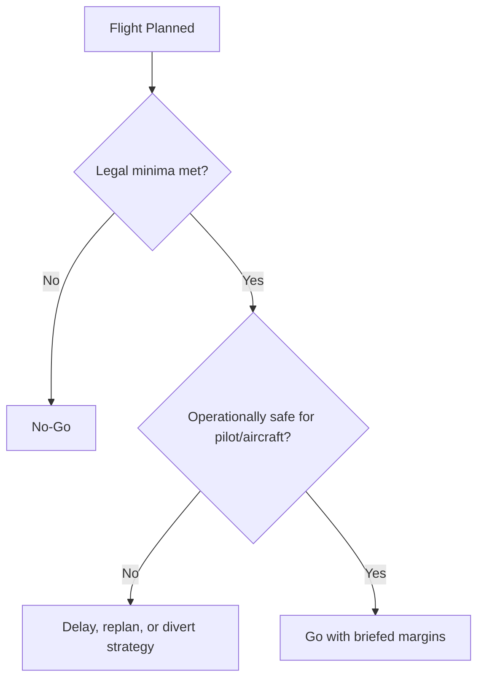

# Chapter 1 - Air Law

**Navigation:** [Overview](index.md) | Chapter 1 | [Next -> Chapter 2](ch2_aircraft_general_knowledge_agk.md)

These notes are exam-focused for CASA PPL Air Law. Always treat current CASA legislation, AIP, and published instruments as controlling references.

---

## 1.1 Regulatory Structure and Authority

- CASA administers civil aviation safety in Australia.
- Legislative hierarchy (simplified):
  - Civil Aviation Act
  - CASR/CAR
  - Manuals of Standards (MOS)
  - AIP, ERSA, DAP, NOTAM and other promulgated operational information
- For exam questions, read carefully whether the scenario is private, charter, training, controlled/uncontrolled, or day/night VFR.

---

## 1.2 Licensing, Ratings, Endorsements, and Privileges

- Understand privileges and limitations of:
  - Student pilot status
  - RPL vs PPL (and when privileges differ)
- Core licence considerations:
  - Medical/certificate requirements
  - Recency and proficiency requirements
  - Flight review requirements
  - Carriage of passengers requirements
- Know what requires a rating/endorsement/approval (e.g., aircraft category/class, operational privileges).

### RPL vs PPL

| Item | RPL (Recreational Pilot Licence) | PPL (Private Pilot Licence) |
| --- | --- | --- |
| Typical training scope | Entry-level private operations, usually local/regional use | Broader private operations with higher theoretical depth |
| Theory depth | Lower than PPL; focused on core recreational/private operations | Higher depth across all PPL theory subjects |
| Operational privilege scope | More limited privileges; often endorsement-dependent for expanded operations | Wider private pilot privileges (still subject to ratings/endorsements and recency) |
| Aircraft/operation complexity | Generally simpler operations unless extra endorsements held | Supports progression to more complex ops with added ratings/endorsements |
| Pathway value | Good first milestone; can bridge toward PPL | Standard licence for broader private flying and further training pathways |
| Exam mindset | Know what is permitted vs not permitted without extra endorsements | Know broader privileges plus legal/operational limits and conditions |

> Always confirm current CASA definitions, limitations, and endorsement requirements in the latest regulations/MOS and official guidance.

### Exam cues
- Distinguish legal privilege vs practical competency.
- Recency and flight review rules are frequent question areas.

---

## 1.3 Pilot in Command Responsibilities

- PIC is responsible for safe and legal operation.
- Key PIC duties:
  - Verify aircraft airworthiness status/documentation
  - Confirm weather and operational suitability
  - Ensure fuel/oil requirements met
  - Ensure loading/CG within limits
  - Ensure passengers are briefed and secured
  - Comply with all clearances/instructions/procedures
- You cannot delegate legal accountability for the flight outcome.

---

## 1.4 Flight Rules (VFR Focus)

- VFR minima and associated conditions are fundamental exam items.
- Understand:
  - Flight conditions
  - Day VFR vs Night VFR concept differences
  - Cloud clearance and visibility minima by airspace/altitude context
  - Terrain/obstacle and minimum height rules
  - Cruising level selection logic
- Special operations concepts:
  - Operations in controlled vs non-controlled airspace
  - Operations near restricted/prohibited/danger areas
  - Use of special procedures where published.

### Flight Conditions

| Classification | Ceilings and Visibility |
| --- | --- |
| Visual Flight Rules (**VFR**) | > 3,000ft AGL and > 5 SM |
| Marginal VFR (**MVFR**) | 1,000 - 3,000ft AGL and/or 3 - 5 SM | 
| Instrument Flight Rules (**IFR**) | 500 - 1,000ft AGL and/or 1 - 3 SM |
| Low IFR | < 5,000ft AGL and/or < 1 SM |

### VMC/VFR minima criteria

> Use this as a study summary. For legal dispatch, always confirm current values in the latest AIP ENR and CASA publications.

| Condition | Typical minima to remember (Australia VFR exam context) |
| --- | --- |
| At/above 10,000 ft AMSL | Visibility 8 km; cloud clearance 1,000 ft vertical and 1,500 m horizontal |
| Below 10,000 ft AMSL (general case) | Visibility 5 km; cloud clearance 1,000 ft vertical and 1,500 m horizontal |
| Class G at or below 3,000 ft AMSL or 1,000 ft AGL (whichever higher threshold applies in context) | Clear of cloud and in sight of ground or water (plus applicable visibility requirement) |
| Controlled airspace entry | ATC clearance required; VMC minima still apply unless operating under IFR |
| Class A | VFR not permitted |

### Day VFR constraints (what limits you)

- Must remain in VMC and comply with applicable visibility/cloud criteria at all times.
- Must comply with airspace, altitude, and clearance requirements for route.
- Navigation and terrain clearance must be possible by visual reference and appropriate charting/planning.
- Fuel planning and flight notification/SARTIME obligations still apply based on operation type/airspace.
- Legal minima are minimums only; operationally safe margins should be higher.

### Night VFR constraints (what changes at night)

- Requires Night VFR privilege/rating and aircraft/equipment that meets night operation requirements.
- Night VFR is still VFR in VMC; however, practical risk is higher due to reduced external visual cues.
- Harder to detect cloud, terrain, and weather deterioration at night; inadvertent IMC risk is increased.
- Greater emphasis on:
  - Instrument cross-check proficiency
  - Lighting/terrain awareness
  - Conservative weather minima and alternate strategy
  - Higher personal decision margins than daytime operations.

### Practical example: Day VFR acceptable, Night VFR not acceptable

- Same route and legal minima by day may be manageable with clear terrain/visual references.
- At night, with scattered cloud layers, limited moonlight, and sparse ground lighting, visual horizon and terrain cues may be inadequate.
- Correct exam/operational decision: reassess as higher risk, tighten minima, and delay/divert or cancel if cues/margins are insufficient.

---

## 1.5 Airspace and ATS

- Airspace classes: know service levels, separation responsibilities, and communications/transponder requirements conceptually.
- ATC/ATS interactions:
  - Clearances, readbacks, and compliance
  - Mandatory reports and position reporting where required
  - Frequency management and listening watch requirements

### Airspace classes summary (Australia, exam-focused)

> Study table only. Verify current operational requirements in AIP/ERSA/NOTAM for actual flight.  
> Note: Australia primarily uses Classes `A`, `C`, `D`, `E`, and `G` for PPL operations.

| Airspace class | Service level (ATS) | Separation responsibility | Communications / transponder expectations |
| --- | --- | --- | --- |
| **Class A** | Controlled, IFR-only environment | ATC separates all aircraft (IFR) | VFR not permitted; IFR clearance and full ATC communication compliance required |
| **Class C** | Controlled for IFR and VFR | ATC separates IFR-IFR and IFR-VFR; VFR receives traffic information on other VFR traffic | ATC clearance required; 2-way radio required; transponder required where published/mandated |
| **Class D** | Controlled tower airspace (typically terminal/circuit environment) | ATC separates IFR-IFR; traffic information and sequencing provided to assist IFR/VFR and VFR/VFR integration | ATC clearance required to enter/operate; 2-way radio required; transponder as published/required |
| **Class E** | Controlled airspace for IFR with VFR permitted | ATC separates IFR from IFR; VFR remains responsible for see-and-avoid and own separation from other traffic unless specifically instructed otherwise | IFR requires clearance; VFR generally no clearance for en route transit, but must comply with applicable radio/carriage requirements and published procedures |
| **Class G** | Uncontrolled (non-controlled) airspace | Pilot responsible for separation by see-and-avoid; ATS provides information/alerting services as available | No ATC clearance required; use appropriate area/CTAF procedures; radio/transponder requirements depend on specific airspace/equipment mandates |

### Quick memory points

- `A` = IFR only.
- `C` and `D` = clearance required before entry/operation.
- `E` = IFR controlled, VFR permitted without routine ATC separation.
- `G` = no controlled separation; pilot lookout and traffic awareness are critical.

### Distress and urgency

- **Distress (MAYDAY):** grave and imminent danger requiring immediate assistance.
  - Typical triggers: engine failure with forced landing likely, onboard fire/smoke threat, severe control difficulty, critical fuel state with immediate landing needed.
- **Urgency (PAN PAN):** serious situation requiring priority handling, but not yet immediate danger.
  - Typical triggers: significant technical issue still controllable, deteriorating weather with uncertainty, passenger medical concern without immediate life threat.

### Priority and ATS response

- Distress traffic has highest priority over all other communications.
- Urgency traffic has priority over normal traffic but below distress.
- ATC/ATS will typically provide:
  - Priority handling and traffic deconfliction support
  - Assistance with headings, altitudes, and nearest suitable aerodrome
  - Coordination with emergency services where needed.

### Practical transmission structure

- Use this sequence in plain language:
  - Distress or urgency signal (`MAYDAY` or `PAN PAN`) x3
  - Station called (if known) and callsign/aircraft identification
  - Nature of problem
  - Intentions (e.g., diverting, immediate landing)
  - Position, altitude, heading
  - Persons on board and any other essential information.

### When to declare

- Declare early when safety margin is shrinking; do not delay waiting for perfect diagnosis.
- If uncertain between urgency and distress:
  - Start with PAN PAN if situation is serious but stable.
  - Escalate immediately to MAYDAY if risk becomes immediate.
- Good airmanship: aviate first, then communicate as workload allows.

### Common exam traps (distress/urgency)

- Delaying a call until the situation becomes critical.
- Treating PAN PAN as "optional" and continuing normal operations without priority request.
- Omitting key information (position, intentions, POB) in first call.
- Fixating on radio phraseology perfection instead of timely declaration.

### ICAO-style radio examples

**PAN PAN example (urgency):**

`PAN PAN, PAN PAN, PAN PAN, Brisbane Centre, Cessna VH-ABC, engine rough running, maintaining 4,500 feet, 15 miles north of Toowoomba, tracking south, request priority direct Toowoomba for landing, 3 persons on board.`

**MAYDAY example (distress):**

`MAYDAY, MAYDAY, MAYDAY, Melbourne Centre, Piper VH-XYZ, engine failure, conducting forced landing, 8 miles east of Bacchus Marsh, 2,500 feet descending, 2 persons on board.`

---

## 1.6 Aerodrome Rules and Surface Operations

- Circuit joining/rejoining/departure expectations:
  - Determine and brief active runway, circuit direction, and aerodrome procedures before arrival/departure.
  - Maintain mandatory broadcasts/calls and listening watch as required for aerodrome type.
  - Join in accordance with published or standard pattern procedures; integrate safely with existing traffic flow.
  - Maintain correct circuit spacing, altitude discipline, and sequencing (avoid cutting in or overtaking in circuit).
  - Rejoin only when safe and predictable to other traffic; if unsure, extend/reposition and rejoin in an orderly manner.
  - Comply with right-of-way and wake-turbulence separation considerations, especially behind heavier/faster aircraft.
  - On departure, follow runway tracking/noise-abatement/published departure procedures unless safety requires otherwise.
  - Do not commence takeoff or cross/enter runway without required clearance/instruction at controlled aerodromes.
  - If go-around is required, execute promptly, broadcast/call as required, and re-sequence safely.
- Runway use, holding points, movement area discipline.
- Readback-critical instructions and runway incursion prevention.
- Light/sign/marking awareness for controlled and non-controlled operations.
- Wake turbulence and prop/jet blast awareness on ground and in circuit.

---

## 1.7 Documents, Publications, and Carriage Requirements

- Typical documents/publications a pilot must consult/carry as applicable:
  - Licence and medical evidence
  - Aircraft registration and airworthiness documentation
  - Maintenance release and defect status
  - Current charts/publications for route
  - Flight plan/notification details where required
- Must understand where to obtain current operational info:
  - NOTAM
  - AIP/ERSA/DAP
  - Weather products and operational advisories.

---

## 1.8 Fuel and Flight Planning Legal Context

- Legal fuel requirements are not just performance math; they are compliance requirements.
- CASA exam scenarios may explicitly reference policy assumptions (e.g., Part 91 MOS context in exam workbook).
- Always identify:
  - Planned fuel
  - Reserve requirements
  - Alternate/contingency assumptions if scenario requires.

---

## 1.9 Incident, Accident, and Reporting Obligations

- Know post-flight obligations when safety events occur:
  - Immediate safety actions
  - Preservation of evidence where required
  - Who must be notified and when (conceptually)
- Distinguish reportable occurrences from minor defects handled through maintenance channels.

---

## 1.10 Security and Dangerous Goods Awareness

- Security compliance includes controlled access, suspicious activity reporting, and passenger/baggage vigilance.
- Dangerous goods awareness:
  - Do not carry prohibited items unless permitted and properly handled.
  - If unsure, treat as prohibited until verified.

---

## 1.11 Key Definitions and Practical Examples

- **PIC (Pilot in Command):** the pilot legally responsible for operation and safety of the flight.
  - Example: even if an instructor or experienced passenger gives advice, PIC remains responsible for final decisions.
- **Clearance:** formal ATC authorization for a specific operation under stated conditions.
  - Example: cleared into controlled airspace at a specific level does not authorize entry at a different level.
- **Instruction:** ATC direction requiring compliance unless safety is compromised.
  - Example: "Hold short runway" must be complied with and read back as required.
- **NOTAM (Notice to Airmen):** time-critical operational information not practical to publish by permanent amendment.
  - Example: runway lighting unserviceable at destination changes night/VFR feasibility.
- **AIRMET (Airman's Meteorological Information):** aviation weather advisory issued by the Aviation Weather Center to alert pilots of, or forecast, moderate icing, moderate turbulence, sustained surface winds of 30+ knots, or widespread IFR conditions, mostly affecting smaller, single-engine aircraft. AIRMETs cover large areas (3,000+ sq miles) and are updated every 6 hours.
  - AIRMET Sierra (IFR/Mountain Obscuration): issued for ceiling less than 1,000 ft, visibility less than 3 miles, or extensive mountain obscuration.
  - AIRMET Tango (Turbulence): issued for moderate turbulence, sustained surface winds of 30 knots or more, or non-convective low-level wind shear.
  - AIRMET Zulu (Icing): issued for moderate icing and freezing levels.
- **Recency:** recent experience required to exercise specific privileges (e.g., passenger carrying).
  - Example: legally current for solo local flight may still be not current to carry passengers.

### Scenario: legal but not wise

- Conditions are just at legal minima, crosswind near your personal limit, and alternates are marginal.
- Correct exam mindset: legal minima are not automatic go criteria; operational judgment and margins still apply.

---
## 1.12 Common Air Law Exam Traps

- Applying memory of old rules instead of current promulgated requirements.
- Confusing ATS service availability with pilot legal responsibility.
- Misreading controlled vs non-controlled airspace obligations.
- Missing specific wording in scenario (e.g., passenger carrying, time of day, operational category).
- Treating SOP preferences as if they are legal minima.

---

## 1.13 Rapid Revision Checklist (Pre-Exam)

- Can explain PIC legal responsibilities before/during/after flight.
- Can identify required publications and preflight info sources.
- Can apply VFR minima logic to scenario-based questions.
- Can distinguish clearance/instruction obligations and correct readback behavior.
- Can identify reporting obligations after an incident/occurrence.
- Can separate legal limits from best-practice margins.

---

## 1.14 Operational Decision Graphics and Tables

### Graphic: legal vs operational go/no-go logic

### Preflight legal compliance matrix (exam memory aid)

| Domain | Core legal check | Typical evidence source |
|---|---|---|
| Pilot | Licence, medical, recency | Licence/medical + logbook records |
| Aircraft | Registration, maintenance release, defects | Aircraft docs and release entries |
| Operation | Weather minima, airspace rules, NOTAM | AIP/ERSA/NOTAM + weather brief |
| Planning | Fuel compliance and alternates | Flight planning sheet + policy assumptions |

### Radio urgency/distress comparison

| Item | PAN PAN (Urgency) | MAYDAY (Distress) |
|---|---|---|
| Threat level | Serious, not immediate grave danger | Grave and imminent danger |
| Priority | Above normal traffic | Highest priority |
| Escalation | Can escalate to MAYDAY if worsens | Immediate emergency handling |

### Practical legal sequence (PIC workflow)

1. Confirm legal authority to fly (pilot, aircraft, operation).
2. Confirm operational suitability (weather, fuel, alternates, risk).
3. Brief threats and hard decision points before departure.
4. Reassess legality and safety after any major condition change.

---

## References (Primary)

- CASA RPL/PPL/CPL Aeroplane Workbook (exam method assumptions): <https://www.casa.gov.au/rpl-ppl-and-cpl-aeroplane-workbook>
- FAA PHAK (airport operations and communications supporting concepts): <https://www.faa.gov/regulations_policies/handbooks_manuals/aviation/phak>
- ICAO Annex 2 (Rules of the Air): <https://www.icao.int/>

## References (Supplementary)

- CASA Day VFR syllabus page: <https://www.casa.gov.au/day-vfr-helicopters-syllabus>
- CASA Visual Flight Rules Guide (VFRG): <https://www.casa.gov.au/sites/default/files/2022-02/visual-flight-rules-guide.pdf>
- CASA Advisory Circular AC 61-05 (Night VFR rating guidance): <https://www.casa.gov.au/night-vfr-rating>
- EASA Air Operations reference portal: <https://www.easa.europa.eu/en/domains/air-operations>

---

**Navigation:** [Overview](overview.md) | Chapter 1 | [Next -> Chapter 2](ch2_aircraft_general_knowledge_agk.md)

