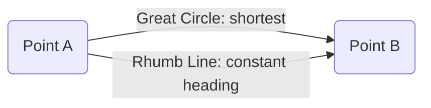
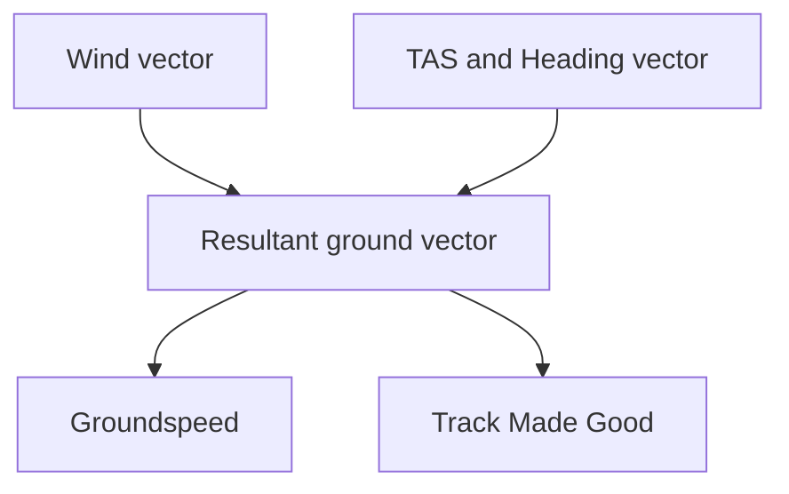
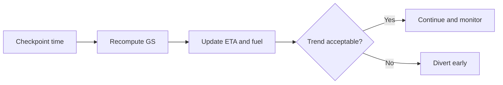

# Chapter 6 - Navigation

**Navigation:** [<- Previous Chapter 5](ch5_meteorology.md) | [Overview](index.md) | Chapter 6 | [Next -> Chapter 7](ch7_operational_procedures.md)

This chapter is an expanded exam-and-flight-practice reference for PPL navigation. It combines core theory, formula memory aids, worked examples, and cockpit decision flow.

---

## 6.1 Earth Geometry and Direction Basics

### Why this matters

Navigation starts with a geometric model of Earth. Most exam mistakes in this area come from mixing latitude and longitude distance rules.

### Core concepts

- **Great Circle (GC):** shortest path between two points on a sphere.
- **Rhumb Line (RL/Loxodrome):** crosses all meridians at a constant angle (constant track).
- **Meridians:** lines from pole to pole (longitude).
- **Parallels:** east-west circles (latitude), only equator is a great circle.

### Graphic: GC vs RL concept

### Key constants

| Quantity | Value | Notes |
|---|---:|---|
| Earth circumference | 21,600 NM | 360 deg x 60 NM |
| 1 deg latitude | 60 NM | Always true (for navigation use) |
| 1 NM | 1.852 km | ICAO standard |
| 1 kt | 1 NM/h | Speed unit in navigation |

---

## 6.2 Latitude, Longitude, and Distance Calculations

### Latitude distance

$$
\text{Distance (NM)} = \Delta \text{Lat (deg)} \times 60
$$

or in minutes:

$$
\text{Distance (NM)} = \Delta \text{Lat (min)}
$$

### Longitude distance (Departure)

$$
\text{Departure (NM)} = \Delta \lambda \text{ (min)} \times \cos(\text{Mean Lat})
$$

Where:
- $\Delta \lambda$ is longitude difference in minutes.
- Mean latitude is used for the segment.

### Worked example

- $\Delta \lambda = 30^\circ 12' = 1812'$
- Mean Lat $= 37^\circ$
- Departure $= 1812 \times \cos 37^\circ \approx 1447$ NM

### Exam trap

- Forgetting the cosine factor in departure formula is one of the most common errors.

---

## 6.3 Time Discipline (UTC, ETA, ETO)

- Plan and report in **UTC**.
- Recompute **ETA/ETO** whenever actual groundspeed differs from planned.
- In SAR context, precise reporting time matters as much as position.

### Quick formulas

$$
\text{Time (hr)} = \frac{\text{Distance (NM)}}{\text{GS (kt)}}
$$

$$
\text{Fuel used} = \text{Fuel flow} \times \text{Time}
$$

---

## 6.4 Tracks, Headings, Drift, and Wind Triangle

### Definitions

- **Track (TRK/TT):** intended or actual path over ground.
- **Heading (HDG):** direction aircraft nose points.
- **Drift angle:** difference between heading and track due to crosswind.
- **WCA:** wind correction angle applied to maintain planned track.

### Graphic: wind triangle logic

### Practical sequence (DR planning)

1. Plot true track (TT).
2. Apply WCA from forecast wind -> true heading (TH).
3. Apply variation -> magnetic heading (MH).
4. Apply deviation -> compass heading (CH), if required.
5. Compute GS and leg ETE.

### Sign reminder

- Wind from right -> correct right.
- Wind from left -> correct left.

---

## 6.5 Compass, Variation, and Deviation

### Types of north

| Type | Meaning | Used for |
|---|---|---|
| True North | Geographic pole reference | Charts, true tracks |
| Magnetic North | Earth magnetic field reference | Magnetic headings/bearings |
| Compass North | Aircraft compass indication | Compass steering |

### Conversion chain

$$
\text{True} \pm \text{Variation} = \text{Magnetic} \pm \text{Deviation} = \text{Compass}
$$

Memory aid: **True Virgins Make Dull Company**.

### Worked conversion

- $CH = 345^\circ$
- Deviation $= -7^\circ$ (west)
- $MH = 338^\circ$
- Variation $= +27^\circ$ (west)
- $TH = 005^\circ$

---

## 6.6 Earth Convergence and Conversion Angle

### Earth convergence

$$
Cv = \Delta \lambda \times \sin(\text{Mean Lat})
$$

Where:
- $Cv$ = angle between meridians over longitude interval.
- $\Delta \lambda$ in degrees.

### Conversion angle (commonly used with Lambert assumptions)

$$
CA = \frac{1}{2} Cv
$$

### RL from GC relationship

$$
RL = GC \pm CA
$$

### Worked example

- $\Delta \lambda = 90^\circ,\; \text{Mean Lat}=45^\circ$
- $Cv = 90 \times \sin 45^\circ \approx 64^\circ$
- $CA \approx 32^\circ$

---

## 6.7 1-in-60 Rule and Track Error Correction

### Formula set

$$
\text{Track Error (deg)} \approx \frac{\text{Off-track (NM)} \times 60}{\text{Distance flown (NM)}}
$$

$$
\text{Closing Angle (deg)} \approx \frac{\text{Off-track (NM)} \times 60}{\text{Distance to go (NM)}}
$$

$$
\text{Total correction} \approx \text{Track Error} + \text{Closing Angle}
$$

### Fast mental anchor

- 1 NM off after 60 NM flown ~= 1 deg error.

### Worked example

- 4 NM right of track after 80 NM flown:
  - Track error $= 4 \times 60 / 80 = 3^\circ$
- 40 NM to destination:
  - Closing angle $= 4 \times 60 / 40 = 6^\circ$
- Total correction left $= 9^\circ$

---

## 6.8 Wind Components and Runway Use

Given angle $\theta$ between runway heading and wind direction:

$$
\text{Crosswind} = W \times \sin\theta
$$

$$
\text{Head/Tailwind} = W \times \cos\theta
$$

### Clock code estimates

| Relative angle | Factor |
|---:|---:|
| 15 deg | 0.25 |
| 30 deg | 0.50 |
| 45 deg | 0.70 to 0.75 |
| 60 deg or more | ~1.00 (for crosswind mental estimate) |

### Operational reminders

- Crosswind and tailwind must be checked against aircraft/operation limits.
- Headwind usually improves takeoff/landing performance but still verify distance data.

---

## 6.9 Chart Projections (Exam Focus)

### Mercator

- Conformal (angles preserved locally).
- Rhumb lines plot as straight lines.
- Scale distortion increases with latitude.

### Lambert Conformal Conic

- Standard aviation enroute chart projection.
- Good compromise over mid-latitudes.
- GC and RL can both appear nearly straight over moderate ranges.

### Polar stereographic

- Used for high latitudes.
- Useful where meridian convergence is extreme.

### Comparison table

| Projection | Straight line on chart | Best use | Main trap |
|---|---|---|---|
| Mercator | Rhumb line | Low-mid lat marine/general nav | Assuming straight line is shortest |
| Lambert | Approx GC over operational ranges | Aviation enroute charts | Forgetting residual distortion |
| Polar stereographic | Depends on grid/plot method | Polar operations | Ignoring grid reference conversions |

---

## 6.10 Grid Navigation and Grivation (Advanced awareness)

At high latitudes, true/magnetic references become difficult due to meridian convergence and magnetic behavior. Grid references provide a stable operational framework.

- **Grid Convergence:** difference between Grid North and True North.
- **Grivation:** difference between Grid North and Magnetic North.

$$
\text{Grivation} = \text{Grid Convergence} + \text{Variation}
$$

Use these terms for conceptual exam questions, even if not heavily used in basic PPL route flying.

---

## 6.11 Radio Navigation Essentials (PPL level)

### NDB/ADF

- ADF needle indicates relative bearing to station.
- Convert relative bearing to QDM/QDR style understanding with heading context.
- Errors: night effect, coastal refraction, thunderstorms, mountainous terrain.

### VOR

- Radials are **from** the station.
- Correct TO/FROM interpretation is critical.
- Tracking and intercept logic should be practiced, not memorized only.

### DME

- Reads slant range, not always horizontal distance.
- Largest slant-range error when high and near station.

---

## 6.12 GNSS/GPS Practical Use and Risk Management

### Core operating points

- Verify waypoint sequence and active leg.
- Check CDI scale/sensitivity and mode awareness.
- Understand integrity concept (for exam: RAIM/SBAS awareness).

### Pilot discipline

- GNSS is primary situational aid, not single-source truth.
- Continue map/terrain/time cross-check (pilotage + DR).
- Confirm database validity and NOTAM impacts before flight.

---

## 6.13 Navigation Log and In-Flight Replanning

### Minimum useful nav log fields

| Leg item | Why it matters |
|---|---|
| Planned track and heading | Baseline steering reference |
| Distance and planned GS | Planned ETE and fuel |
| Actual time overhead checkpoints | Real GS trend |
| Revised ETA and fuel remaining | Diversion decision quality |
| Frequencies and airspace notes | Workload and compliance management |

### In-flight update loop

---

## 6.14 Lost Procedure and Repositioning

Priority order:

1. **Aviate** (safe altitude, stable control).
2. **Navigate** (fix position).
3. **Communicate** (seek ATS/FIS assistance early).

Typical practical sequence:

- Climb if safe and legal for better line-of-sight.
- Circle if necessary to reduce workload.
- Identify major features or electronic aids.
- Set a fuel/time decision point and commit.

---

## 6.15 Human Factors and Error Management

Common traps:

- Confirmation bias ("I must be here").
- Fixation on one source (e.g., GNSS only).
- Late correction due to poor time discipline.

Countermeasures:

- Use time-track-distance triangle every leg.
- Run periodic gross-error checks.
- Brief diversion gates before departure.

---

## 6.16 Formula Pack (Quick Revision)

| Topic | Formula |
|---|---|
| Latitude distance | $D = \Delta Lat(\deg) \times 60$ |
| Departure | $Dep = \Delta Long(\min) \times \cos(\text{Mean Lat})$ |
| Time | $t = D/GS$ |
| Fuel used | $Fuel = FF \times t$ |
| Earth convergence | $Cv = \Delta \lambda \times \sin(\text{Mean Lat})$ |
| Conversion angle | $CA = 0.5 \times Cv$ |
| 1-in-60 track error | $TE = Off \times 60 / Flown$ |
| Closing angle | $CA_{close} = Off \times 60 / ToGo$ |
| Crosswind | $XW = W \sin\theta$ |
| Head/tailwind | $HW/TW = W \cos\theta$ |

---

## 6.17 Common Exam Traps

- Mixing true/magnetic/compass references in one calculation chain.
- Wrong east/west sign application for variation or deviation.
- Forgetting cosine in longitude distance.
- Assuming straight line on all charts means shortest path.
- Applying 1-in-60 with distance-to-go when question asks distance-flown.
- Trusting GNSS without procedural cross-check.

---

## 6.18 Quick Study Plan (High Retention)

1. Memorize formula pack by writing from memory daily.
2. Do mixed 10-question blocks: wind, conversion, chart, timing.
3. Explain each result in words ("why this sign?", "why this correction?").
4. Rework all wrong questions after 48 hours.
5. Practice tidy wind-triangle drawing under time pressure.

---

## References

- FAA Pilot's Handbook of Aeronautical Knowledge (Navigation chapters): <https://www.faa.gov/regulations_policies/handbooks_manuals/aviation/phak>
- ICAO Annex 4 (Aeronautical Charts): <https://www.icao.int/>
- CASA Visual Navigation Guide and VFR resources: <https://www.casa.gov.au/>
- EASA ATPL Learning Objectives (General Navigation): <https://www.easa.europa.eu/>

---

**Navigation:** [<- Previous Chapter 5](ch5_meteorology.md) | [Overview](index.md) | Chapter 6 | [Next -> Chapter 7](ch7_operational_procedures.md)

